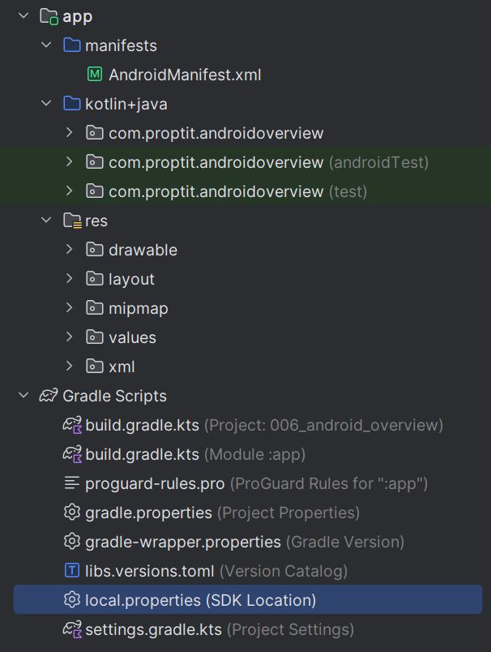
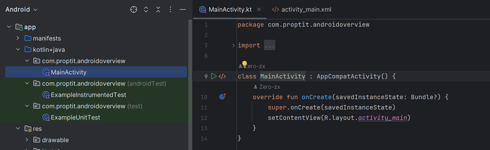

# ANDROID OVERVIEW & BASIC LAYOUT
## Giới thiệu về hệ điều hành android và IDE android studio
### Hệ điều hành Android
Android là hệ điều hành mã nguồn mở, dựa trên Linux Kernel, dành cho các thiết bị di động nói chung (điện thoại, máy tính bảng, đồng hồ thông minh, máy nghe nhạc,…).

Có nghĩa là Android không chỉ giới hạn trong phạm vi một hệ điều hành cho điện thoại! Nó có thể được nhà sản xuất cài đặt lên đồng hồ, máy nghe nhạc, thiết bị định vị GPS, thậm chí là ô tô (các thiết bị Android Auto).

Android cũng không phải là một thiết bị hay sản phẩm cụ thể, nó là một hệ điều hành dựa trên Linux, nguồn mở, linh hoạt.

Hiện Android là một thương hiệu của Google. Có khả năng tùy biến rất cao và có thể chạy trên nhiều thiết bị, nhiều kiến trúc vi xử lý (ARM / x86).

Sơ đồ kiến trúc của hệ điều hành Android:


Tóm tắt về các tầng của kiến trúc này như sau (từ trên xuống nhé):

- Tầng Applications: Là tầng chứa các ứng dụng Danh bạ, Gọi điện, Trình duyệt, Nghe nhạc,… các ứng dụng này thường mua máy về chúng ta đã có sẵn rồi.
- Tầng Framework: Là tầng chứa các API để làm việc với hệ điều hành như lấy thông tin danh bạ, quản lý các Activity (Activity là gì thì giờ chúng ta chưa cần quan tâm, các bài sau sẽ giải thích kĩ), quản lý địa điểm, quản lý các View (cũng chưa cần quan tâm).
- Tầng Libraries: Chứa các thư viện, API gần như là cốt lõi của Android, bao gồm bộ quản lý bề mặt cảm ứng (Surface Manager), OpenGL (phục vụ cho việc dựng đồ họa phức tạp),…
- Tầng Android Runtime: Chứa các thư viện lõi của Android và máy ảo Dalvik Virtual Machine (từ Android 4 trở lên chúng ta có thêm máy ảo ART).
- Tầng Kernel: Là nhân lõi của hệ điều hành, chứa các tập lệnh, driver giao tiếp giữa phần cứng và phần mềm của Android.

Trong quá trình làm việc, chúng ta sẽ gần như chỉ làm việc với tầng xanh lam (Applications và Application Framework) và xanh lá (Libraries). Chương trình Android được viết bằng ngôn ngữ Java và được máy ảo DVM / ART trong mỗi thiết bị Android biên dịch ra mã máy.

### Giới thiệu về Android Studio và Android SDK
#### Android Studio
Android Studio là môi trường phát triển ứng dụng tích hợp (IDE) dành riêng cho Android, mã nguồn mở, dựa trên IDE Java IntelliJ cảu hãng JetBrains.

Android Studio chạy trên Windows, Mac và Linux, nhằm thay thế cho Eclipse Android Development Tool (ADT) vốn được sử dụng làm IDE chính trong các năm trước đó.

#### Android SDK
Tương tự như Java Development Kit (JDK), Android Software Development Kit (Android SDK) là bộ công cụ phát triển cho Android, SDK này sẽ cung cấp cho chúng ta một bộ các thư viện và công cụ cần thiết để chúng ta có thể build, kiểm tra và debug cho các ứng dụng Android mà ta lập trình. 

## Android Project folder Structure
Một folder structure trông như dưới đây:



Một project android bao gồm các module ứng dụng khác nhau, các tệp source code, các tệp resource:
1. manifests folder
2. kotlin+java folder
3. res (Resources) Folder
   - drawable Folder
   - layout Folder
   - mipmap Folder
   - values Folder
4. Gradle Scripts

### manifest folder 
Thư mục manifests bao gồm file AndroidManifest.xml sử dụng cho việc tạo ra ứng dụng android. File này bao gồm thông tin về ứng dụng như phiên bản Android, metadata, states package cho tệp Kotlin, và các application component khác. Nó hoạt động như một trung gian giữa hệ điều hành Android và ứng dụng.


AndroidManifest.xml
```xml
<?xml version="1.0" encoding="utf-8"?>
<manifest xmlns:android="http://schemas.android.com/apk/res/android"
    xmlns:tools="http://schemas.android.com/tools">

    <application
        android:allowBackup="true"
        android:dataExtractionRules="@xml/data_extraction_rules"
        android:fullBackupContent="@xml/backup_rules"
        android:icon="@mipmap/ic_launcher"
        android:label="@string/app_name"
        android:roundIcon="@mipmap/ic_launcher_round"
        android:supportsRtl="true"
        android:theme="@style/Theme._006_android_overview"
        tools:targetApi="31">
        <activity
            android:name=".MainActivity"
            android:exported="true">
            <intent-filter>
                <action android:name="android.intent.action.MAIN" />

                <category android:name="android.intent.category.LAUNCHER" />
            </intent-filter>
        </activity>
    </application>

</manifest>
```
### kotlin+java folder
Thư mục này chứa tất cả các file source code Java và Kotlin mà chúng ta tọa ra trong quá trình phát triển ứng dụng, bao gồm cả các file Test.



### Resource (res) folder

Đây là thư mục quan trọng nhất vì nó chứa tất cả các non-code sources như hình ảnh, bố cục XML, các chuỗi giao diện người dùng (UI strings) cho ứng dụng Android của chúng ta.

#### Thư mục res/drawable
Nó chứa các loại hình ảnh khác nhau được sử dụng để phát triển ứng dụng. Chúng ta cần thêm tất cả hình ảnh vào một thư mục drawable để phát triển ứng dụng.
#### thư mục res/layout
Thư mục bố cục chứa tất cả các tệp bố cục XML mà chúng tôi đã sử dụng để xác định giao diện người dùng cho ứng dụng của mình. Nó chứa tệp `activity_main.xml`.
```xml
<?xml version="1.0" encoding="utf-8"?>
<androidx.constraintlayout.widget.ConstraintLayout xmlns:android="http://schemas.android.com/apk/res/android"
    xmlns:app="http://schemas.android.com/apk/res-auto"
    xmlns:tools="http://schemas.android.com/tools"
    android:id="@+id/main"
    android:layout_width="match_parent"
    android:layout_height="match_parent"
    tools:context=".MainActivity">

    <TextView
        android:layout_width="wrap_content"
        android:layout_height="wrap_content"
        android:text="Hello World!"
        app:layout_constraintBottom_toBottomOf="parent"
        app:layout_constraintEnd_toEndOf="parent"
        app:layout_constraintStart_toStartOf="parent"
        app:layout_constraintTop_toTopOf="parent" />

</androidx.constraintlayout.widget.ConstraintLayout>
```
#### Thư mục res/mipmap
Thư mục này chứa các tệp launcher.xml để xác định các biểu tượng được sử dụng để hiển thị trên màn hình chính. Nó chứa các loại biểu tượng có mật độ khác nhau tùy thuộc vào kích thước của thiết bị, chẳng hạn như hdpi, mdpi, xhdpi.

#### Thư mục res/value
Thư mục Giá trị chứa một số tệp XML như strings, dimensions, colors và style definitions. Một trong những tệp quan trọng nhất là tệp strings.xml chứa tài nguyên. 
```xml
<resources>
    <string name="app_name">006_android_overview</string>
</resources>
```
#### Gradle Scripts folder
Gradle có nghĩa là hệ thống xây dựng tự động và nó chứa một số tệp được sử dụng để xác định cấu hình bản dựng có thể áp dụng cho tất cả các module trong ứng dụng. Trong build.gradle (Project) có các bản dựng và trong build.gradle (Module) và các triển khai được sử dụng để xây dựng các cấu hình có thể áp dụng cho tất cả các module ứng dụng.


## Giới thiệu về xml
XML là từ viết tắt của từ Extensible Markup Language là ngôn ngữ đánh dấu mở rộng. XML có chức năng truyền dữ liệu và mô tả nhiều loại dữ liệu khác nhau. Tác dụng chính của XML là đơn giản hóa việc chia sẻ dữ liệu giữa các nền tảng và các hệ thống được kết nối thông qua mạng Internet.

XML dùng để cấu trúc, lưu trữ và trong trao đổi dữ liệu giữa các ứng dụng và lưu trữ dữ liệu. Ví dụ khi ta xây dựng một ứng dụng bằng Php và một ứng dụng bằng Java thì hai ngôn ngữ này không thể hiểu nhau, vì vậy ta sẽ sử dụng XML để trao đổi dữ liệu. Chính vì vậy, XML có tác dụng rất lớn trong việc chia sẻ, trao đổi dữ liệu giữa các hệ thống.
### Ưu, nhược điểm
#### Ưu điểm
- XML sở hữu tính độc lập cao, chúng được sử dụng phổ biến dưới phần mô tả ở dạng text. Vì vậy, hầu hết các phần mềm và chương trình bình thường đều đọc được chúng.
- XML còn có khả năng đọc cũng như phân tích nguồn dữ liệu một cách dễ dàng. Bởi vậy, mục đích chính của nó là giúp trao đổi dữ liệu giữa các chương trình và hệ thống khác nhau.
#### Nhược điểm
- XML có tỉ lệ sai sót lên đến 5 đến 7 %, mặc dù là chỉ số không quá cao. Tuy nhiên, theo thực tế nó lại khiến người dùng phải cân nhắc kỹ lưỡng trước khi lựa chọn XML để trao đổi thông tin.
### Sơ lược về cú pháp XML
Cú pháp XML cơ bản cho một phần tử là:
```xml
<tên thuộc_tính="giá trị">nội dung</tên>
```

Một file XML (eXtensible Markup Language) thường bao gồm các thành phần sau:

1. Khai báo XML (XML Declaration)

   Đây là phần khai báo ở đầu file để xác định phiên bản XML và encoding được sử dụng. Ví dụ:
   ```xml
   <?xml version="1.0" encoding="UTF-8"?>
   ```
2. Thẻ gốc (Root Element)

   Đây là thẻ chính bao quanh tất cả các thành phần khác trong file XML. Một file XML chỉ có một thẻ gốc duy nhất.
   ```xml
   <root>
     ...
   </root>
   ```
3. Thẻ con (Child Element)

   Các thẻ này nằm bên trong thẻ gốc và có thể lồng vào nhau để tạo thành cấu trúc cây.
   ```xml
   <root>
     <child>
       <subchild>Value</subchild>
     </child>
   </root>
   ```
4. Thuộc tính (Attributes):

   Các thuộc tính được đặt trong thẻ mở và cung cấp thêm thông tin về các phần tử.
   ```xml
   <element attribute="value">Content</element>
   ```
5. Nội dung (Content):

   Nội dung giữa thẻ mở và thẻ đóng của một phần tử. Nội dung có thể là văn bản, các thẻ con, hoặc cả hai.
   ```xml
   <element>Text content</element>
   ```
Ví dụ:
```xml
<?xml version="1.0" encoding="UTF-8"?>
<công_thức_nấu_ăn tên="bánh mì" thời_gian_chuẩn_bị="5 phút" thời_gian_nấu="3 tiếng">
 <title>Bánh mì cơ bản</title>
 <nguyên_liệu lượng="3" đơn_vị="ca">Bột mì</nguyên_liệu>
 <nguyên_liệu lượng="7" đơn_vị="gram">Men</nguyên_liệu>
 <nguyên_liệu lượng="1.5" đơn_vị="ca" trạng_thái="ấm">Nước</nguyên_liệu>
 <nguyên_liệu lượng="1" đơn_vị="thìa cà phê">Muối</nguyên_liệu>
 <chỉ_dẫn>
 <bước>Trộn tất cả các nguyên liệu với nhau và nhào kĩ</bước>
 <bước>Phủ một mảnh vải, ủ một tiếng đồng hồ trong phòng ấm.</bước>
 <bước>Nhào lại, đổ vào khuôn, cho vào lò nướng.</bước>
 </chỉ_dẫn>
</công_thức_nấu_ăn>
```
## Các tool cơ bản trong Android Studio
### Debbuger
Có 2 cách để chạy trình gỡ lỗi cùng ứng dụng:

- Đính kèm trình gỡ lỗi vào một quy trình của ứng dụng hiện có chạy trên thiết bị hoặc trình mô phỏng.
- Chạy ứng dụng bằng trình gỡ lỗi.

#### Đính kèm trình gỡ lỗi vào một quy trình của ứng dụng
Nếu ứng dụng đang chạy, bạn có thể đính kèm trình gỡ lỗi vào ứng dụng đó.

Để đính kèm trình gỡ lỗi vào một quy trình của ứng dụng, hãy làm theo các bước sau:

Nhấp vào biểu tượng  Attach Debugger to Android Process (Đính kèm trình gỡ lỗi vào quy trình Android).

Hộp thoại Choose Process (Chọn quy trình) sẽ mở ra. Tại đây, bạn có thể chọn quy trình mà mình muốn đính kèm với trình gỡ lỗi.

2. Chọn `com.example.diceroller` rồi nhấp vào OK.


Ngăn **Debug** (Gỡ lỗi) xuất hiện ở cuối Android Studio với thông báo cho biết trình gỡ lỗi được đính kèm vào thiết bị mục tiêu hoặc trình mô phỏng.


Debugger đã được đính kèm vào ứng dụng.
#### Chạy ứng dụng bằng debugger
Nếu muốn sử dụng trình gỡ lỗi ngay từ đầu, bạn có thể tiết kiệm thời gian bằng cách chạy ứng dụng bằng trình gỡ lỗi. Hơn nữa, nếu bạn muốn gỡ lỗi một đoạn mã chỉ chạy vào lúc ứng dụng khởi chạy, bạn cần chạy ứng dụng khi đã đính kèm trình gỡ lỗi.

Nhấn vào  **Debug 'app'**.

Ngăn **Debug (Gỡ lỗi)** cũng xuất hiện ở cuối Android Studio với một số dữ liệu đầu ra từ bảng điều khiển.
### Logcat
Khác với Terminal của các ứng dụng Java thông thường. Với Android Studio chúng ta có một công cụ mới là LogCat. Về bản chất của chúng thì như nhau, nhưng LogCat cho phép người khác viết plugin để hoạt động linh hoạt hơn, và nó là một công cụ tách rời trong Android SDK.

Để sử dụng LogCat, thay vì viết println() như code thường thì bạn thay bằng các hàm của lớp Log.

#### Cách ghi Log
Các hàm ghi log được liệt kê như sau.

- Để in ra log dạng lỗi (error): `Log.e(String, String)`
- Để in ra log dạng cảnh báo (warning): `Log.w(String, String)`
- Để in ra log kiểu cung cấp thông tin (information): `Log.i(String, String)`
- Để in ra log cho các nhu cầu debug: `Log.d(String, String)`
- Và log cho các nhu cầu khác (verbose): `Log.v(String, String)`

Hàm log nào cũng có 2 tham số truyền vào, tham số thứ nhất cho phép bạn đặt một nhãn gọi là tag, tag dùng để gom nhóm hay phân biệt các loại log với nhau; Tham số thứ hai là nội dung của log mà bạn muốn in ra. Chú ý tag sẽ được dùng đi dùng lại nhiều lần nên tốt nhất nên khai báo chúng là một biến static để tiện cho việc dùng lại.

Ví dụ:
```java
class MainActivity : AppCompatActivity() {
  override fun onCreate(savedInstanceState: Bundle?) {
     super.onCreate(savedInstanceState)
     setContentView(R.layout.activity_main)
     Log.d("MainActivity", "onCreate: Activity created")
     Log.i("MainActivity", "onCreate: Information log")
     Log.w("MainActivity", "onCreate: Warning log")
     Log.e("MainActivity", "onCreate: Error log")
  }
}
```
Giờ bạn hãy chạy ứng dụng lên máy ảo hay máy thật. Khi màn hình ứng dụng vừa hiện lên trên thiết bị, bạn tìm đâu đó trong cửa sổ logcat sẽ thấy các dòng log mà bạn vừa code lúc nãy như sau:


### Debug bố cục bằng Layout Inspector
Layout Inspector trong Android Studio cho phép bạn gỡ lỗi bố cục của ứng dụng bằng cách hiển thị một hệ phân cấp khung hiển thị để có thể kiểm tra thuộc tính của từng khung hiển thị. Với Layout Inspector (Trình kiểm tra bố cục), bạn có thể so sánh bố cục ứng dụng với mô hình thiết kế, hiện khung hiển thị phóng to hoặc 3D của ứng dụng và kiểm tra thông tin chi tiết về bố cục trong thời gian chạy. Điều này đặc biệt hữu ích khi bố cục được xây dựng trong thời gian chạy chứ không phải hoàn toàn bằng XML và bố cục đang hoạt động không như mong đợi.

## Các view cơ bản
Các thành phần giao diện xây dựng từ lớp cơ sở `View (android.view.View)` của Android, các thành phần này cung cấp sẵn khá đa dạng như `Button, TextView, CheckBox ...` tất cả chúng ta gọi nó là View. Sơ đồ các View được mộ tả theo sơ đồ như hình dưới.

View biểu diễn một hình chữ nhật, trong đó nó hiện thị thông tin nào đó cho người dùng, và người dùng có thể tương tác với View. Những loại View cơ bản cần tìm hiểu trước tiên đó là: `TextView, ImageView, Button, EditText`


### Một số tính chất / phương thức có trong tất cả các View

Các View dù là Button, TextView ... đều là kế thừa từ View, nên nó có các thuộc tính chung như:

| Thuộc tính | Mô tả                                                                                                                                            |
|------------------------|--------------------------------------------------------------------------------------------------------------------------------------------------|
| id                     | Xác định id của View, được khai báo ở file định nghĩa giao diện XML và sử dụng lại trong code Java để ánh xạ đối tượng, tìm kiếm các View khi cần. |
| layout_height          | Quy định chiều cao của View, có các giá trị match_parent, wrap context, giá trị xác định                                                         |
| layout_width           | Quy định chiều rộng của View, có các giá trị match_parent, wrap context, giá trị xác định                                                        |
| background             | Xác định màu nền của View                                                                                                                        |
| margin và padding      | - margin: là khoảng cách từ các cạnh của View hiện tại tới các View khác.                                                                        |     
|                        | - padding: là khoảng cách từ các cạnh của View tới phần nội dung bên trong.                                                                      |

> Tất cả các View được khởi tạo bằng XML bắt buộc phải có 2 thuộc tính:
> - layout_width.
> - layout_height.

### TextView
TextView là View dùng để hiển thị văn bản (text) lên màn hình. TextView được định nghĩa bởi thẻ `<TextView>` trong XML:
```java
<TextView
     attribute1="value"
     attribute2="value"
     attribute3="value"
... />
```
- Các thuộc tính của TextView:

| Thuộc tính | Mô tả                                                                                                                      |
|------------|----------------------------------------------------------------------------------------------------------------------------|
|android:text            | xác định văn bản sẽ hiển thị lên TextView                                                                                  |
|android:textColor            | xác định màu chữ của TextView                                                                                              |
|android:textSize            | xác định kích thước chữ của TextView                                                                                       |
|android:textStyle            | xác định kiểu chữ TextView, có 3 giá trị là `normal` (thông thường), `bold` (in đậm), `ilalic` (nghiêng)                   |
|android:drawableLeft            | xác định drawable nằm bên trái văn bản, ngoài ra còn có `android:drawableRight`, `android:drawableTop`, `android:drawableBottom` |

Ví dụ:
```
<TextView
        android:layout_width="wrap_content"
        android:layout_height="wrap_content"
        android:text="Hello World!"
        app:layout_constraintBottom_toBottomOf="parent"
        app:layout_constraintEnd_toEndOf="parent"
        app:layout_constraintStart_toStartOf="parent"
        app:layout_constraintTop_toTopOf="parent" />
```
### EditView
EditText là View dùng để lấy giá trị từ người dùng nhập vào. EditText được định nghĩa bởi thẻ `<EditText>` trong XML.
```java
<EditText
     attribute1="value"
     attribute2="value"
     attribute3="value"
... />
```
- 1 số thuộc tính của EditText:

  - `android:text`: xác định văn bản hiển thị lên EditText.
  - `android:textColor`: xác định màu của text.
  - `android:textSize`: xác định kích thước của text.
  - `android:textStyle`: xác định kiểu của văn bản gồm các giá trị italic (nghiêng), bold (in đậm), normal (kiểu thường).
  - `android:inputType`: xác định phương thức nhập của Edittext.
  Có các giá trị như sau: `text, number, textPassword, phone, textUrl, …`
Ví dụ:
```java

```
### Button
Button là View dùng để nhận 1 các cú chạm (nhấn nút) và thực hiện các chức năng trong phương thức onClick(). Button được định nghĩa bởi thẻ `<Button>` trong XML.
- 1 số thuộc tính:
    - `android:text`: xác định văn bản sẽ hiển thị.
    - `android:textColor`: xác định màu văn bản.
      Ví dụ:
```java
<Button
     android:id="@+id/button"
     android:layout_width="wrap_content"
     android:layout_height="wrap_content"
     android:text="Button"
     app:layout_constraintBottom_toBottomOf="parent"
     app:layout_constraintEnd_toEndOf="parent"
     app:layout_constraintHorizontal_bias="0.818"
     app:layout_constraintStart_toStartOf="parent"
     app:layout_constraintTop_toTopOf="parent"
     app:layout_constraintVertical_bias="0.308" />
```
### ImageView
ImageView là View dùng để hiển thị hình ảnh.
- 1 số thuộc tính phổ biến của ImageView:
    - `android:src`: xác định nguồn hình ảnh hoặc drawable.
    - `android:scaleType`: kiểu hiển thị hình ảnh của ImageView.
      Có các giá trị: `fitCenter, fitStart, fitEnd, center, centerCrop, centerInside, matrix`.
      Ví dụ:
```java
<ImageView
        android:id="@+id/imageView"
        android:layout_width="271dp"
        android:layout_height="299dp"
        app:layout_constraintBottom_toBottomOf="parent"
        app:layout_constraintEnd_toEndOf="parent"
        app:layout_constraintHorizontal_bias="0.228"
        app:layout_constraintStart_toStartOf="parent"
        app:layout_constraintTop_toTopOf="parent"
        app:layout_constraintVertical_bias="0.93"
        app:srcCompat="@drawable/nh_1" />
```