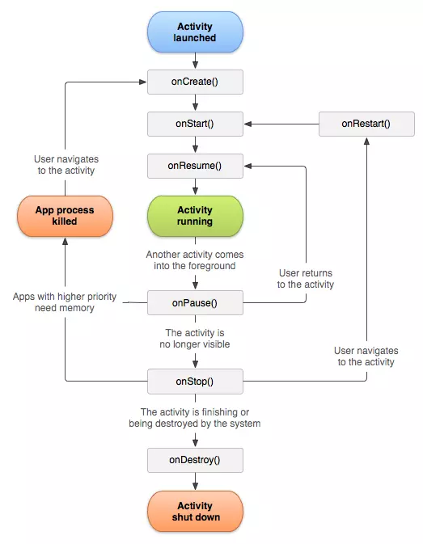

# Activity
## Foreground, background application trong android
### Foreground application
Nếu như trên máy tính, màn hình to, rộng nên có thể hiển thị cùng lúc nhiều cửa sổ / màn hình của nhiều ứng dụng. Trên mobile thì ứng dụng cũng được chạy song song nhưng vì màn hình nhỏ nên nó chỉ hiển thị 1 app vào 1 thời điểm. Ứng đang chạy, đang hiển thị cho người dùng thấy thì nó được gọi là foreground application.

### Background application
Là ứng dụng đó đó đang được chạy ngầm (chạy nền) bên trong hệ thống, người dùng không thấy nó. Tình huống thường xảy ra là, khi người dùng bấm nút Home (trên iphone, android) thì ứng dụng đó "đóng lại". Mình không thấy nó nhưng nó vẫn đang được chạy ngầm bên dưới.

### Ví dụ
Nếu bạn bật cả Chrome và Facebook cùng một lúc nhưng màn hình hiển thị Facebook, thì Facebook là foreground application, còn Chrome sẽ là background application.

Chrome vẫn có thể chạy các tác vụ nền như tải trang hoặc phát nhạc nếu bạn không tắt hẳn, nhưng vì không hiển thị và tương tác trực tiếp với bạn, nên nó được coi là ứng dụng nền sau (background)

## Activity
Một Activity trong Android là một màn hình giao diện người dùng của ứng dụng Android. Một ứng dụng Android có thể chứa một hoặc nhiều Activity, nghĩa là một hoặc nhiều màn hình giao diện. Ứng dụng Android bắt đầu bằng cách hiển thị Activity chính (Main Activity) và có thể mở thêm nhiều màn hình Activity khác tuỳ theo chức năng của ứng dụng.
### Vòng đời của Activity
#### Sơ đồ



#### Mô tả

Sơ đồ bắt đầu từ khi Activity launched, tức là khi Activity được kích hoạt, và được hệ thống để vào BackStack. Sau khi kích hoạt, lần lượt các callback `onCreate(), onStart(), onResume()` sẽ được hệ thống gọi đến.

Sau khi gọi đến các callback trên, thì Activity mới chính thức được xem là đang chạy (Activity running).

Lúc này, nếu có bất kỳ Activity nào khác chiếm quyền hiển thị, thì Activity hiện tại sẽ rơi vào trạng thái `onPause()`. Nếu cái sự hiển thị của Activity khác làm cho Activity mà chúng ta đang nói đến không còn nhìn thấy nữa thì `onStop()` sẽ được gọi tiếp theo nữa.

Nếu Acvitity đã vào `onPause()` rồi, tức là đang bị Activity khác đè lên, mà người dùng sau đó quay về lại Activity cũ, thì `onResume()` được gọi. Còn nếu Activity đã vào `onStop()` rồi, mà người dùng quay về lại Activity cũ thì `onRestart()` được gọi.

Trong cả hai trường hợp Activity rơi vào `onPause()` hoặc `onStop()`, nó sẽ rất dễ bị hệ thống thu hồi (tức là hủy) để giải phóng tài nguyên, khi này nếu quay lại Activity cũ, `onCreate()` sẽ được gọi chứ không phải `onResume()` hay `onRestart()`.

Và cuối cùng, nếu một Activity bị hủy một cách có chủ đích, chẳng hạn như người dùng nhấn nút Back ở System Bar, hay hàm `finish()` được gọi,… thì `onDestroy()` sẽ được kích hoạt và Activity kết thúc vòng đời của nó.
### Activity Back Stack
#### Task
Mỗi một ứng dụng được khởi chạy trong Android sẽ được hệ thống xem là một Task.

Khi mà người dùng nhấn vào một icon app nào đó trên màn hình chính của thiết bị. Hoặc từ danh sách các Task khi nhấn vào nút Overview như hình trên đây. Thì việc đầu tiên hệ thống sẽ xem xem Task hiện tại của ứng dụng đó có tồn tại hay không. Nếu chưa có thông tin Task của ứng dụng đó trong hệ thống, hệ thống sẽ tạo mới một Task cho nó. Còn nếu ứng dụng đã có sẵn một Task, có nghĩa là bạn đã chạy ứng dụng trước đó rồi nhưng bạn đã nhấn Home để về màn hình chính, và Task cũ của nó vẫn còn đang “sống”, thì việc của hệ thống là nhìn vào trong Task đang chạy đó để tìm kiếm vài thông tin, trong đó có thông tin về Activity mà Task đó đang hiển thị là gì, để mà tiếp tục hiển thị lại cho bạn.

Trong Task của mỗi ứng dụng sẽ chứa đựng thông tin về Back Stack. Chính Back Stack này sẽ nói cho hệ thống biết nên hiển thị Activity nào của ứng dụng.
#### Back Stack
Back Stack hoạt động như cấu trúc dữ liệu stack. Back Stack chứa các Activity, việc hệ thống quản lý xem một Activity nào được hiển thị, và Activity nào phải nhường chỗ cho Activity khác, đều chỉ dựa vào cái ngăn chứa này.

### Intent
Intent trong Android là những object tin nhắn không đồng bộ mà bạn có thể sử dụng để yêu cầu hành động từ các thành phần Android khác. Bên cạnh đó nó cho phép bạn tương tác với các thành phần từ các ứng dụng tương tự cũng như với các thành phần do các ứng dụng khác đóng góp. Ví dụ: một Activity có thể bắt đầu một Activity bên ngoài để chụp ảnh.

Intents có thể được sử dụng để:

- Mở một Activity mới và truyền dữ liệu cho Activity đó
- Mở một Fragments / Giao tiếp giữa các Fragments.
- Mở hoặc dừng một Service
- Hoặc có thể gọi một Activity bằng Broadcast Receiver

#### Phân loại Intent
Có 2 loại intent:

**1. Explicit Intent – Intent dạng tường minh** 

Hiểu đơn giản explicit intents là intent xác định rõ và cụ thể các thành phần tham gia hành động.

Ví dụ: Giả sử bạn có hai Activity trong ứng dụng: `MainActivity` và `DetailActivity`. Bạn muốn từ `MainActivity` chuyển đến `DetailActivity`.
```java
val intent = Intent(this, DetailActivity::class.java)
startActivity(intent)
```
> `this`: Đại diện cho context của `Activity` hiện tại (trong trường hợp này là `MainActivity`).
>
> `DetailActivity::class.java`: Là Activity mà bạn muốn Intent chuyển đến.

Khi bạn gọi `startActivity(intent)`, `DetailActivity` sẽ được khởi chạy.

**2. Implicit Intent – Intent không tường minh**

Loại Intents này chỉ ra hành động cần được thực hiện (action) và dữ liệu cho hành động đó (data).

Khi bạn sử dụng implicit intent, hệ thống Android sẽ tìm kiếm tất cả thành phần thích hợp để start bằng cách cách so sánh nội dung của Intent được gửi với các Intent filter được khai báo trong ứng dụng khác.
Nếu intent đc gửi đó khớp với intent filter trong một component hoặc một ứng dụng nào đó, thì ngay lập tức hệ thống sẽ khởi động thành phần đó và cung cấp cho nó intent ban đầu được gửi . Nếu nhiều intent filter tương thích thì hệ thống sẽ hiển thị hộp thoại để người dùng có thể chọn ứng dụng nào sẽ sử dụng.

**Ví dụ 1:** chúng ta cần phải hiển thị một vị trí lên bản đồ. Thay vì chúng ta phải mã hóa và viết hẳn module bản đồ để hiển thị thì có thể gửi vị trí đó vào intent, rồi Android sẽ tự tìm xem có ứng dụng nào phù hợp ( như Google Map chẳng hạn) để hiển thị nó.

Ví dụ 2: Giả sử bạn muốn mở một trang web trong trình duyệt:
```java
val intent = Intent(Intent.ACTION_VIEW)
intent.data = Uri.parse("https://www.example.com")
startActivity(intent)
```
> `Intent.ACTION_VIEW`: Là một hành động chung mà hệ thống hiểu, trong trường hợp này là để hiển thị nội dung (thường là trang web, hình ảnh, v.v.).
> 
> `Uri.parse("https://www.example.com")`: Xác định nội dung cần được hiển thị, ở đây là URL của trang web.
>
> `startActivity(intent)`: Gửi Intent này đến hệ thống. Hệ thống sẽ tìm kiếm ứng dụng nào có thể xử lý Intent này (ví dụ: trình duyệt web) và khởi chạy nó để mở URL được chỉ định.

### Truyền dữ liệu giữa 2 Activity
Chúng ta chỉ có duy nhất một cách để truyền dữ liệu qua lại giữa các Activity. Đó là cách “nhét” dữ liệu vào Intent và nhờ thành phần này chuyển giúp. Hệ thống sẽ đảm bảo dữ liệu được gửi qua “nguyên vẹn” và kịp thời ở Activity mới.

Dữ liệu được “nhét” vào trong Intent và được lấy ra khỏi Intent theo các cặp dữ liệu dạng key/value.
Key ở đây là một chuỗi, giúp định danh cho dữ liệu value. Nếu bạn để vào trong Intent cặp key/value nào, thì bạn phải lấy ra bởi cặp key/value đó, phải đảm bảo khai báo đúng key và lấy ra đúng kiểu dữ liệu của value khi để vào.

Có 2 hình thức sử dụng Intent để truyền dữ liệu là `Extra` và `Bundle`.

#### Dùng Extra
Có thể nói, truyền nhận dữ liệu bằng Extra là cách dễ nhất.

- Đầu tiên, để gửi dữ liệu bằng Extra. Sau khi khai báo Intent và trước khi bạn dùng nó để kích hoạt activity nào đó, bạn có thể sử dụng các phương thức được nạp chồng của nó để gửi dữ liệu. Các phương thức đó có chung một tên là `putExtra()`. Với mỗi `putExtra()` như vậy, tham số đầu tiên chính là key, tham số thứ hai tương tự chính là value.

    - Ví dụ:
    ```java
    val intent = Intent(this, ContactActivity::class.java)
    intent.putExtra("Key_1", "Truyền một String")  // Truyền một String
    intent.putExtra("Key_2", 5)                    // Truyền một Int
    intent.putExtra("Key_3", true)                 // Truyền một Boolean
    startActivity(intent)
    ```
- ContactActivity sẽ được kích hoạt với dữ liệu là ba cặp key/value được truyền qua. Ở phương thức `onCreate()` hoặc bất cứ chỗ nào của ContactActivity, bạn đều có thể lấy bất cứ cặp key/value nào ra dùng. Bằng cách gọi đến `getXxxExtra().` (`Xxx` là kiểu dữ liệu phù hợp với value).
    - Ví dụ:
    ```java
    override fun onCreate(savedInstanceState: Bundle?) {
        super.onCreate(savedInstanceState)
        setContentView(R.layout.activity_contact)
    
        // Các dòng code khác...
    
        val intent = intent
        val value1 = intent.getStringExtra("Key_1")
        val value2 = intent.getIntExtra("Key_2", 0)
        val value3 = intent.getBooleanExtra("Key_3", false)
    }
    ```
## Context
Context là thành phần trong ứng dụng android cung cấp quyền truy cập thông tin về các trạng thái của ứng dụng đó. Nó cung cấp các Activities, Fragments và Services truy cập tới các file tài nguyên, hình ảnh, theme, style và các file nằm ngoài ứng dụng. Nó cũng cho phép truy cập vào các thành phần chính của Android như layout, keyboard và tìm kiếm các content providers.

Trong Android, Context là khái niệm quan trọng nhất và việc sử dụng sai ngữ cảnh sẽ dẫn đến rò rỉ bộ nhớ. Activity đề cập đến một màn hình riêng lẻ và Application đề cập đến toàn bộ ứng dụng và cả hai đều kế thừa lớp Context.
### Ví dụ thực tế
Một người đến thăm một khách sạn. Anh ấy cần bữa sáng, bữa trưa và bữa tối vào thời điểm thích hợp. Ngoại trừ những việc này, còn có rất nhiều việc khác, anh muốn làm trong thời gian lưu trú. Vậy làm sao anh ta có được những thứ này? Anh ta sẽ nhờ người phục vụ phòng mang những thứ này đến cho anh ta. Vì vậy, ở đây **người phục vụ phòng** là **Context** nếu coi **người khách** là một **Activity** và **khách sạn** là **ứng dụng** của bạn , cuối cùng, **bữa sáng, bữa trưa và bữa tối** là **resources**.

### Phân loại Context trong Android
Có 2 loại Context trong Android:
- Application Context
- Activity Context

Tổng thể của hệ thống phân cấp ứng dụng như sau:


Có thể thấy rằng trong `Sample Application`, Context gần nhất là **Application Context**. Trong `Activity1` và `Activity2` có cả **Activity Context** và **Application Context**, Context gần nhất với cả hai Activity là **Activity Context** của chúng.


