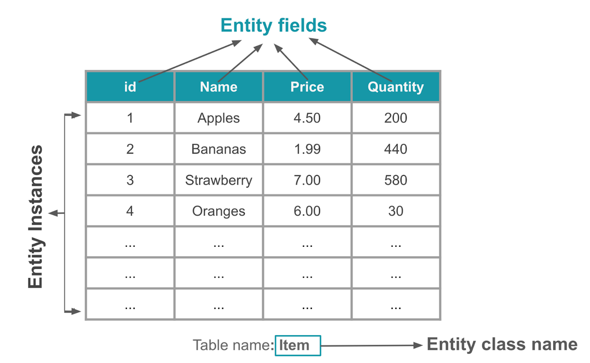
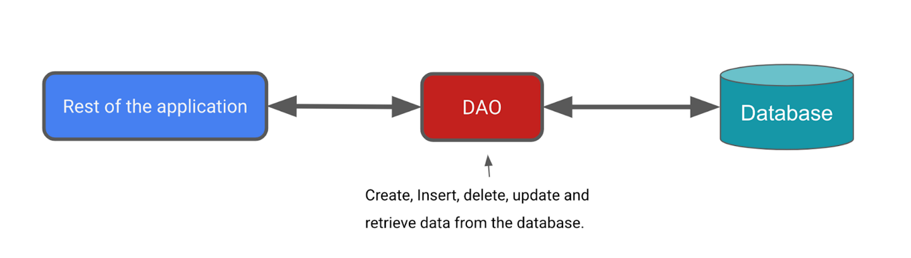

# Room
## So sánh SQLite và MySQL
SQLite và MySQL đều là hệ quản trị cơ sở dữ liệu quan hệ mã nguồn mở. Hãy cùng so sánh chi tiết sự khác biệt giữa hai hệ thống này.

### Sự khác biệt về kiến trúc – SQLite vs MySQL
- SQLite là một dự án mã nguồn mở có sẵn trong miền công cộng.
- MySQL là một dự án mã nguồn mở được sở hữu bởi Oracle.

SQLite là cơ sở dữ liệu không có máy chủ và tự quản. Điều này còn được gọi là cơ sở dữ liệu nhúng, có nghĩa là công cụ cơ sở dữ liệu chạy như một phần của ứng dụng.

Ngược lại, MySQL yêu cầu một máy chủ để chạy. MySQL cần có kiến trúc client-server để tương tác qua mạng.

### Hỗ trợ kiểu dữ liệu – SQLite vs MySQL
SQLite hỗ trợ các kiểu dữ liệu: Blob, Integer, Null, Text, Real.

MySQL hỗ trợ các kiểu dữ liệu sau:

Tinyint, Smallint, Mediumint, Int, Bigint, Double, Float, Real, Decimal, Double precision, Numeric, Timestamp, Date, Datetime, Char, Varchar, Year, Tinytext, Tinyblob, Blob, Text, MediumBlob, MediumText, Enum, Set, Longblob, Longtext.

Như bạn có thể thấy, MySQL linh hoạt hơn nhiều khi nói đến kiểu dữ liệu.

### Lưu trữ và di động – SQLite vs MySQL
Thư viện SQLite có kích thước khoảng 250 KB, trong khi máy chủ MySQL có kích thước khoảng 600 MB. SQLite trực tiếp lưu thông tin vào một tệp duy nhất, giúp dễ dàng sao chép. Không yêu cầu cấu hình phức tạp, và quá trình này có thể thực hiện với sự hỗ trợ tối thiểu.

Trước khi sao chép hoặc xuất MySQL, bạn cần nén nó thành một tệp duy nhất. Đối với các cơ sở dữ liệu lớn hơn, điều này sẽ mất nhiều thời gian.

### Truy cập đa người dùng và khả năng mở rộng – SQLite vs MySQL
SQLite không có chức năng quản lý người dùng cụ thể và do đó không phù hợp với việc truy cập đa người dùng. MySQL có một hệ thống quản lý người dùng được xây dựng tốt, có thể xử lý nhiều người dùng và cấp các mức quyền truy cập khác nhau.

SQLite phù hợp với các cơ sở dữ liệu nhỏ. Khi cơ sở dữ liệu phát triển, yêu cầu về bộ nhớ cũng tăng lên khi sử dụng SQLite. Tối ưu hóa hiệu suất cũng khó khăn hơn khi sử dụng SQLite và nó có một số hạn chế khi ghi dữ liệu.

Ngược lại, MySQL dễ dàng mở rộng và có thể xử lý cơ sở dữ liệu lớn hơn với ít nỗ lực hơn.

### Bảo mật và dễ dàng thiết lập – SQLite vs MySQL
SQLite không có cơ chế xác thực tích hợp. Các tệp cơ sở dữ liệu có thể được truy cập bởi bất kỳ ai. Tuy nhiên, MySQL đi kèm với nhiều tính năng bảo mật tích hợp. Điều này bao gồm xác thực bằng tên người dùng, mật khẩu, và SSH.

SQLite không yêu cầu nhiều cấu hình và dễ dàng thiết lập. MySQL yêu cầu nhiều cấu hình hơn so với SQLite và cũng có nhiều hướng dẫn thiết lập hơn.

### Khi nào nên sử dụng SQLite
Có một số trường hợp khi SQLite có thể hiệu quả hơn:

- Phát triển các ứng dụng độc lập nhỏ.
- Các dự án nhỏ không yêu cầu mở rộng nhiều.
- Khi bạn cần đọc và ghi trực tiếp từ đĩa.
- Phát triển cơ bản và kiểm thử.
### Khi nào nên sử dụng MySQL
Dưới đây là một số tình huống mà MySQL là lựa chọn tốt hơn:

- Truy cập ứng dụng bởi nhiều người dùng.
- Khi người dùng cần các tính năng bảo mật và xác thực mạnh.
- Với các hệ thống phân tán.
- Với các ứng dụng yêu cầu cơ sở dữ liệu lớn hơn.
- Với các dự án yêu cầu khả năng mở rộng nhiều.
- Các ứng dụng web.
- Khi phát triển các giải pháp tùy chỉnh.
### Ưu và nhược điểm – SQLite vs MySQL

|        | Ưu điểm                                                                                                                                                                                                     | Nhược điểm                                                                                                                                                    |
|--------|-------------------------------------------------------------------------------------------------------------------------------------------------------------------------------------------------------------|---------------------------------------------------------------------------------------------------------------------------------------------------------------|
| SQLite | - Dựa trên tệp và dễ dàng thiết lập, sử dụng. <br>- Dễ dàng di động. <br> - Sử dụng cú pháp SQL tiêu chuẩn với một số điều chỉnh nhỏ. <br> - Dễ sử dụng.                                                    | - Thiếu các tính năng quản lý người dùng và bảo mật.<br> - Không dễ dàng mở rộng. <br> - Không phù hợp với các cơ sở dữ liệu lớn. <br> - Không thể tùy chỉnh. |
| MySQL  | - Dễ sử dụng. <br> - Cung cấp nhiều tính năng liên quan đến cơ sở dữ liệu. <br> - Tính năng bảo mật tốt. <br> - Dễ dàng mở rộng và phù hợp với các cơ sở dữ liệu lớn. <br> - Hiệu suất và tốc độ tốt. <br> - Cung cấp quản lý người dùng và kiểm soát truy cập đa người dùng. | - Cần có kiến thức kỹ thuật để thiết lập. <br> - Cú pháp hơi khác so với SQL thông thường.                                                                                                               |

## Room Database
Room database được phát triển và cải tiến từ sqlite. Room database giúp đơn giản hoá việc code,và giảm thiểu các công đoạn liên quan đến cơ sở dữ liệu.

Bản chất Room database là abstract layer gồm cơ sở dữ liệu chuẩn SQLite được Android thông qua.

### Cài đặt thư viện
```
dependencies {
    val room_version = "2.6.1"

    implementation("androidx.room:room-runtime:$room_version")
    implementation("androidx.room:room-ktx:$room_version")
    
    // To use Kotlin annotation processing tool (kapt)
    kapt("androidx.room:room-compiler:$room_version")
}
```
### Các thành phần bên trong Room


#### Entity
Entity là một lớp, nhưng khi biên dịch Room sẽ dựa vào mỗi lớp Entity mà bạn đã định nghĩa để tạo ra các Table tương ứng. Các thuộc tính bên trong lớp Entity chính là các cột của Table đó.


Ví dụ:
```
@Entity(tableName = "note_table")
data class Note(
    @PrimaryKey(autoGenerate = true) val id: Int = 0,
    @ColumnInfo(name = "title") val title: String,
    @ColumnInfo(name = "content") val content: String
)
```

- **@Entity** – Bạn phải khai báo annotation này trước mỗi Entity để Room hiểu rằng đây là một Entity, và vì vậy nó sẽ giúp tạo ra một Table bên trong cơ sở dữ liệu.
- **@PrimaryKey** – Annotation này giúp chúng ta định nghĩa thuộc tính nào là khóa chính của Table.
- **@ColumnInfo** – Chúng ta dùng Annotation này với thuộc tính kèm theo là name để đặt lại tên cho Column (cột) của Table.


#### DAO (Data Access Object)
Đây là một đối tượng chịu trách nhiệm làm việc chính với các Entity trong cơ sở dữ liệu. Đối tượng này sẽ giúp bạn định nghĩa các phương thức tương tác với các Entity, chẳng hạn như, `insert(), getAll(), delete(),….`



Ví dụ:
```java
@Dao
interface NoteDao {
 
    @Query("SELECT * FROM note_table ORDER BY id ASC")
    suspend fun getAllNotes(): List<Note>
 
    @Query("SELECT * FROM note_table WHERE title LIKE :title")
    suspend fun findNoteByTitle(title: String): Note
 
    @Insert
    suspend fun insert(note: Note)
 
    @Delete
    suspend fun delete(note: Note)
}
```
Một DAO phải là một interface.
- **@Dao** – Cũng giống như **@Entity** trên kia. Annotation Dao này giúp Room hiểu rằng đây là một DAO và sẽ hành xử với các phương thức đi kèm nó với các annotation như sau.
- **@Insert, @Update, @Delete** – Là các annotation liên quan đến các chức năng thêm, sửa, xóa đối với các table của cơ sở dữ liệu.
- **@Query** – Annotation Query giúp chúng ta viết các câu truy vấn vào trong đó.
#### RoomDatabase
Room Database sẽ bao bọc lấy cơ sở dữ liệu. Nó giúp khởi tạo một “cửa ngõ” để ứng dụng bắt đầu can thiệp với cơ sở dữ liệu. Ở Room Database chúng ta có thể khai báo ra các Entity cần dùng, các DAO liên quan đến các Entity. Và nơi đây cũng là nơi định nghĩa phiên bản của cơ sở dữ liệu của ứng dụng.

RoomDatabase phải là một lớp abstract. Sau đó nó phải kế thừa từ lớp **RoomDatabase**.
Bên trong lớp này bạn phải xây dựng các phương thức abstract để lấy về các DAO đã khai báo.

Ví dụ:
```java
@Database(entities = [Note::class], version = 1)
abstract class NoteRoomDatabase : RoomDatabase() {
 
    abstract fun noteDao(): NoteDao
 
    companion object {
        private var INSTANCE: NoteRoomDatabase?= null
        private val DB_NAME = "note_db"
 
        fun getDatabase(context: Context): NoteRoomDatabase {
            val tempInstance = INSTANCE
            if (tempInstance != null) {
                return tempInstance
            }
            synchronized(this) {
                val instance = Room.databaseBuilder(
                    context.applicationContext,
                    NoteRoomDatabase::class.java,
                    DB_NAME
                ).build()
                INSTANCE = instance
                return instance
            }
        }
    }
}
```
**@Database** – Như bao thành phần khác của Room trên kia, bạn phải khai báo annotation là Database cho lớp này để Room biết đây là một RoomDatabase. Với khai báo này bạn truyền thêm thông tin danh sách các Entity trong ứng dụng.

## Relationship trong Room
### Quan hệ 1-1


```java
@Entity
data class Dog(
    @PrimaryKey val dogId: Long,
    val dogOwnerId: Long,
    val name: String,
    val cuteness: Int,
    val barkVolume: Int,
    val breed: String
)

@Entity
data class Owner(@PrimaryKey val ownerId: Long, val name: String)
```
- Trong trường hợp chúng ta muốn hiển thị list tất cả Dog và Owner của nó trong một màn hình. Để làm được điều này, chúng ta cần tạo một table DogAndOnwer data class:
```java
data class DogAndOwner(
    val owner: Owner,
    val dog: Dog
)
```
Bước tiếp theo với SQLite, chúng ta phải cần:
- Thực hiện 2 query: một cho get tất cả các Owners, và một cho get tất cả các Dogs dựa trên những Id có được từ query trước đó.
- Sau đó, phải handle mapping các object đó:
```java
SELECT * FROM Owner
SELECT * FROM Dog
    WHERE dogOwnerId IN (ownerId1, ownerId2, …)
```
- Trong khi đó ở ROOM , chúng ta không cần phải thực hiện 2 query và phải xử lý mapping, thay vào đó chỉ cần thêm @Relation annotation.
- Trong ví dụ này, khi mà table Dog đã có thông tin owner của nó, chúng ta sẽ thêm @Relation annotation vào dog variable để xác định rằng column trên parent (Owner entity) tương ứng với dogId đó.
```java
data class DogAndOwner(
    @Embedded val owner: Owner,
    @Relation(
         parentColumn = "ownerId",
         entityColumn = "dogOwnerId"
    )
    val dog: Dog
)
```
Trong DAO:
```java
@Transaction
@Query("SELECT * FROM Owner")
fun getDogsAndOwners(): List<DogAndOwner>
```
### Quan hệ 1-n


Sửa lại dataclass:
```java
data class OwnerWithDogs(
    val owner: Owner,
    val dogs: List<Dog>
)
```
Tương tự như trường hợp Một-một, để tránh phải query tuần tự 2 lần, chúng ta có thể define mỗi quan hệ Một-nhiều giữa Owner và Dog bằng cách thêm annotation @Retention trước dogs như sau:
```java
data class OwnerWithDogs(
     @Embedded val owner: Owner,
     @Relation(
          parentColumn = "ownerId",
          entityColumn = "dogOwnerId"
     )
     val dogs: List<Dog>
)
```
Và DAO chỉ cần thêm 1 query tương tự như trên:
```java
@Transaction
@Query("SELECT * FROM Owner")
fun getDogsAndOwners(): List<OwnerWithDogs>
```

### Quan hệ n-n


Trường hợp này, khi Dogs có nhiều Owners chúng ta cần phải có nhiều entry cho cùng một dogOwnerId của Dogs, ứng với các ownerId khác nhau. Vì dogIId là khóa chính trong Dog, chúng ta không thể insert nhiều Dogs với chung id. Để khắc phục điều này chúng ta sẽ tạo ra table kết hợp (bảng phụ tham chiếu chéo) giữa các cặp (dogId,ownerId)

```java
@Entity(primaryKeys = ["dogId", "ownerId"])
data class DogOwnerCrossRef(
    val dogId: Long,
    val ownerId: Long
)
```
Trong ROOM, chúng ta sẽ cần update lại table OwnerWithDogs và thông báo cho ROOM rằng để get được Dogs, nó cần sử dụng bảng phụ DogOwnerCrossRef. Chung ta tạo tham chiếu với table này bằng cách sử dụng một Junction:

```java
data class OwnerWithDogs(
    @Embedded val owner: Owner,
    @Relation(
         parentColumn = "ownerId",
         entityColumn = "dogId",
         associateBy = Junction(DogOwnerCrossRef::class)
    )
    val dogs: List<Dog>
)
```
DAO:
```java
@Transaction
@Query("SELECT * FROM Owner")
fun getOwnersWithDogs(): List<OwnerWithDogs>
```
