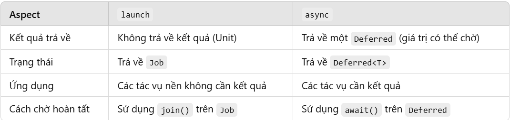

# KOTLIN BASIC COROUTINE 
## Lập trình bất đồng bộ
Trong nhiều thập kỷ, với tư cách là các nhà phát triển, chúng ta thường xuyên đối mặt với một vấn đề cần giải quyết – làm thế nào để ngăn ứng dụng của chúng ta bị chặn. Dù đang phát triển ứng dụng cho desktop, di động hay thậm chí là ứng dụng phía server, chúng ta đều muốn tránh tình trạng người dùng phải chờ đợi, hoặc tệ hơn nữa là gây ra các nút thắt cổ chai làm ngăn cản khả năng mở rộng của ứng dụng.

Lập trình bất đồng bộ là một khía cạnh quan trọng trong phát triển phần mềm hiện đại, cho phép các ứng dụng thực hiện nhiều tác vụ đồng thời, chẳng hạn như lấy dữ liệu từ các máy chủ từ xa, thực hiện các thao tác I/O, và nhiều hơn nữa mà không chặn luồng chính.

Có nhiều kỹ thuật lập trình bất đồng bộ, bao gồm:

- Đa luồng (Threading)
- Callback
- Futures, promises, và các phương pháp khác
- Reactive Extensions
- Coroutines

## Thread
Cho đến nay, các luồng (Thread) có lẽ là cách tiếp cận nổi tiếng nhất để tránh chặn các ứng dụng.

Ví dụ:
```java
fun main(args: Array<String>) {
    val thread1 = Thread {
        for(i in 1..10) {
            print("$i ")
        }
    }

    val thread2 = Thread {
        for(i in 11..20) {
            print("$i ")
        }
    }
    thread1.start()
    thread2.start()
}
//Output: 1 2 3 4 5 6 11 12 13 14 15 7 8 9 10 16 17 18 19 20 
```
Nếu một tiến trình mất quá nhiều thời gian để chạy sẽ chặn giao diện người dùng, ta có thể chạy nó trong luồng riêng biệt. Điều này sẽ giúp tránh việc giao diện người dùng bị chặn.

Đây là một kỹ thuật phổ biến, nhưng có một số nhược điểm:
- Các luồng (threads) không rẻ. Các luồng yêu cầu chuyển đổi ngữ cảnh, điều này rất tốn tài nguyên.

- Các luồng không phải là vô hạn. Số lượng luồng có thể được khởi chạy bị giới hạn bởi hệ điều hành. Trong các ứng dụng phía máy chủ, điều này có thể gây ra một nút thắt cổ chai nghiêm trọng.

- Các luồng không phải lúc nào cũng khả dụng. Một số nền tảng, chẳng hạn như JavaScript, thậm chí không hỗ trợ các luồng.

- Các luồng không dễ sử dụng. Gỡ lỗi các luồng và tránh các điều kiện tranh chấp là những vấn đề phổ biến mà chúng ta gặp phải trong lập trình đa luồng.

## Coroutine
Cách tiếp cận của Kotlin khi làm việc với mã bất đồng bộ là sử dụng coroutines, dựa trên ý tưởng về các phép tính có thể tạm ngưng (suspendable computations), tức là một hàm có thể tạm dừng thực thi tại một điểm nào đó và tiếp tục sau đó.

Một trong những lợi ích của coroutines là đối với lập trình viên, việc viết mã không chặn (non-blocking code) gần như giống với viết mã chặn (blocking code). Mô hình lập trình không thực sự thay đổi nhiều, giúp cho việc viết mã trở nên dễ hiểu và dễ quản lý hơn.

Ví dụ:
```java
fun postItem(item: Item) {
    launch {
        val token = preparePost()
        val post = submitPost(token, item)
        processPost(post)
    }
}

suspend fun preparePost(): Token {
    // makes a request and suspends the coroutine
    return suspendCoroutine { /* ... */ }
}
```
Đoạn mã này sẽ khởi chạy một thao tác chạy lâu mà không chặn luồng chính. Hàm `preparePost` là một hàm có thể tạm ngưng (suspendable function), vì vậy nó được đặt từ khóa `suspend` ở trước. Điều này có nghĩa là hàm sẽ thực thi, tạm dừng và tiếp tục tại một thời điểm nào đó sau đó.

### Ưu điểm của Coroutine so với những kỹ thuật khác:
- Hàng nghìn coroutines có thể được bắt đầu cùng một lúc, còn nếu hàng nghìn thread chạy thì performance sẽ trả 1 cái giá rất đắt. Giá phải trả cho 1 thread là rất đắt, còn coroutine thì gần như là hàng free.
- Dễ code, dễ debug.
- Kotlin Coroutine là nền tảng độc lập. Cho dù bạn đang viết code JavaScript hay bất kỳ nền tảng nào khác, cách viết code implement Kotlin Coroutine sẽ đều giống nhau.

### Blocking vs Non-Blocking
Blocking và Non-Blocking chủ yếu được đề cập khi muốn miêu tả về cách một chương trình thực hiện các dòng lệnh của nó.

- **Blocking**: Chương trình theo mô hình Blocking có nghĩa là các dòng lệnh được thực hiện một cách tuần tự. Nếu dòng lệnh là các thao tác cần nhiều thời gian xử lí như liên quan đến IO hay network thì bản thân nó sẽ trở thành vật cản cho các lệnh xử lí phía sau mặc dù chúng không liên quan gì đến nhau.
- **Non-Blocking**: các dòng lệnh không nhất thiết phải thực hiện tuần tự hay đồng bộ với nhau nếu không có phụ thuộc về kết quả. Những dòng lệnh này được thực hiện theo cách không đồng bộ (Asynchronous), và đi theo mỗi dòng lệnh thường có một callback là đoạn mã sẽ được thực hiện ngay sau khi có kết quả trả về từ dòng lệnh không đồng bộ. 

### Normal function vs Suspend function
- Normal function:
Thread phải chạy hết function A rồi mới đến function B


- Suspend function:

Suspend function có khả năng ngừng hay gián đoạn việc thực thi một lát (trạng thái ngừng là trạng thái suspend) và có thể tiếp tục thực thi lại khi cần thiết.


FunctionA bị gián đoạn để functionB chạy và sau khi functionB chạy xong thì function A tiếp tục chạy tiếp.

> Chú ý: Chỉ có thể được gọi suspend function bên trong một suspend function khác hoặc bên trong một coroutine.

Ví dụ:
```java
suspend fun sayHello() {
    delay(1000L) //suspend function
    println("Hello!")
}
```

### Coroutine
`Coroutines = Co + Routines` Ở đây, `Co` có nghĩa là hợp tác và `Routines` có nghĩa là các chức năng. Có nghĩa là khi các chức năng hợp tác với nhau, chúng ta gọi nó là `Coroutines`.

Ví dụ: Giả sử chúng ta có 2 function là functionA và functionB:
```java
fun functionA(case: Int) {
    when (case) {
        1 -> {
            taskA1()
            functionB(1)
        }
        2 -> {
            taskA2()
            functionB(2)
        }
        3 -> {
            taskA3()
            functionB(3)
        }
        4 -> {
            taskA4()
            functionB(4)
        }
    }
}
```

```java
fun functionB(case: Int) {
    when (case) {
        1 -> {
            taskB1()
            functionA(2)
        }
        2 -> {
            taskB2()
            functionA(3)
        }
        3 -> {
            taskB3()
            functionA(4)
        }
        4 -> {
            taskB4()
        }
    }
}
```
Gọi function A:
```java
functionA(1)
```

Tại đây, functionA sẽ thực hiện taskA1 và sau đó trao quyền điều khiển cho functionB để thực thi taskB1.

Sau đó, functionB sẽ thực hiện taskB1 và trả lại điều khiển cho functionA để thực thi taskA2, v.v.

Điều này nghĩa là functionA và functionB đang hợp tác với nhau.

Với Kotlin Coroutines, việc hợp tác trên có thể được thực hiện rất dễ dàng mà không cần sử dụng when hoặc switch case mà tôi đã sử dụng trong ví dụ trên.

Định nghĩa chính xác của Coroutines: Một framework để quản lý đồng thời theo cách đơn giản và hiệu quả hơn với thread nhẹ được viết trên đầu threading framework thực tế để tận dụng tối đa nó bằng cách sử dụng tính chất hợp tác của các hàm.


### CoroutineScope
Hãy tưởng tượng, khi bạn chạy 10 coroutine để thực thi 10 task trong 1 activity nào đó. Khi Activity đó bị `destroy`, các result của các task trên không còn cần thiết nữa. Làm thế nào để stop 10 coroutine kia để tránh memory leaks. Tất nhiên, bạn có thể stop thủ công từng coroutine bằng hàm `cancel()`, nhưng Kotlin Coroutines cung cấp một thằng có khả năng quản lý vòng đời của cả 10 coroutine kia: `CoroutineScope`

`CoroutineScope` là một phạm vi (scope) cho các `coroutine`, đảm bảo các coroutine được khởi chạy trong phạm vi này có thể bị hủy nếu phạm vi bị hủy. Mỗi CoroutineScope có một `Job` làm nhiệm vụ quản lý và hủy coroutine.

#### Tạo CoroutineScope
Để tạo một CoroutineScope, bạn cần cung cấp một CoroutineContext. Dưới đây là một số cách tạo:

- Sử dụng `GlobalScope`: Đây là một CoroutineScope toàn cục, tồn tại trong toàn bộ ứng dụng, không có cơ chế tự động hủy. Thường được dùng cho các tác vụ tồn tại suốt vòng đời ứng dụng (như tải tài nguyên ứng dụng).
```
GlobalScope.launch {
    // Coroutine chạy trong phạm vi toàn cục
}
```

- Sử dụng `MainScope`: Thường được sử dụng trong các ứng dụng Android vì nó tạo ra một phạm vi với Dispatchers.Main, thích hợp cho các tác vụ UI.
```java
val scope = MainScope()
scope.launch {
    // Coroutine chạy trên luồng chính
}
```
- Tạo CoroutineScope tùy chỉnh:
```java
val customScope = CoroutineScope(Dispatchers.IO + Job())
customScope.launch {
    // Coroutine chạy trong phạm vi tùy chỉnh với IO dispatcher
}
```

Trong Android, CoroutineScope thường được sử dụng với ViewModel để quản lý vòng đời của coroutine cùng với ViewModel hoặc Lifecycle.
```java
class MyViewModel : ViewModel() {
    init {
        viewModelScope.launch {
            // Coroutine chạy trong viewModelScope, sẽ bị hủy khi ViewModel bị hủy
        }
    }
}
```

#### Job
Trong Kotlin Coroutines, Job là một thành phần quan trọng trong việc quản lý các coroutine. Nó đóng vai trò quản lý và giám sát vòng đời của một coroutine.

`Job` đại diện cho một tác vụ bất đồng bộ có thể hủy được. Khi bạn khởi tạo một coroutine với `launch` hoặc `async`, bạn nhận lại một `Job` đại diện cho coroutine đó. `Job` giúp bạn theo dõi và kiểm soát coroutine, bao gồm hủy hoặc kiểm tra trạng thái của coroutine.

Khi bạn khởi chạy một coroutine với launch hoặc async, bạn nhận lại một đối tượng Job để quản lý coroutine đó.

```java
val job = CoroutineScope(Dispatchers.Default).launch {
    // Một coroutine đang thực thi
    delay(1000)
    println("Coroutine hoàn thành công việc.")
}
```

- Các phương thức và thuộc tính của Job:
    - `cancel()`: Dùng để hủy coroutine. Khi gọi job.`cancel()`, coroutine sẽ ngừng thực thi và chuyển sang trạng thái `Cancelled`.
    - `join()`: Dùng để đợi coroutine hoàn thành trước khi tiếp tục. `join()` sẽ tạm dừng coroutine đang gọi cho đến khi coroutine được liên kết hoàn thành.
    - `isActive`: Trả về true nếu coroutine đang ở trạng thái `Active`, và false nếu coroutine đã bị hủy hoặc hoàn tất.
#### Dispatcher
Trong Kotlin Coroutines, Dispatcher quyết định luồng (thread) mà coroutine sẽ chạy trên đó. Nó giống như một bộ định hướng luồng cho các coroutine, giúp điều phối công việc bất đồng bộ trên các luồng thích hợp, tối ưu hóa hiệu suất và đảm bảo tính nhất quán của dữ liệu.

Kotlin cung cấp các loại Dispatcher chính sau:
- `Dispatchers.Default`: Dùng cho các tác vụ nặng về CPU (như tính toán, xử lý dữ liệu phức tạp). Nó sử dụng một tập hợp các luồng được tối ưu hóa cho các tác vụ này và phân bổ dựa trên số lõi CPU.
- `Dispatchers.IO`: Dùng cho các tác vụ I/O (như truy cập mạng, đọc/ghi vào cơ sở dữ liệu hoặc file). Nó có thể mở rộng hơn `Dispatchers.Default` để xử lý số lượng lớn yêu cầu I/O.
- `Dispatchers.Main`: Dùng cho các tác vụ liên quan đến UI (trong Android, các thao tác với giao diện cần được thực thi trên luồng chính). Chỉ sử dụng `Dispatchers.Main` cho các tác vụ nhẹ, vì nó không dành cho các công việc nặng.
- `Dispatchers.Unconfined`: Không bị ràng buộc với một luồng cụ thể. Nó bắt đầu chạy trên luồng mà nó được gọi và có thể chuyển sang luồng khác trong quá trình thực thi. `Dispatchers.Unconfined` ít được dùng trong thực tế vì tính không ổn định của nó, và chỉ nên dùng cho các trường hợp đặc biệt.

#### launch, async, await
- **launch**: `launch` là một hàm khởi tạo coroutine và trả về một Job để quản lý coroutine. launch thường dùng cho các tác vụ không trả về kết quả mà chỉ cần chạy trong nền, ví dụ như cập nhật giao diện hoặc ghi dữ liệu vào cơ sở dữ liệu.
    - `launch` không có giá trị trả về. Nó sẽ thực thi các lệnh bên trong coroutine nhưng không cần đợi coroutine hoàn thành.
```java
GlobalScope.launch {
    println("Coroutine bắt đầu")
    delay(1000)  // Giả lập tác vụ mất thời gian
    println("Coroutine hoàn thành")
}
```

- **async**: `async` cũng là một hàm khởi tạo coroutine, nhưng nó khác với launch ở chỗ nó trả về một đối tượng `Deferred<T>` (một loại con của `Job`). Đối tượng Deferred này có thể lưu trữ kết quả của coroutine và cho phép chúng ta đợi kết quả khi cần.
  - `async` dùng cho các tác vụ trả về kết quả. Nó có thể chạy song song với các coroutine khác. Để lấy kết quả từ async, chúng ta sử dụng `await`.
- **await**: `await` là một hàm được sử dụng với Deferred để đợi và nhận lại kết quả của coroutine đã khởi tạo bằng `async`.
  - `await` sẽ tạm dừng coroutine đang gọi cho đến khi coroutine bên trong `async` hoàn tất và trả về giá trị.
```java
val deferredResult = GlobalScope.async {
    println("Bắt đầu tính toán")
    delay(1000)  // Giả lập tác vụ mất thời gian
    42  // Trả về kết quả
}

runBlocking {
    println("Kết quả: ${deferredResult.await()}")
}
```
#### So sánh `launch` và `async`:
