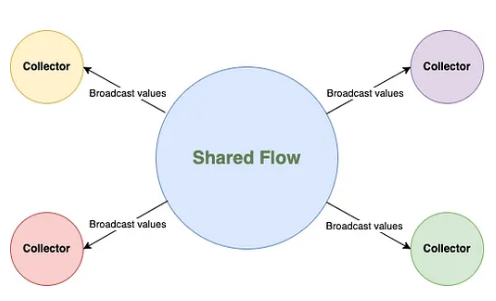
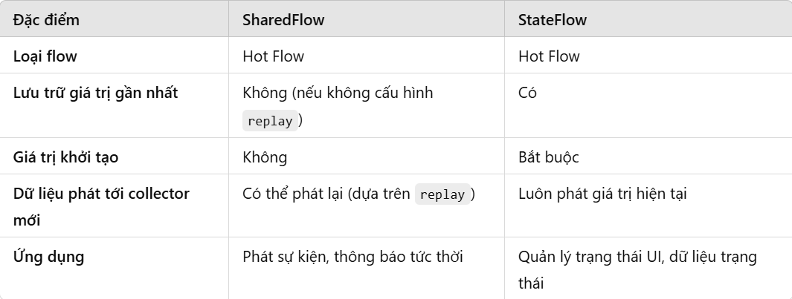

# FLOW

---

## Flow là gì? Cách tạo ra flow
### Flow là gì?
Trong coroutine, flow là một loại dữ liệu có thể phát ra nhiều giá trị tuần tự, khác với suspend function (hàm tạm ngưng) chỉ trả về một giá trị duy nhất.

Flow được xây dựng dựa trên coroutine và có thể cung cấp nhiều giá trị. Về cơ bản, flow là một dòng dữ liệu có thể được tính toán không đồng bộ. Các giá trị trả về phải thuộc cùng một loại dữ liệu.

Ví dụ: `Flow<Int>` là một flow trả về giá trị số nguyên.

Flow rất giống với `Iterator` có khả năng tạo ra một dãy giá trị, nhưng flow sử dụng hàm tạm ngưng để tạo và xử lý các giá trị một cách không đồng bộ. 

Có 3 thực thể tham gia vào dòng dữ liệu:

- Thực thể tạo (producer) có vai trò tạo dữ liệu để thêm vào dòng dữ liệu. Nhờ coroutine, flow cũng có thể tạo ra dữ liệu một cách không đồng bộ.
- Thực thể trung gian (intermediary, nếu có) có thể sửa đổi từng giá trị được phát vào dòng dữ liệu hoặc sửa đổi chính dòng dữ liệu.
- Thực thể tiêu thụ (consumer) sử dụng các giá trị trong dòng dữ liệu.


Trong kiến trúc Android, mỗi lớp thường đảm nhiệm một vai trò nhất định:
- Repository: `Producer`
- ViewModel: `Intermediary`
- Fragment/Activity: `Consumer`


### Cách tạo flow
Hàm tạo `flow` sẽ tạo một dòng dữ liệu mới để bạn có thể phát giá trị mới vào dòng dữ liệu theo cách thủ công thông qua hàm `emit`.

VD:
```java
fun foo(): Flow<Int> = flow {
    // flow builder
    for (i in 1..3) {
        delay(1000)
        emit(i) // emit next value
    }
}

fun main() = runBlocking {
    // Launch a concurrent coroutine to check if the main thread is blocked
    launch {
        println(Thread.currentThread().name)
        for (k in 1..3) {
            delay(900)
            println("I'm not blocked $k")
        }
    }
    // Collect the flow
    val time = measureTimeMillis {
        foo().collect { value -> println(value) }
    }
    println("$time s")
}
```
- Khối `flow { }` là một builder function giúp ta tạo ra 1 đối tượng Flow.
- Code bên trong `flow { ... }` có thể `suspend`, điều này có nghĩa là chúng ta có thể gọi các suspend function trong khối `flow { }`. Vì vậy function `foo()` gọi khối `flow { }` không cần thiết phải là suspend function nữa.
- Hàm `emit` dùng để phát ra các giá trị từ Flow. Hàm này là suspend function
- Hàm `collect` dùng để get giá trị được emit từ hàm emit. Hàm này cũng là suspend function.

Các Flow là các luồng lạnh (cold streams). Điều đó có nghĩa là code bên trong `flow { }` sẽ không chạy cho đến khi Flow gọi hàm `collect`.

#### Hàm `flowOf()`
```java
fun main() = runBlocking {
    val data = flowOf(1,"abc", 3.4, "def")
    data.collect { println(it) }
}
```
Output:
```java
1
abc
3.4
def
```

#### Hàm extension `asFlow()`
Các `Collections, Arrays, Sequences` hay một kiểu `T` gì đó đều có thể convert sang Flow thông qua extension function là `asFlow()`.

VD:
```java
fun main() = runBlocking {
    listOf(1, "abc", 3.4, "def").asFlow().collect { println(it) }
}
```

## Các toán tử của Flow
### Toán tử `take()`
Sử dụng toán tử take() nếu bạn muốn nguồn thu lấy một lượng giới hạn các phần tử được phát ra từ nguồn phát.

VD:
```java
fun numbers(): Flow<Int> = flow {
    try {
        emit(1)
        emit(2)
        println("This line will not execute")
        emit(3)
    } catch (e: CancellationException) {
        println("exception")
    } finally {
        println("close resource here")
    }
}

fun main() = runBlocking {
    numbers()
        .take(2) // take only the first two
        .collect { value -> println(value) }
}
```
Output:
```java
1
2
exception
close resource here
```
### Toán tử `transform()`
Toán tử này được dùng để biến đổi giá trị được phát ra từ nguồn phát trước khi emit cho nguồn thu nhận nó. Ngoài công dụng chính là để biến đổi phần tử, nó còn có các công dụng khác như nguồn thu có thể bỏ qua (skip) các giá trị mà nó không muốn nhận từ nguồn phát hoặc chúng ta có thể emit một giá trị nhiều hơn một lần (có nghĩa là phát 10 giá trị nhưng nhận có thể tới 20 giá trị).
```java
fun main() = runBlocking {
    (1..9).asFlow() // a flow of requests
        .transform { value ->
            if (value % 2 == 0) { // Emit only even values, but twice
                emit(value * value)
                emit(value * value * value)
            } // Do nothing if odd
        }
        .collect { response -> println(response) }
}
```
Output:
```java
4
8
16
64
36
216
64
512
```
### Toán tử `map()`
Vậy công dụng chính của nó cũng là để biến đổi phần tử nhận được như toán tử `transform` nhưng khác ở chỗ: toán tử `transform` cho phép ta skip phần tử hoặc emit một phần tử nhiều lần còn toán tử `map` thì không thể skip hay emit multiple times. Với mỗi phần tử nhận được từ nguồn phát, nguồn thu sẽ xử lý biến đổi và emit một và chỉ một giá trị cho nguồn thu.

VD:
```java
fun main() = runBlocking {
    (1..3).asFlow()
        .map { it * it } // squares of numbers from 1 to 5
        .collect { println(it) }
}
```
Output:
```java
1
4
9
```
### Toán tử `filter()`
Toán tử này giúp chúng ta filter lọc ra các giá trị thỏa mãn điều kiện và bỏ qua các giá trị không thỏa mãn điều kiện từ nguồn phát.

VD:
```java
fun main() = runBlocking {
    (1..5).asFlow()
        .filter {
            println("Filter $it")
            it % 2 == 0
        }.collect {
            println("Collect $it")
        }
}
```
Ở đây chúng ta thấy công dụng lọc này giống với công dụng của hàm `transform`. Đúng vậy, hàm `filter` thực chất cũng sử dụng hàm `transform` nên hàm `transform` cũng có thể lọc phần tử y hệt hàm `filter`.

### Toán tử `onEach()`
Toán tử này dùng khi ta muốn thực hiện một action gì đó trước khi value từ `flow` được emit.

VD:
```java
fun main() = runBlocking {
    val nums = (1..3).asFlow().onEach { delay(3000) } // numbers 1..3 every 300 ms
    val startTime = System.currentTimeMillis()
    nums.collect { value ->
            println("$value at ${System.currentTimeMillis() - startTime} ms from start")
        }
}
```
Output:
```java
1 at 3082 ms from start
2 at 6085 ms from start
3 at 9086 ms from start
```
### Toán tử `reduce()`
Toán tử `reduce()` được sử dụng để gộp hoặc tích lũy các giá trị trong một `Flow` hoặc một `Collection` thành một giá trị duy nhất. Nó thực hiện điều này bằng cách áp dụng một hàm được cung cấp trên từng phần tử của dòng (hoặc danh sách) theo thứ tự.

VD:
```java
fun main() = runBlocking {
    val sum = listOf("a", "b", "c", "d", "e").asFlow()
        .reduce { a, b ->
            println("Tổng đã tích lũy: $a")
            println("Giá trị mới: $b")
            a + b }
    println("Kết quả = $sum")
}
```
Output:
```java
Tổng đã tích lũy: a
Giá trị mới: b
Tổng đã tích lũy: ab
Giá trị mới: c
Tổng đã tích lũy: abc
Giá trị mới: d
Tổng đã tích lũy: abcd
Giá trị mới: e
Kết quả = abcde
```

### Toán tử `fold()`
Toán tử `fold()` được sử dụng để gộp hoặc tích lũy các giá trị trong một Collection hoặc Flow, tương tự như `reduce`. Tuy nhiên, `fold` khác biệt ở chỗ cho phép bạn cung cấp một `giá trị khởi tạo (initial value)` cho quá trình tích lũy.

VD:
```java
fun main() = runBlocking {
    val sum = (1..3).asFlow()
        .fold(initial = 10) { a, b -> // mình cho giá trị khởi tạo ban đầu là 10
            println("Tổng đã tích lũy: $a đồng")
            println("Giá trị mới: $b đồng")
            a + b } // sum them (terminal operator)
    println("Kết quả = $sum đồng")
}
```
Output:
```java
Tổng đã tích lũy: 10 đồng
Giá trị mới: 1 đồng
Tổng đã tích lũy: 11 đồng
Giá trị mới: 2 đồng
Tổng đã tích lũy: 13 đồng
Giá trị mới: 3 đồng
Kết quả = 16 đồng
```

### Toán tử `debounce()`
Toán tử `debounce` trong Kotlin Flow giúp giới hạn số lần phát sự kiện trong một khoảng thời gian nhất định, chỉ phát sự kiện cuối cùng sau khi không có sự kiện mới trong thời gian đó. Điều này hữu ích khi xử lý các sự kiện nhanh và cần tránh việc phản hồi quá nhiều lần, chẳng hạn như tìm kiếm theo thời gian thực.

Cách hoạt động:
- Khi không có sự kiện mới trong một khoảng thời gian nhất định, sự kiện sẽ được phát ra.
- Nếu có sự kiện mới trong khoảng thời gian này, thời gian đợi sẽ được reset.

VD:
```java
import kotlinx.coroutines.flow.*
import kotlinx.coroutines.runBlocking
import kotlinx.coroutines.delay

fun main() = runBlocking {
    // Flow phát ra các từ khóa tìm kiếm mà người dùng nhập
    val searchQueryFlow = flowOf("a", "ab", "abc", "abcd", "abcde")
        .onEach { delay(100) }  // Giả lập độ trễ giữa các lần nhập của người dùng

    // Áp dụng debounce để chỉ gửi yêu cầu tìm kiếm khi người dùng ngừng nhập trong 500ms
    searchQueryFlow
        .debounce(500)  // Chỉ phát khi không có sự kiện mới trong 500ms
        .collect { query ->
            println("Searching for: $query")
        }
}
```
Output:
```java
abcde
```

### Toán tử `sample()`
Toán tử `sample` trong Flow của Kotlin giúp lấy mẫu dữ liệu từ một Flow tại các khoảng thời gian xác định, tức là chỉ phát các giá trị tại các thời điểm định kỳ.

VD:
```java
fun main() = runBlocking {
    val flow = flow {
        repeat(10) {
            emit(it)
            delay(110)
        }
    }.sample(200)
        
    flow.collect {value ->
        println(value)
    }
}
```
Output:
```java
1
3
5
7
9
```
### Toán tử `flatMapMerge()`
`flatMapMerge` là một toán tử trong Flow được sử dụng để biến đổi các phần tử trong một Flow thành các Flow khác và kết hợp tất cả các Flow đó lại với nhau. Toán tử này sẽ hợp nhất tất cả các Flow con và phát ra các giá trị của chúng một cách không đồng bộ.

VD:
```java
fun main() = runBlocking {
    // Flow gốc phát ra các số 1, 2, 3
    val flow = flowOf(1, 2, 3)

    // Sử dụng flatMapMerge để chuyển mỗi số thành một Flow khác
    flow.flatMapMerge { value ->
        flow {
            delay(500) // Giả lập độ trễ
            emit("Processed $value")
        }
    }
        .collect { result ->
            println(result)  // In ra kết quả
        }
}
```
Output:
```java
Processed 1
Processed 2
Processed 3
```
### Toán tử `flatMapConcat()`
`flatMapConcat` là một toán tử trong Kotlin Flow được sử dụng để biến đổi các phần tử trong một Flow thành các Flow con và kết hợp các Flow này lại theo một cách nối tiếp (tuần tự), tức là nó sẽ chờ cho một Flow con hoàn thành trước khi bắt đầu Flow tiếp theo.

VD:
```java
fun main() = runBlocking {
    // Flow gốc phát ra các số 1, 2, 3
    val flow = flowOf(1, 2, 3)

    // Sử dụng flatMapConcat để chuyển mỗi số thành một Flow khác
    flow.flatMapConcat { value ->
        flow {
            delay(500) // Giả lập độ trễ
            emit("Processed $value")
        }
    }
        .collect { result ->
            println(result)  // In ra kết quả
        }
}
```

### Toán tử `combine()`
Trả về một Flow mà các giá trị của nó được tạo ra bằng hàm `transform` bằng cách kết hợp các giá trị được phát gần đây nhất từ mỗi flow.

VD:
```java
val flow = flowOf(1, 2).onEach { delay(10) }
val flow2 = flowOf("a", "b", "c").onEach { delay(15) }
flow.combine(flow2) { i, s -> i.toString() + s }.collect {
    println(it) // Will print "1a 2a 2b 2c"
}
```

### Toán tử `zip()`

Dịch câu trên sang tiếng Việt:

Kết hợp các giá trị từ flow hiện tại (this) với một flow khác bằng cách sử dụng hàm transform được áp dụng cho từng cặp giá trị. Flow kết quả sẽ hoàn thành ngay khi một trong hai flow hoàn thành, và flow còn lại sẽ bị hủy.

VD:
```java
val flow = flowOf(1, 2, 3).onEach { delay(10) }
val flow2 = flowOf("a", "b", "c", "d").onEach { delay(15) }
flow.zip(flow2) { i, s -> i.toString() + s }.collect {
    println(it) // Will print "1a 2b 3c"
}
```

## Cold flow và hot flow
### Cold flow
Một cold flow (luồng lạnh) là loại flow chỉ tạo ra giá trị khi có collector hoạt động. Điều này có nghĩa là mã của flow sẽ được thực thi độc lập cho từng collector, và mỗi collector sẽ nhận được toàn bộ các giá trị phát ra từ đầu.

#### Đặc điểm:
1. Phát dữ liệu theo yêu cầu:

    Flow lạnh chỉ bắt đầu phát dữ liệu khi một collector (hoặc subscriber) bắt đầu thu thập dữ liệu.
2. Collector độc lập:

    Mỗi collector nhận toàn bộ luồng dữ liệu từ đầu, và hoạt động độc lập với các collector khác.
3. Không có trạng thái dùng chung:

    Không có trạng thái dùng chung giữa các collector, đảm bảo sự cách ly giữa chúng.

VD:
```java
fun fetchData(): Flow<List<String>> = flow {
    // Simulate network request or database query
    delay(2000)
    emit(listOf("Item 1", "Item 2", "Item 3"))
}

fun main() = runBlocking {
    fetchData().collect { items ->
        println(items)
    }
} //Output: [Item 1, Item 2, Item 3]
```

#### Trường hợp sử dụng
- Tải dữ liệu: Truy vấn dữ liệu từ mạng hoặc cơ sở dữ liệu chỉ khi cần thiết.
- Xử lý dữ liệu độc lập: Mỗi subscriber cần xử lý dữ liệu theo logic riêng của mình.
- Tránh vấn đề trạng thái dùng chung: Ngăn ngừa các vấn đề về dữ liệu không nhất quán giữa nhiều subscriber.

### Hot flow
Một hot flow (luồng nóng) phát dữ liệu ngay cả khi không có collector hoạt động. Nó giống như một hệ thống phát sóng, nơi nhiều listener (người nghe) có thể đăng ký và nhận giá trị mới nhất.

#### Đặc điểm:
1. Phát dữ liệu liên tục: Luồng nóng phát giá trị bất kể có collector hay không.
2. Trạng thái chia sẻ: Nhiều collector có thể chia sẻ cùng một luồng và nhận dữ liệu từ thời điểm đăng ký trở đi (không nhận dữ liệu trước đó).
3. Có thể gặp vấn đề về áp lực ngược (BackPressure): Nếu dữ liệu được phát nhanh hơn tốc độ xử lý của collector, có thể xảy ra tình trạng quá tải dữ liệu.

#### **Trường hợp sử dụng của Hot Flow**:

1. **Quản lý trạng thái giao diện người dùng (UI State Management)**:
    - **StateFlow** là một lựa chọn phổ biến để quản lý trạng thái UI trong các ứng dụng Android.

2. **Luồng dữ liệu chia sẻ (Shared Data Streams)**:
    - **SharedFlow** cho phép chia sẻ cùng một luồng dữ liệu giữa nhiều collector.

3. **Cập nhật thời gian thực (Real-time Updates)**:
    - Theo dõi dữ liệu như vị trí GPS, dữ liệu từ cảm biến, hoặc thông báo thời gian thực.

4. **Bất kỳ tình huống nào cần nhiều collector nhận cùng một dữ liệu**:
    - Khi một dữ liệu hoặc sự kiện cần được truyền cho nhiều thành phần ứng dụng.


### StateFlow


`StateFlow` là một hot flow đại diện cho một trạng thái, chỉ giữ một giá trị duy nhất tại một thời điểm. Nó là một `conflated flow`, nghĩa là khi có giá trị mới được phát, giá trị mới nhất sẽ được lưu giữ và ngay lập tức phát cho các `collector` mới.

Hữu ích khi cần duy trì một nguồn trạng thái duy nhất và tự động cập nhật tất cả các collector với trạng thái mới nhất.

Luôn có giá trị khởi tạo ban đầu.
Chỉ lưu trữ giá trị được phát gần đây nhất.

StateFlow không bao giờ kết thúc. Một cuộc gọi đến `Flow.collect` trên một StateFlow sẽ không bao giờ kết thúc bình thường, và coroutine được khởi tạo bởi hàm `Flow.launchIn` cũng sẽ không kết thúc. Một `collector` hoạt động của StateFlow được gọi là `subscriber`.

StateFlow gồm hai biến thể: StateFlow và MutableStateFlow :

- `StateFlow<T>`: interface chỉ cung cấp quyền truy cập giá trị.
- `MutabaleStateFlow<T>`: interface cung cấp khả năng sửa đổi giá trị.

VD:
```java
// ViewModel quản lý số lượng bài viết yêu thích
class FavoriteArticlesViewModel : ViewModel() {
    // MutableStateFlow để lưu trữ trạng thái số lượng bài viết yêu thích
    private val _favoriteCount = MutableStateFlow(0)
    // StateFlow cho UI, đảm bảo không có thay đổi trạng thái từ bên ngoài ViewModel
    val favoriteCount: StateFlow<Int> = _favoriteCount

    // Cập nhật số lượng bài viết yêu thích
    fun incrementFavoriteCount() {
        _favoriteCount.value += 1
    }

    fun decrementFavoriteCount() {
        _favoriteCount.value -= 1
    }
}

// Activity hoặc Fragment
class FavoriteArticlesFragment : Fragment(R.layout.fragment_favorite_articles) {

    private lateinit var viewModel: FavoriteArticlesViewModel

    override fun onViewCreated(view: View, savedInstanceState: Bundle?) {
        super.onViewCreated(view, savedInstanceState)
        viewModel = ViewModelProvider(this).get(FavoriteArticlesViewModel::class.java)

        // Thu thập (collect) giá trị từ StateFlow để cập nhật UI
        lifecycleScope.launchWhenStarted {
            viewModel.favoriteCount.collect { count ->
                // Cập nhật TextView với số lượng bài viết yêu thích
                view.findViewById<TextView>(R.id.favorite_count_text).text = count.toString()
            }
        }

        // Các sự kiện người dùng thay đổi số lượng bài viết yêu thích
        view.findViewById<Button>(R.id.increment_button).setOnClickListener {
            viewModel.incrementFavoriteCount()
        }

        view.findViewById<Button>(R.id.decrement_button).setOnClickListener {
            viewModel.decrementFavoriteCount()
        }
    }
}

```
### SharedFlow



`SharedFlow` là một hot flow có thể có nhiều `collector`. Nó có thể phát giá trị mà không phụ thuộc vào việc có collector hay không, và nhiều collector có thể thu thập cùng một giá trị từ flow.

Hữu ích khi cần phát giá trị đến nhiều collector cùng lúc hoặc khi muốn có nhiều subscriber theo dõi cùng một luồng dữ liệu.

Không có giá trị khởi tạo ban đầu.

Có thể cấu hình bộ đệm (replay cache) để lưu trữ một số giá trị đã phát trước đó dành cho các collector mới.

VD:
```java
// ViewModel phát thông báo bài viết mới
class ArticleNotificationViewModel : ViewModel() {
    // MutableSharedFlow để phát thông báo bài viết mới
    private val _newArticleNotifications = MutableSharedFlow<String>(replay = 1)
    // SharedFlow công khai để UI có thể thu thập
    val newArticleNotifications: SharedFlow<String> = _newArticleNotifications

    // Phát thông báo bài viết mới
    fun postNewArticleNotification(articleTitle: String) {
        viewModelScope.launch {
            _newArticleNotifications.emit("Có bài viết mới: $articleTitle")
        }
    }
}

// Activity hoặc Fragment thu thập thông báo bài viết mới
class ArticleNotificationFragment : Fragment(R.layout.fragment_article_notification) {

    private lateinit var viewModel: ArticleNotificationViewModel

    override fun onViewCreated(view: View, savedInstanceState: Bundle?) {
        super.onViewCreated(view, savedInstanceState)
        viewModel = ViewModelProvider(this).get(ArticleNotificationViewModel::class.java)

        // Thu thập (collect) thông báo bài viết mới từ SharedFlow
        lifecycleScope.launchWhenStarted {
            viewModel.newArticleNotifications.collect { notification ->
                // Hiển thị thông báo bài viết mới trong TextView
                view.findViewById<TextView>(R.id.notification_text).text = notification
            }
        }

        // Phát thông báo bài viết mới
        view.findViewById<Button>(R.id.post_notification_button).setOnClickListener {
            viewModel.postNewArticleNotification("Bài viết Android mới!")
        }
    }
}

```

So sánh `StateFlow` và `SharedFlow`:



## So sánh Flow với LiveData
### LiveData

LiveData là một lớp giữ dữ liệu có khả năng nhận thức vòng đời (lifecycle-aware), nghĩa là nó tuân theo vòng đời của các thành phần Android như Activity và Fragment. LiveData cung cấp dữ liệu có thể quan sát được (observable) bởi nhiều observer, thường là các thành phần giao diện người dùng, và tự động cập nhật chúng khi dữ liệu thay đổi. LiveData đơn giản hóa việc quản lý các thành phần giao diện người dùng, vì nó tự động xử lý việc đăng ký và hủy đăng ký dựa trên trạng thái vòng đời.

Đặc điểm của LiveData
- Nhận thức vòng đời (lifecycle-aware): LiveData tự động quản lý việc đăng ký và hủy đăng ký observer dựa trên trạng thái vòng đời của thành phần liên kết.
- Gắn với luồng chính: Phương thức onChanged() của observer trong LiveData luôn được gọi trên luồng chính (UI), cho phép cập nhật giao diện trực tiếp.
- Không hỗ trợ backpressure: LiveData không hỗ trợ xử lý backpressure, phù hợp với các trường hợp không cần kiểm soát hoặc giới hạn luồng dữ liệu.

Trường hợp sử dụng LiveData
- Cập nhật giao diện theo thời gian thực: LiveData rất phù hợp để quan sát và cập nhật các thành phần giao diện trong thời gian thực, chẳng hạn như thay đổi từ cơ sở dữ liệu hoặc phản hồi từ mạng.
- Dữ liệu ràng buộc vòng đời: Nhờ nhận thức vòng đời, LiveData lý tưởng để cập nhật dữ liệu liên kết chặt chẽ với vòng đời của các thành phần Android.

### Flow

Flow là một API xử lý luồng bất đồng bộ được giới thiệu cùng với Kotlin Coroutines. Flow cho phép các lập trình viên phát ra nhiều giá trị một cách bất đồng bộ và cung cấp các toán tử mạnh mẽ để biến đổi và kết hợp các giá trị này. Flow được thiết kế để hoạt động liền mạch với coroutines, mang lại cách xử lý bất đồng bộ tiện lợi và có cấu trúc.

Đặc điểm của Flow
- Xử lý luồng bất đồng bộ: Flow cung cấp một tập hợp các toán tử toàn diện để xử lý luồng dữ liệu bất đồng bộ một cách có cấu trúc và tuần tự.
- Tích hợp coroutines: Flow tích hợp liền mạch với Kotlin Coroutines, cho phép lập trình viên kết hợp sức mạnh của cả hai API để viết mã bất đồng bộ ngắn gọn và hiệu quả.
- Hỗ trợ backpressure: Flow hỗ trợ xử lý backpressure tự nhiên, cho phép kiểm soát tốc độ phát và xử lý dữ liệu.

Trường hợp sử dụng Flow
- Xử lý dữ liệu bất đồng bộ: Flow là lựa chọn tuyệt vời khi cần xử lý các luồng dữ liệu bất đồng bộ yêu cầu biến đổi hoặc kết hợp phức tạp, chẳng hạn như xử lý đồng thời nhiều yêu cầu mạng.
- API dựa trên Flow: Các thư viện xây dựng với Kotlin Coroutines thường cung cấp API dựa trên Flow, khiến Flow trở thành lựa chọn tự nhiên để tiêu thụ dữ liệu từ các thư viện đó.