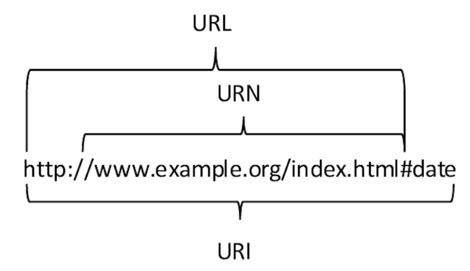
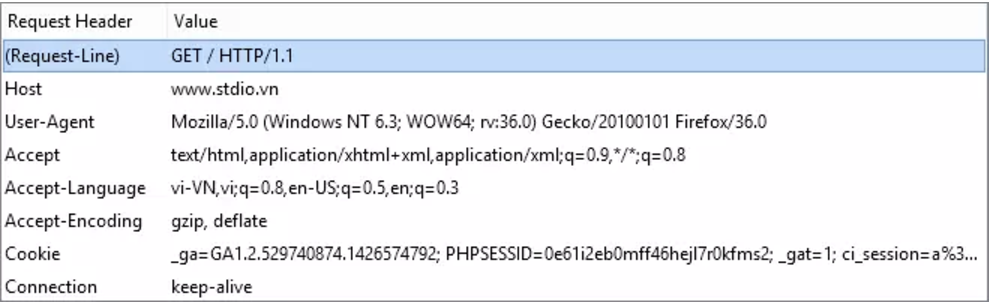

# CALL API
## Tổng quan về Networking
### Mô hình Client - Server
Mô hình Client Server là mô hình mạng máy tính trong đó các máy tính con được đóng vai trò như một máy khách, chúng làm nhiệm vụ gửi yêu cầu đến các máy chủ. Để máy chủ xử lý yêu cầu và trả kết quả về cho máy khách đó.


#### Nguyên tắc hoạt động
Trong mô hình Client Server, server chấp nhận tất cả các yêu cầu hợp lệ từ mọi nơi khác nhau trên Internet, sau đó trả kết quả về máy tính đã gửi yêu cầu đó

Máy tính được coi là máy khách khi chúng làm nhiệm vụ gửi yêu cầu đến các máy chủ và đợi câu trả lời được gửi về.

Để máy khách và máy chủ có thể giao tiếp được với nhau thì giữa chúng phải có một chuẩn nhất định, và chuẩn đó được gọi là giao thức. Một số giao thức được sử dụng phổ biến hiện nay như: HTTPS, TCP/IP, FTP,...

### Giao thức HTTP
**HTTP (Hypertext Transfer Protocol)** là giao thức truyền tải siêu văn bản. Đây là giao thức tiêu chuẩn cho `World Wide Web (www)` để truyền tải dữ liệu dưới dạng văn bản, âm thanh, hình ảnh, video từ Web Server tới trình duyệt web của người dùng và ngược lại.

`HTTP` hoạt động theo mô hình Client (máy khách) – Server (máy chủ). Khi bạn truy cập một trang web qua giao thức HTTP, trình duyệt sẽ thực hiện các phiên kết nối đến server của trang web đó thông qua địa chỉ IP do hệ thống phân giải tên miền DNS cung cấp. Máy chủ sau khi nhận lệnh, sẽ trả về lệnh tương ứng giúp hiển thị website, bao gồm các nội dung như: văn bản, ảnh, video, âm thanh,…

Trong quá trình kết nối và trao đổi thông tin, trình duyệt của bạn sẽ mặc nhiên thừa nhận địa chỉ IP đó đến từ server của chính website mà bạn muốn truy cập mà không hề có biện pháp xác thực nào. Các thông tin được gửi đi qua giao thức HTTP (bao gồm địa chỉ IP, các thông tin mà bạn nhập vào website…) cũng không hề được mã hóa và bảo mật. Đây chính là kẽ hở mà nhiều hacker đã lợi dụng để đánh cắp thông tin người dùng, thường được gọi là tấn công sniffing.

### Giao thức HTTPS
**HTTPS (Hypertext Transfer Protocol Secure)** là giao thức truyền tải siêu văn bản an toàn. Thực chất, đây chính là giao thức HTTP nhưng tích hợp thêm Chứng chỉ bảo mật SSL nhằm mã hóa các thông điệp giao tiếp để tăng tính bảo mật. Có thể hiểu, HTTPS là phiên bản HTTP an toàn, bảo mật hơn.

`HTTPS` hoạt động tương tự như `HTTP`, tuy nhiên được bổ sung thêm chứng chỉ `SSL (Secure Sockets Layer – tầng ổ bảo mật)` hoặc `TLS (Transport Layer Security – bảo mật tầng truyền tải)`. Hiện tại, đây là các tiêu chuẩn bảo mật hàng đầu cho hàng triệu website trên toàn thế giới.

Cả `SSL` và `TLS` đều sử dụng hệ thống `PKI (Public Key Infrastructure -hạ tầng khóa công khai)` không đối xứng. Hệ thống này sử dụng hai “khóa” để mã hóa thông tin liên lạc, `“khóa công khai” (public key)` và `“khóa riêng” (private key)`. Bất cứ thứ gì được mã hóa bằng khóa công khai chỉ có thể được giải mã bởi khóa riêng và ngược lại. Các tiêu chuẩn này đảm bảo các nội dung sẽ được mã hóa trước khi truyền đi, và giải mã khi nhận. Điều này khiến hacker dù có chen ngang lấy được thông tin cũng không thể “hiểu” được thông tin đó.

### IP
**Địa chỉ IP** - `Internet Protocol (giao thức Internet)` là một địa chỉ đơn nhất mà những thiết bị điện tử hiện nay đang sử dụng để nhận diện và liên lạc với nhau trên mạng máy tính bằng cách sử dụng giao thức Internet.

Bất kỳ thiết bị mạng nào bao gồm bộ định tuyến, bộ chuyển mạch mạng, máy vi tính, máy chủ hạ tầng (như NTP, DNS, DHCP, SNMP, v.v.), máy in, máy fax qua Internet, và vài loại điện thoại—tham gia vào mạng đều có địa chỉ riêng, và địa chỉ này là đơn nhất trong phạm vi của một mạng cụ thể. Vài địa chỉ IP có giá trị đơn nhất trong phạm vi Internet toàn cầu, trong khi một số khác chỉ cần phải đơn nhất trong phạm vi một công ty.

### Port
Port (cổng) trong mạng máy tính là một khái niệm liên quan đến giao tiếp và truyền dữ liệu qua mạng. Đây là một số nguyên được sử dụng để phân biệt các dịch vụ hoặc ứng dụng chạy trên một thiết bị trong mạng.

Port hoạt động như một điểm đầu mối giúp hệ thống xác định ứng dụng hoặc dịch vụ nào cần xử lý dữ liệu đến hoặc dữ liệu gửi đi. Khi một thiết bị gửi dữ liệu qua mạng, dữ liệu không chỉ được gửi đến địa chỉ IP của thiết bị đích, mà còn cần xác định rõ cổng nào trên thiết bị đó sẽ nhận dữ liệu.

Port được chia thành 3 loại chính:

- **Well-Known Ports (Cổng chuẩn)**:
  - Giá trị từ 0 đến 1023.
  - Dành cho các dịch vụ mạng phổ biến, được định nghĩa bởi IANA (Internet Assigned Numbers Authority).
  - Ví dụ: `Port 80: HTTP`, `Port 443: HTTPS`, `Port 22: SSH`.
- **Registered Ports (Cổng đăng ký)**:

  - Giá trị từ 1024 đến 49151.
  - Dành cho các ứng dụng hoặc dịch vụ đã đăng ký nhưng ít phổ biến hơn.
  - VD: `Port 3306: MySQL`, `Port 8080: Giao thức HTTP thay thế`.
- **Dynamic or Private Ports (Cổng động hoặc riêng)**:
  - Giá trị từ 49152 đến 65535.
  - Được hệ thống hoặc ứng dụng sử dụng tạm thời khi thiết lập kết nối.
### URL
`URL (Uniform Resource Locator)` là một định dạng chuẩn được sử dụng để định vị và truy cập đến các tài nguyên trên Internet. Nó là một địa chỉ duy nhất chỉ đến một tài nguyên cụ thể, chẳng hạn như một trang web, hình ảnh, video, tệp tin, hoặc tài liệu.

Thông thường, một URL sẽ gồm những thành phần cơ bản như sau:

- **Giao thức**: `http`, `https`, `FTP`…
- **World Wide Web**: `www`  (có thể không có thường gọi là non-www)
- **Tên miền (domain)**: `www.youtube.com/`
- **Cổng giao tiếp (port)**: 443, 80, 2082, 2222…

### DNS
**DNS (Domain Name System)** là một hệ thống quan trọng trên Internet giúp chuyển đổi tên miền dễ nhớ của con người (như google.com) thành địa chỉ IP (như 142.250.199.78) mà các máy tính và thiết bị mạng sử dụng để giao tiếp với nhau.

### Nguyên lý hoạt động của DNS
Nguyên lý hoạt động của DNS dựa trên mô hình phân tán và thực hiện các chức năng chính để chuyển đổi tên miền thành địa chỉ IP và ngược lại. Dưới đây là quy trình chính của cách DNS hoạt động:
- Người dùng gửi yêu cầu: Khi nhập tên miền vào trình duyệt, một yêu cầu sẽ được gửi đến **Recursive DNS Server**.

- **Recursive DNS Server** tìm kiếm: **Recursive DNS Server** thực hiện các bước tìm kiếm thông tin từ **Root DNS Server** đến **Authoritative DNS Server**.

- **Authoritative DNS Server** cung cấp địa chỉ IP: Server cuối cùng cung cấp địa chỉ IP tương ứng với tên miền.

- **Recursive DNS Server** nhận địa chỉ IP: Được cung cấp địa chỉ IP, **Recursive DNS Server** trả về thông tin cho trình duyệt và cập nhật bộ nhớ đệm.

- Trình duyệt kết nối đến máy chủ web: Trình duyệt sử dụng địa chỉ IP để kết nối đến máy chủ web và tải trang web.

### URI
**URI (Uniform Resource Identifier)**, là một khái niệm quan trọng trong lĩnh vực công nghệ thông tin và truyền thông. URI là một chuỗi ký tự dùng để xác định một tài nguyên trên mạng. Nghĩa là bất kỳ tài nguyên nào, từ trang web, tài liệu, hình ảnh cho đến dịch vụ trực tuyến, đều có thể được xác định thông qua URI.


URI được sử dụng rộng rãi trong việc xác định các tài nguyên trên Internet. Một URI thường bao gồm ba phần chính gồm giao thức (như `HTTP, HTTPS`), tên miền (như `example.com`) và đường dẫn (như `/path/to/resource`). Ví dụ, trong URI "https://www.example.com/index.html", "https" là giao thức, "www.example.com" là tên miền và "/index.html" là đường dẫn.

Việc xác định này được dựa trên hai yếu tố chính là location (vị trí chính là URL) và name với tên được gọi đầy đủ là Uniform Resource Name (URN)

Tổng quát lại, URI sẽ bao gồm hai tập nhỏ hơn là URL và URN. URI có nhiệm vụ là kết nối các giao thức lại với nhau bằng cách nhận thông tin về vị trí và tên, sau đó là xác định trang web.

### Sự khác nhau giữa URL và URI



| URI                                                                            | URL |
|--------------------------------------------------------------------------------|-----|
| Dùng để xác định một tài nguyên bất kỳ trên internet, bao gồm cả tên và vị trí |Dùng để xác định vị trí của một website hoặc tài nguyên bất kỳ trên internet     |
|Các yếu tố được dùng để xác định danh tính của một mục                                                                                |Các yếu tố nhằm mô tả đặc điểm vị trí của các mục     |
|Bất kì hình thức kết nối nào cũng có thể dùng để xác định và phân biệt các tài nguyên                                                                                |Thông qua các giao thức được sử dụng, các nội dung của trang web sẽ liên kết với nhau     |
|Không gồm các đặc điểm về giao thức                                                                                |Cung cấp cho người dùng thông tin về giao thức được sử dụng     |  
|           URI có các thành phần như scheme, path, Authority..                                                                                                        |Chỉ chứa scheme và Authority                                                                |
|                                    Schema của URI có thể là tệp dữ liệu, thông số kỹ thuật hay giao thức                                                                                                                                  |Scheme là giao thức cố định, phổ biến nhất là HTTP, HTTPs.                                                                                            |
|URI là tập lớn của URL                                                                                                                                                                      |URL là một loại URI                                                                                           |
|URI hay được sử dụng trong các file XML, JSTL,...                                                                                                                                                              |URL thường được sử dụng để tìm kiếm các địa chỉ website.                                                                                            |

Ví dụ:
- URN: `urn:isbn:0451450523`, `https://www.facebook.com/groups/513896635965396`
- URL: `https://www.example.com/index.html`

## RESTful API
### API
**API (Application Programming Interface)** là một giao diện phần mềm cho phép các ứng dụng giao tiếp và tương tác với nhau. Nó cung cấp một bộ quy tắc, giao thức và công cụ để các nhà phát triển xây dựng phần mềm hoặc tích hợp các ứng dụng.

Ví dụ: Một ứng dụng thời tiết trên điện thoại có thể sử dụng API của một dịch vụ thời tiết để lấy thông tin về nhiệt độ, độ ẩm, hoặc dự báo.
#### Cách hoạt động của API
Kiến trúc API thường được giải thích dưới dạng máy chủ và máy khách. Ứng dụng gửi yêu cầu được gọi là máy khách, còn ứng dụng gửi phản hồi được gọi là máy chủ.

Như vậy, trong ví dụ về ứng dụng thời tiết, cơ sở dữ liệu của cơ quan thời tiết là máy chủ còn ứng dụng di động là máy khách. 

API hoạt động theo 4 cách khác nhau `(API SOAP, API RPC, API Websocket, API REST)` , tùy vào thời điểm và lý do chúng được tạo ra.

#### API REST
**REST (REpresentational State Transfer)** là một dạng chuyển đổi cấu trúc dữ liệu, một kiểu kiến trúc để viết API. Nó sử dụng phương thức HTTP đơn giản để tạo cho giao tiếp giữa các máy. Vì vậy, thay vì sử dụng một URL cho việc xử lý một số thông tin người dùng, REST gửi một yêu cầu HTTP như `GET, POST, DELETE,...` đến một URL để xử lý dữ liệu.

### RESTful API
**RESTful API** là một tiêu chuẩn dùng trong việc thiết kế API cho các ứng dụng web (thiết kế Web services) để tiện cho việc quản lý các resource. Nó chú trọng vào tài nguyên hệ thống (tệp văn bản, ảnh, âm thanh, video, hoặc dữ liệu động…), bao gồm các trạng thái tài nguyên được định dạng và được truyền tải qua HTTP.

#### Các nguyên tắc của RESTful API
1. Nguyên tắc 1: Tách biệt giữa Client - Server

  - Trách nhiệm của phía server và phía client được tách biệt, cho phép mỗi bên được triển khai độc lập.

  - Mã phía server (API) và mã phía client có thể được thay đổi mà không ảnh hưởng đến bên kia, miễn là cả hai tiếp tục giao tiếp theo định dạng chung.
2. Không trạng thái (Statelessness)
- Giao tiếp giữa client và server không theo dõi trạng thái phiên (session) từ yêu cầu này đến yêu cầu khác.
- Trạng thái phiên được bao gồm trong mỗi yêu cầu, vì vậy client và server không cần biết trạng thái của nhau để giao tiếp.
3. Giao diện thống nhất (Uniformity of the interface)
- Các hành động và/hoặc tài nguyên sẵn có với endpoint và tham số cụ thể phải được xác định rõ ràng và tuân thủ nghiêm ngặt bởi cả client và server.
- Mỗi phản hồi phải chứa đủ thông tin để được hiểu mà không cần client phải có thông tin khác trước đó.
- Các phản hồi không nên quá dài và nên chứa liên kết đến các endpoint khác.
4. Caching (Bộ nhớ đệm)
- Các phản hồi có thể được lưu trữ để tránh làm quá tải server không cần thiết.
- REST API phải xác định rõ liệu phản hồi có thể được lưu trữ hay không và thời gian lưu trữ là bao lâu để tránh việc client nhận thông tin lỗi thời.
5. Kiến trúc phân lớp (Layered architecture)
- Một client kết nối với REST API thường không thể phân biệt liệu nó đang giao tiếp với server cuối cùng hay một server trung gian.
- Kiến trúc REST cho phép API nhận yêu cầu tại server A, lưu trữ dữ liệu tại server B, và quản lý xác thực tại server C.
6. Code on demand (Mã thực thi phía client) - **KHÔNG BẮT BUỘC**
- API có thể trả về mã thực thi thay vì phản hồi bằng JSON hoặc XML.
- RESTful API có thể mở rộng mã của client trong khi đơn giản hóa bằng cách cung cấp mã thực thi như JavaScript hoặc Java applet.

### Các phương thức HTTP trong RESTful API
1. GET: Phương thức `GET` được sử dụng để 'truy xuất' một bản ghi hoặc tập hợp các bản ghi từ máy chủ.
2. POST: Phương thức `POST` gửi dữ liệu để tạo ‘bản ghi mới’ trên máy chủ.
3. PUT: Phương thức `PUT` gửi dữ liệu để cập nhật 'bản ghi hiện có' trên máy chủ.
4. PATCH: Giống như phương thức `PUT`, `PATCH` cũng được sử dụng để gửi dữ liệu nhằm cập nhật ‘bản ghi hiện có’ trên máy chủ. Nhưng điểm khác biệt quan trọng giữa `PUT` và `PATCH` là `PATCH` chỉ áp dụng sửa đổi một phần cho bản ghi thay vì thay thế toàn bộ bản ghi.
5. DELETE: Phương thức `DELETE` được sử dụng để xóa (các) bản ghi khỏi máy chủ.

### Cấu trúc một API endpoint
#### Base URL
Base URL (Uniform Resource Locator cơ sở) là một phần cố định trong URL, dùng làm nền tảng để xây dựng các đường dẫn (endpoint) khác trong một API hoặc ứng dụng web. Base URL thường chứa thông tin về:
- Giao thức (HTTP hoặc HTTPS).
- Tên miền hoặc địa chỉ IP của server.
- (Tùy chọn) Cổng và/hoặc đường dẫn cơ sở nếu cần.
#### Endpoint
Endpoint API là một URL đóng vai trò là điểm liên lạc giữa client và server. Client gửi yêu cầu đến endpoint để truy cập chức năng và dữ liệu của API.

API REST điển hình có nhiều endpoint tương ứng với các tài nguyên sẵn có của nó. Ví dụ: API hỗ trợ ứng dụng truyền thông xã hội có thể sẽ bao gồm các endpoint cho người dùng, bài đăng và nhận xét. Các yêu cầu tới endpoint phải bao gồm một phương thức cho biết thao tác sẽ được thực hiện cũng như các tiêu đề, tham số, thông tin xác thực và dữ liệu nội dung cần thiết.

Ví dụ: 
- Base URL: `https://api.example.com/v1`
- Một số Endpoint cụ thể:
  - Lấy danh sách người dùng: `https://api.example.com/v1/users`. Phương thức HTTP: `GET`
  - Lấy thông tin chi tiết của 1 người dùng (dựa trên id): `https://api.example.com/v1/users/123`. Phương thức HTTP: `GET`
  - Tạo mới một người dùng: `https://api.example.com/v1/users`. Phương thức HTTP: `POST`


#### Query parameter
**Query parameter** là một cách để truyền thông tin tới API một cách linh hoạt và đơn giản. Chúng được thêm vào cuối URL endpoint dưới dạng một chuỗi các key-value.

Ví dụ: Xem xét API endpoint sau:
`https://www.example.com/api/items?sort=asc&category=books`

Trong ví dụ này, `sort` và `category` là các tham số truy vấn được chuyển tới API để chỉ định thứ tự sắp xếp mong muốn và danh mục các mục cần truy xuất.

#### Path parameter
**Path parameter** là các phần có thể thay đổi của đường dẫn URL. Chúng thường được sử dụng để trỏ đến một tài nguyên cụ thể trong bộ sưu tập, chẳng hạn như người dùng được xác định bằng ID. Một URL có thể có nhiều tham số đường dẫn, mỗi tham số được biểu thị bằng dấu ngoặc nhọn `{ }`.
```java
GET /users/{id}
GET /cars/{carId}/drivers/{driverId}
GET /report.{format}
```
Ví dụ:
```java
Endpoint mẫu:
    DELETE /products/{productId}
Request cụ thể:
    DELETE /products/789
```
### HTTP Request
HTTP request là thông tin được gửi từ client lên server, để yêu cầu server tìm hoặc xử lý một số thông tin, dữ liệu mà client muốn. HTTP request có thể là một file text dưới dạng XML hoặc Json mà cả hai đều có thể hiểu được.



- Bắt đầu của HTTP Request sẽ là dòng Request-Line bao gồm 3 thông tin đó là:

  - **Method**: là phương thức mà HTTP Request này sử dụng, thường là GET, POST, ngoài ra còn một số phương thức khác như HEAD, PUT, DELETE, OPTION, CONNECT. Trong ví dụ trên là GET
  - **URI**: là địa chỉ định danh của tài nguyên. Trong tường hợp này URI là / - tức request cho tài nguyên gốc, nếu request không yêu cầu một tài nguyên cụ thể, URI có thể là dấu *.
  - **HTTP version**: là phiên bản HTTP đang sử dụng, ở đây là HTTP 1.1.
- Tiếp theo là các trường **request-header**, cho phép client gửi thêm các thông tin bổ sung về thông điệp HTTP request và về chính client. Một số trường thông dụng như:

  - **Accept**: loại nội dung có thể nhận được từ thông điệp response. Ví dụ: text/plain, text/html…
  - **Accept-Encoding**: các kiểu nén được chấp nhận. Ví dụ: gzip, deflate, xz, exi…
  - **Connection**: tùy chọn điều khiển cho kết nối hiện thời. Ví dụ: keep-alive, Upgrade…
  - **Cookie**: thông tin HTTP Cookie từ server.
  - **User-Agent**: thông tin về user agent của người dùng.
- **Body**:

    

#### HTTP Response
Cấu trúc HTTP response gần giống với HTTP request, chỉ khác nhau là thay vì Request-Line, thì HTTP có response có Status-Line. Và giống như Request-Line, Status-Line cũng có ba phần như sau:

- **HTTP-version**: phiên bản HTTP cao nhất mà server hỗ trợ.
- **Status-Code**: mã kết quả trả về.
- **Reason-Phrase**: mô tả về Status-Code.


#### HTTP Status Codes
Một số loại Status-Code thông dụng mà server trả về cho client như sau:

- 1xx: information Message: các status code này chỉ có tính chất tạm thời, client có thể không quan tâm.

- 2xx Successful: khi đã xử lý thành công request của client, server trả về status dạng này:

  - 200 OK: request thành công.
  - 202 Accepted: request đã được nhận, nhưng không có kết quả nào trả về, thông báo cho client tiếp tục chờ đợi.
  - 204 No Content: request đã được xử lý nhưng không có thành phần nào được trả về.
  - 205 Reset: giống như 204 nhưng mã này còn yêu câu client reset lại document view.
  - 206 Partial Content: server chỉ gửi về một phần dữ liệu, phụ thuộc vào giá trị range header của client đã gửi.
- 3xx Redirection: server thông báo cho client phải thực hiện thêm thao tác để hoàn tất request:

  - 301 Moved Permanently: tài nguyên đã được chuyển hoàn toàn tới địa chỉ Location trong HTTP response.
  - 303 See other: tài nguyên đã được chuyển tạm thời tới địa chỉ Location trong HTTP response.
  - 304 Not Modified: tài nguyên không thay đổi từ lần cuối client request, nên client có thể sử dụng đã lưu trong cache.
- 4xx Client error: lỗi của client:

  - 400 Bad Request: request không đúng dạng, cú pháp.
  - 401 Unauthorized: client chưa xác thực.
  - 403 Forbidden: client không có quyền truy cập.
  - 404 Not Found: không tìm thấy tài nguyên.
  - 405 Method Not Allowed: phương thức không được server hỗ trợ.
- 5xx Server Error: lỗi của server:

  - 500 Internal Server Error: có lỗi trong quá trình xử lý của server.
  - 501 Not Implemented: server không hỗ trợ chức năng client yêu cầu.
  - 503: Service Unavailable: Server bị quá tải, hoặc bị lỗi xử lý.

### JSON 
JSON là viết tắt của JavaScript Object Notation, là một kiểu định dạng dữ liệu tuân theo một quy luật nhất định mà hầu hết các ngôn ngữ lập trình hiện nay đều có thể đọc được. JSON là một tiêu chuẩn mở để trao đổi dữ liệu trên web.


Định dạng JSON sử dụng các cặp key – value để dữ liệu sử dụng. Nó hỗ trợ các cấu trúc dữ liệu như đối tượng và mảng.
- Chuỗi JSON được bao lại bởi dấu ngoặc nhọn {}
- Các key, value của JSON bắt buộc phải đặt trong dấu nháy kép `"`, nếu bạn đặt nó trong dấu nháy đơn thì đây không phải là một chuỗi JSON đúng chuẩn. Nếu trường hợp trong value của bạn có chứa dấu nháy kép `"` thì hãy dùng dấu `()` để đặt trước nó.
- Nếu có nhiều dữ liệu thì dùng dấu phẩy , để ngăn cách.
- Các key của JSON bạn nên đặt chữ cái không dấu hoặc số, dấu _ và không có khoảng trắng., ký tự đầu tiên không nên đặt là số.

File json có thể được lưu với bất kỳ phần mở rộng nào, tuy nhiên thông thường thì nó được lưu dưới phần mở rộng là `.json` hoặc `.js`.
#### Cách JSON được sử dụng trong RESTful API
1. Gửi dữ liệu từ Client đến Server (Request)
- Khi client gửi yêu cầu (request) đến server, JSON thường được sử dụng để định dạng nội dung của body trong các yêu cầu HTTP, như `POST`, `PUT`, hoặc `PATCH`.
VD:
```java
POST /api/users HTTP/1.1
Content-Type: application/json

{
  "name": "Nguyen Van A",
  "email": "nguyenvana@example.com",
  "password": "123456"
}

```
2. Nhận dữ liệu từ Server về Client (Response)
- Khi server phản hồi (response) một yêu cầu, JSON thường được sử dụng để định dạng dữ liệu trong body của phản hồi.
- Ví dụ: Server trả về thông tin người dùng vừa được tạo.
```java
HTTP/1.1 201 Created
Content-Type: application/json

{
  "id": 1,
  "name": "Nguyen Van A",
  "email": "nguyenvana@example.com",
  "createdAt": "2024-11-30T12:34:56Z"
}
```
