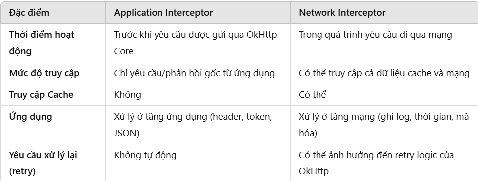
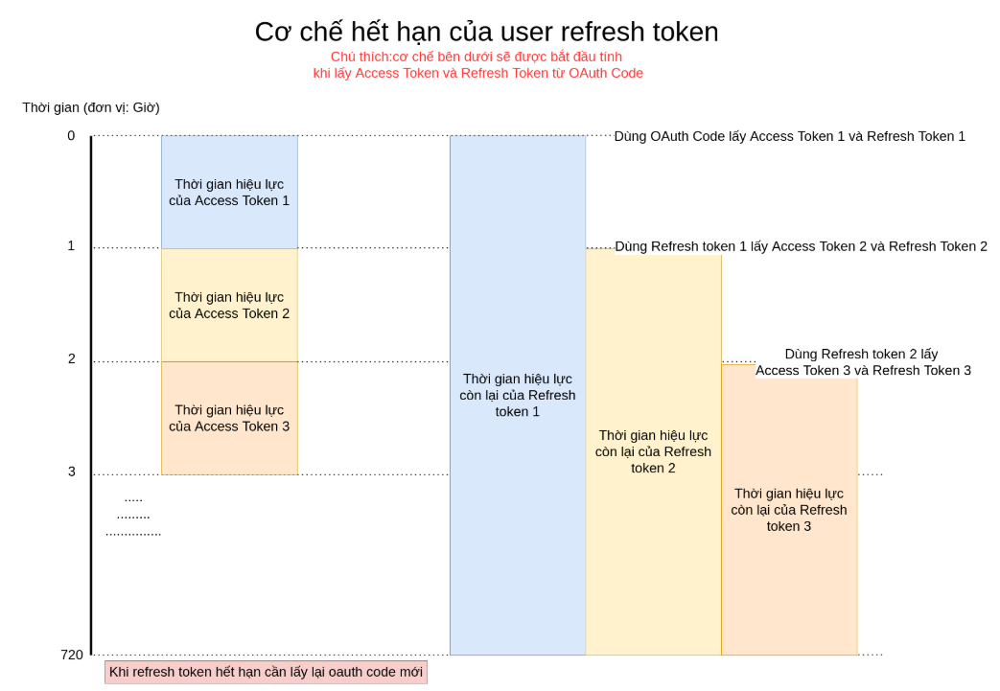

# Retrofit / Ktor Client

## Interceptor
`Interceptors` là một khái niệm mạnh mẽ, có thể giám sát, chỉnh sửa, xác thực, lưu trữ tạm (cache) và thực hiện lại (retry) các yêu cầu API. Nói đơn giản, khi chúng ta thực hiện một yêu cầu API, interceptors có thể giám sát yêu cầu đó, thực hiện một số tác vụ hoặc áp dụng một chuỗi các interceptors trong cùng một yêu cầu.

Interceptors hoạt động rất giống với nhân viên an ninh sân bay trong quá trình kiểm tra an ninh. Họ kiểm tra vé máy bay của chúng ta, đóng dấu xác nhận, sau đó cho phép chúng ta qua.

## Application Interceptors và Network Interceptors
### Application Interceptors
Đây là những interceptor có cấp độ cao được sử dụng để chặn các các request lên hoặc response phản hồi về. Chúng thường được sử dụng để viết lại các `header/query` ở cả request và response. Những interceptor chắc chắn được gọi một lần ngay cả khi phản hồi được nạp từ bộ lưu trữ (cache).

- Vị trí trong luồng xử lý:
  - Làm việc ở tầng ứng dụng, trước khi yêu cầu được gửi đến OkHttp Core.
  - Không liên quan đến việc thực hiện yêu cầu mạng hay cache.
- Quy trình xử lý:
  - Yêu cầu (Request):
    - Interceptor có thể sửa đổi, thay đổi, hoặc ghi log trước khi yêu cầu được gửi đến mạng.
    - Nó chỉ thấy dữ liệu gốc của yêu cầu do ứng dụng gửi đi, chưa bị ảnh hưởng bởi bất kỳ yếu tố mạng nào.
  - Phản hồi (Response):
    - Nó nhận được phản hồi đã xử lý bởi OkHttp Core và có thể thực hiện các thao tác như chỉnh sửa hoặc ghi log.
- Truy cập Cache:
  - Không thể truy cập cache hoặc các dữ liệu được xử lý bởi OkHttp.
- Ứng dụng phổ biến:
  - Thêm header:
    - Ví dụ: Thêm token xác thực (Authorization: Bearer <token>) vào tất cả các yêu cầu.
- Thay đổi dữ liệu yêu cầu/phản hồi:
  - Chuyển đổi dữ liệu phản hồi từ JSON sang các đối tượng trong ứng dụng.
- Quản lý token:
  - Kiểm tra mã phản hồi (như 401 Unauthorized) để tự động làm mới token.
- Lưu ý:
  - Nếu một yêu cầu thất bại, nó sẽ không tự động chạy lại qua Application Interceptor.

### Network Interceptor
Đây là những interceptor có cấp độ thấp hơn được sử dụng để theo dõi các request và response được truyền quan mạng. Nó rất hữu ích để theo dõi việc redirect, retry và tạo ra truy cập đến những chi tiết của request. Chúng không được gọi nếu response đã được lưu trữ.

- Vị trí trong luồng xử lý:
  - Hoạt động trong quá trình giao tiếp mạng, khi yêu cầu đi qua OkHttp Core.
  - Có thể sửa đổi các yêu cầu sau khi được OkHttp Core xử lý và trước khi nó gửi đến mạng.
- Quy trình xử lý:
  - Yêu cầu (Request):
    - Có thể xem hoặc thay đổi yêu cầu đã hoàn thiện, bao gồm tiêu đề (headers), cache, và body.
    - Nó xử lý các yêu cầu gần mạng hơn, cho phép bạn can thiệp trực tiếp vào kết nối mạng.
  - Phản hồi (Response):
    - Nhận được phản hồi từ server và có thể chỉnh sửa trước khi gửi đến ứng dụng.
- Truy cập Cache:
  - Có thể truy cập cache hoặc các dữ liệu tạm thời mà OkHttp lưu trữ.
  - Thường dùng để xử lý dữ liệu cache hoặc kiểm tra dữ liệu phản hồi mạng.
- Ứng dụng phổ biến:
  - Ghi log chi tiết:
    - Ghi lại các yêu cầu, phản hồi, thời gian thực hiện, headers và body.
  - Giải mã phản hồi mã hóa:
    - Ví dụ: Giải mã dữ liệu phản hồi khi server trả về dữ liệu ở dạng nén.
  - Theo dõi thời gian phản hồi:
    - Đo lường thời gian giữa khi yêu cầu rời khỏi thiết bị đến khi nhận được phản hồi từ server.
- Lưu ý:
  - Network Interceptor có thể thấy và sửa đổi kết nối mạng ở mức thấp hơn (bao gồm kết nối SSL hoặc dữ liệu truyền tải qua mạng).

### Sự khác nhau giữa Application Interceptors và Network Interceptors




### Implement Interceptor
Chúng ta chỉ cần phải implement interface `Interceptor` và override lại method `intercept()` như được triển khai dưới đây. Cả 2 loại Interceptor là Application vs Network Interceptor thì được implement bởi cùng một interface.

```java
private class CustomInterceptor : Interceptor {
    @Throws(IOException::class)
    override fun intercept(chain: Interceptor.Chain): Response {
        // chain.request() returns the original request that you can work with (modify, rewrite)
        val request = chain.request()

        // Here you can rewrite the request

        // chain.proceed(request) is the call which will initiate the HTTP work.
        // This call invokes the request and returns the response as per the request.
        val response = chain.proceed(request)

        // Here you can rewrite/modify the response

        return response
    }
}
```

Ví dụ:

ApplicationInterceptor
```java
class ApplicationInterceptor : Interceptor {
    override fun intercept(chain: Interceptor.Chain): Response {
        // Lấy request gốc
        val originalRequest = chain.request()

        // Tạo request mới với header "Authorization"
        val modifiedRequest = originalRequest.newBuilder()
            .addHeader("Authorization", "Bearer your_token")
            .build()

        // Tiếp tục với request mới
        return chain.proceed(modifiedRequest)
    }
}
```

NetworkInterceptor
```java
class NetworkInterceptor : Interceptor {
    override fun intercept(chain: Interceptor.Chain): Response {
        // Lấy request gốc
        val request = chain.request()

        // Gửi request và nhận response
        val response = chain.proceed(request)

        // Log thông tin response
        println("Response Code: ${response.code}")
        println("Response Body: ${response.peekBody(2048).string()}")

        // Trả về response
        return response
    }
}
```

## Authentication và Authorization
### Authentication
**Authentication (xác thực)** là quá trình kiểm tra danh tính của một tài khoản khi tài khoản này tham gia vào hệ thống hiện tại thông qua một hệ thống xác thực khác. Đây cũng là bước đầu tiên của mọi hệ thống có yếu tố người tham gia hiện nay. 

Authentication là về việc xác thực thông tin đăng nhập như Tên người dùng / ID người dùng và mật khẩu để xác minh danh tính. Trong các public và private network, hệ thống xác thực danh tính người dùng thông qua mật khẩu đăng nhập. Authentication thường được thực hiện bởi tên người dùng và mật khẩu, và đôi khi kết hợp với các yếu tố xác thực, trong đó đề cập đến các cách khác nhau để được xác thực.

Dựa trên cấp độ bảo mật, authentication factor có thể thay đổi theo một trong các cách sau:
- Single-Factor Authentication
- Two-Factor Authentication
- Multi-Factor Authentication

### Authorization
Authorization xảy ra sau khi hệ thống của bạn được authentication (xác thực) thành công, cuối cùng cho phép bạn toàn quyền truy cập các tài nguyên như thông tin, file, cơ sở dữ liệu, quỹ, địa điểm, hầu hết mọi thứ. Nói một cách đơn giản, authorization xác định khả năng của bạn để truy cập hệ thống và ở mức độ nào. Khi danh tính của bạn được hệ thống xác minh sau khi xác thực thành công, bạn sẽ được phép truy cập tài nguyên của hệ thống.

Authorization là quá trình để xác định xem người dùng được xác thực có quyền truy cập vào các tài nguyên cụ thể hay không. Nó xác minh quyền của bạn để cấp cho bạn quyền truy cập vào các tài nguyên như thông tin, cơ sở dữ liệu, file, v.v. Authorization thường được đưa ra sau khi xác thực xác nhận các đặc quyền của bạn để thực hiện. Nói một cách đơn giản hơn, nó giống như cho phép ai đó chính thức làm điều gì đó hoặc bất cứ điều gì.

|Authentication     |Authorization     |
|-----|-----|
|Authentication xác nhận danh tính của bạn để cấp quyền truy cập vào hệ thống.     |Authorization xác định xem bạn có được phép truy cập tài nguyên không.     |
|Đây là quá trình xác nhận thông tin đăng nhập để có quyền truy cập của người dùng.     |Đó là quá trình xác minh xem có cho phép truy cập hay không.     |
|Nó quyết định liệu người dùng có phải là những gì anh ta tuyên bố hay không.     |Nó xác định những gì người dùng có thể và không thể truy cập.     |
|Authentication thường yêu cầu tên người dùng và mật khẩu.     |Các yếu tố xác thực cần thiết để authorization có thể khác nhau, tùy thuộc vào mức độ bảo mật.     |
|              Authentication là bước đầu tiên của authorization vì vậy luôn luôn đến trước.                                                |Authorization được thực hiện sau khi authentication thành công.                                                                                                   |


## Access Token, Refresh Token, Bearer Token
### Access Token
Access Token  là một đoạn mã nhỏ chứa một lượng lớn dữ liệu. Thông tin về người dùng, quyền, nhóm và khung thời gian được nhúng trong một mã thông báo truyền từ máy chủ đến thiết bị của người dùng. 

Rất nhiều trang web sử dụng access token. Ví dụ, nếu bạn đã từng sử dụng thông tin đăng nhập từ một trang web (như Facebook) để truy cập vào một trang web khác, thì bạn đã sử dụng access token.

#### Đặc điểm của Access Token
1. Thời gian sống (TTL - Time To Live):

- Access Token có thời gian sống ngắn (thường vài phút hoặc vài giờ).
- Sau khi hết hạn, người dùng cần yêu cầu một token mới.
2. Không lưu trạng thái (Stateless):

- Access Token thường không yêu cầu server lưu trữ thông tin trạng thái vì các thông tin cần thiết đã được mã hóa trong token.
3. Tính bảo mật:

- Được ký bằng khóa bí mật hoặc chứng chỉ số, đảm bảo không thể bị giả mạo.
- Chỉ nên được truyền qua kết nối an toàn (HTTPS).

#### Thành phần
Một access token thông thường bao gồm ba phần riêng biệt, tất cả đều hoạt động cùng nhau để xác minh quyền truy cập tài nguyên của người dùng. 
1. **Header**: Dữ liệu về loại mã thông báo và thuật toán được sử dụng để tạo ra mã thông báo được bao gồm ở đây. 
2. **Payload**: Thông tin về người dùng, bao gồm quyền và ngày hết hạn, đều được bao gồm ở đây. 
3. **Signature**: phần mã hóa của cả hai header và payload kết hợp với mã bí mật cùng thuật toán mã hóa đã được chỉ định ở header.

Vì những thông tin cần thiết để truyền tải được nằm trong payload thế nên dựa vào payload hệ thống có thể xác định được danh tính của người dùng thông qua nó.

VD:
```java
{
  "id" : 1,
  "username": "hoaitx"
}
```
Thì khi lên hệ thống sẽ đọc được id của tôi và xác định được tôi là ai.

Thông tin trong payload chỉ được mã hóa bằng base64, điều đó có nghĩa từ mã JWT tôi có thể trích xuất được những thông tin có trong payload vì thế bạn cần thận trọng trong việc đưa thông tin vào payload trước khi kí chúng. Chắc chắn rằng những thông tin nhạy cảm như password, hay các thông tin cá nhân không cần thiết thì không nên đưa vào.

### Refresh Token
User Refresh Token là thông tin cần để lấy User Access Token mới trong trường hợp User Access Token đã hết hạn.

User Refresh Token sẽ có thời gian hiệu lực tối đa là 30 ngày (tức 720 giờ) và Refresh Token mới sẽ kế thừa thời gian hiệu lực của Refresh Token dùng để tạo ra nó. Trong trường hợp Refresh Token hết hạn, bạn phải thực hiện lại bước yêu cầu user cấp quyền cho Ứng dụng



### Bearer Token
Khi Access Token được truyền trong phần Authorization Header của HTTP request với từ khóa Bearer, nó được gọi là Bearer Token.

Phương thức này hay còn được gọi là token authentication có thể hiểu đơn giản là “cấp quyền truy cấp cho người mang (bearer) token này”. Bearer token sẽ cho phép truy cập đến một số tài nguyên hoặc url nhất định và thường là một chuỗi string được mã hóa, được sinh ra bởi server trong response để thực hiện request login.

Khi thực hiện bằng phương thức này thì client phải gửi bearer token này trong header để thực hiện request

#### Thành phần của bearer token
Mã thông báo Bearer thường bao gồm một chuỗi ký tự ngẫu nhiên. Về mặt hình thức, nó có dạng từ khóa "Bearer" và giá trị mã thông báo được phân tách bằng khoảng trắng. Sau đây là dạng chung của mã thông báo Bearer:
```java
Bearer {token_value}
```
VD:
```java
import okhttp3.OkHttpClient
import okhttp3.Request
import okhttp3.Response
import java.io.IOException

fun fetchProtectedResource(accessToken: String) {
    // Tạo OkHttpClient
    val client = OkHttpClient()

    // Xây dựng yêu cầu HTTP với Bearer Token
    val request = Request.Builder()
        .url("https://api.example.com/resource")
        .addHeader("Authorization", "Bearer $accessToken") // Thêm Bearer Token vào header
        .build()

    // Thực hiện yêu cầu
    client.newCall(request).enqueue(object : okhttp3.Callback {
        override fun onFailure(call: okhttp3.Call, e: IOException) {
            // Xử lý lỗi
            println("Request failed: ${e.message}")
        }

        override fun onResponse(call: okhttp3.Call, response: Response) {
            response.use { 
                if (!response.isSuccessful) {
                    println("Unexpected response code: ${response.code}")
                } else {
                    // Xử lý kết quả trả về từ server
                    println("Response: ${response.body?.string()}")
                }
            }
        }
    })
}
```

## Retrofit/OkHttp
### OkHttp
`OkHttp` là một thư viện của bên thứ ba do Square phát triển để gửi và nhận các yêu cầu mạng dựa trên HTTP. Nó được xây dựng trên thư viện Okio , cố gắng hiệu quả hơn về việc đọc và ghi dữ liệu so với các thư viện Java I/O chuẩn bằng cách tạo một nhóm bộ nhớ dùng chung . Nó cũng là thư viện cơ bản cho thư viện Retrofit cung cấp tính an toàn kiểu cho việc sử dụng các API dựa trên REST.

#### Sử dụng OkHttp

Đầu tiên, chúng ta phải khởi tạo `OkHttpClient` và tạo một đối tượng `Request`.
```java
// should be a singleton
OkHttpClient client = new OkHttpClient();

Request request = new Request.Builder()
                     .url("http://publicobject.com/helloworld.txt")
                     .build();
```
Nếu có bất kỳ tham số truy vấn nào cần được thêm vào, lớp `HttpUrl` do `OkHttp` cung cấp có thể được sử dụng để xây dựng URL:
```java
HttpUrl.Builder urlBuilder = HttpUrl.parse("https://ajax.googleapis.com/ajax/services/search/images").newBuilder();
urlBuilder.addQueryParameter("v", "1.0"); //"v", "1.0": Phiên bản của API là 1.0.
urlBuilder.addQueryParameter("q", "android"); //"q", "android": Tìm kiếm hình ảnh với từ khóa "android"
urlBuilder.addQueryParameter("rsz", "8"); //"rsz", "8": Số lượng kết quả trả về, ở đây là 8.
String url = urlBuilder.build().toString();

Request request = new Request.Builder()
                     .url(url)
                     .build();
```
#### Cuộc gọi mạng đồng bộ
Chúng ta có thể tạo một đối tượng Call và gửi yêu cầu mạng một cách đồng bộ:
```java
Response response = client.newCall(request).execute();
```
Vì Android không cho phép các cuộc gọi mạng trên luồng chính, bạn chỉ có thể thực hiện các cuộc gọi đồng bộ nếu bạn thực hiện trên một luồng riêng biệt hoặc một dịch vụ nền. Bạn cũng có thể sử dụng AsyncTask cho các cuộc gọi mạng nhẹ.
#### Cuộc gọi mạng không đồng bộ
Chúng ta cũng có thể thực hiện các cuộc gọi mạng không đồng bộ bằng cách tạo một đối tượng Call, sử dụng `enqueue()` và truyền một `Callback` ẩn danh triển khai cả `onFailure()` và `onResponse()`.
```java
// Get a handler that can be used to post to the main thread
client.newCall(request).enqueue(new Callback() {
    @Override
    public void onFailure(Call call, IOException e) {
        e.printStackTrace();
    }

    @Override
    public void onResponse(Call call, final Response response) throws IOException {
        if (!response.isSuccessful()) {
            throw new IOException("Unexpected code " + response);
        } else {
            Toast.makeText(getActivity(), "Connection successful", Toast.LENGTH_LONG).show();
        }
    }
});
```
### Retrofit
Retrofit là một HTTP client type-safe cho Android và Java. Retrofit giúp dễ dàng kết nối đến một dịch vụ REST trên web bằng cách chyển đổi API thành Java Interface.

Theo mặc định, Retrofit 2 tận dụng OkHttp làm lớp mạng và được xây dựng dựa trên lớp này. Retrofit tự động tuần tự hóa phản hồi JSON bằng POJO (Plain Old Java Object) phải được định nghĩa trước cho Cấu trúc JSON.

#### Sử dụng
Để tuần tự hóa JSON, trước tiên chúng ta cần một trình chuyển đổi để chuyển đổi JSON thành Gson. Chúng ta cần thêm các phụ thuộc sau vào `build.grade` của mình.
```java
compile 'com.squareup.retrofit2:retrofit:2.1.0'
compile 'com.google.code.gson:gson:2.6.2'
compile 'com.squareup.retrofit2:converter-gson:2.1.0'
```
Thêm quyền truy cập internet vào tệp `AndroidManifest.xml`.

#### Thiết lập Retrofit Inteface
```java
import okhttp3.OkHttpClient
import okhttp3.logging.HttpLoggingInterceptor
import retrofit2.Retrofit
import retrofit2.converter.gson.GsonConverterFactory

object APIClient {

    private var retrofit: Retrofit? = null

    fun getClient(): Retrofit {
        if (retrofit == null) {
            // Tạo interceptor để log thông tin HTTP
            val interceptor = HttpLoggingInterceptor()
            interceptor.level = HttpLoggingInterceptor.Level.BODY

            // Thêm interceptor vào OkHttpClient
            val client = OkHttpClient.Builder()
                .addInterceptor(interceptor)
                .build()

            // Cấu hình Retrofit
            retrofit = Retrofit.Builder()
                .baseUrl("https://reqres.in")
                .addConverterFactory(GsonConverterFactory.create())
                .client(client)
                .build()
        }

        return retrofit!!
    }
}
```

### Ktor Client 
**Ktor** là một framework phát triển ứng dụng cho Kotlin giúp xử lý các yêu cầu HTTP và giao tiếp mạng. **Ktor Client** là một phần của framework này dùng để thực hiện các yêu cầu HTTP, giúp bạn dễ dàng gọi API từ ứng dụng của mình.

#### Cài đặt
Để sử dụng Ktor Client, bạn cần thêm dependencies vào file build.gradle (Module: app).
```java
dependencies {
    implementation "io.ktor:ktor-client-core:2.3.1"
    implementation "io.ktor:ktor-client-android:2.3.1"  // Dành cho Android
    implementation "io.ktor:ktor-client-serialization:2.3.1"  // Dùng để serialize/deserialize JSON
    implementation "io.ktor:ktor-client-logging:2.3.1"  // Dùng để ghi log request/response
}
```

#### Khởi tạo Ktor Client
Để bắt đầu sử dụng Ktor Client, bạn cần khởi tạo một instance của HttpClient. Sau đây là ví dụ về cách khởi tạo một HttpClient cơ bản:
```java
import io.ktor.client.*
import io.ktor.client.engine.android.*
import io.ktor.client.request.*
import io.ktor.client.features.json.*
import io.ktor.client.features.json.serializer.*

val client = HttpClient(Android) {
    install(JsonFeature) {
        serializer = KotlinxSerializer(Json { ignoreUnknownKeys = true })  // Để xử lý JSON
    }
    install(Logging) {
        level = LogLevel.ALL  // Để ghi log tất cả các yêu cầu HTTP
    }
}
```
#### Gửi yêu cầu HTTP
Ví dụ, bạn muốn gửi một yêu cầu GET tới một API:
```java
import io.ktor.client.request.*
import io.ktor.http.*

suspend fun getWeather(city: String): String {
    val response: String = client.get("https://api.openweathermap.org/data/2.5/weather") {
        parameter("q", city)  // Thêm tham số "q" với tên thành phố
        parameter("appid", "your_api_key")  // Thêm tham số "appid" với API key
    }
    return response
}
```
Ví dụ gửi một yêu cầu POST với body là JSON:
```java
import io.ktor.client.request.*
import io.ktor.http.*

suspend fun createUser(username: String, password: String): String {
    val response: String = client.post("https://example.com/api/users") {
        contentType(ContentType.Application.Json)
        body = """
            {
                "username": "$username",
                "password": "$password"
            }
        """
    }
    return response
}
```

#### Đóng Ktor Client
Sau khi sử dụng xong, bạn nên đóng client để giải phóng tài nguyên:
```java
client.close()
```
