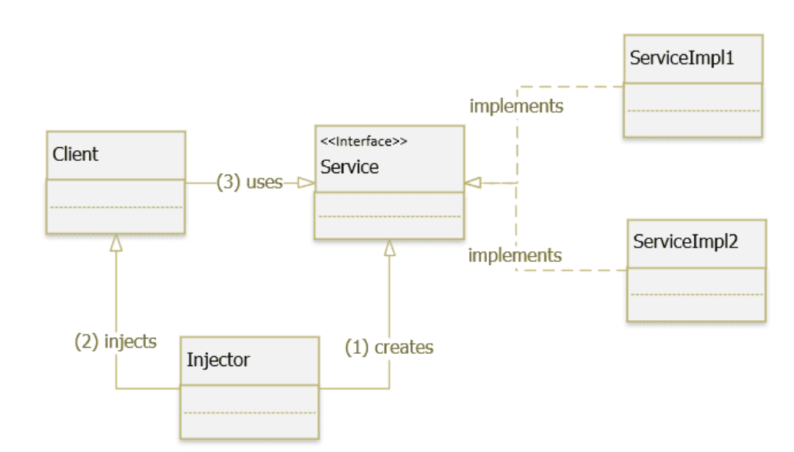
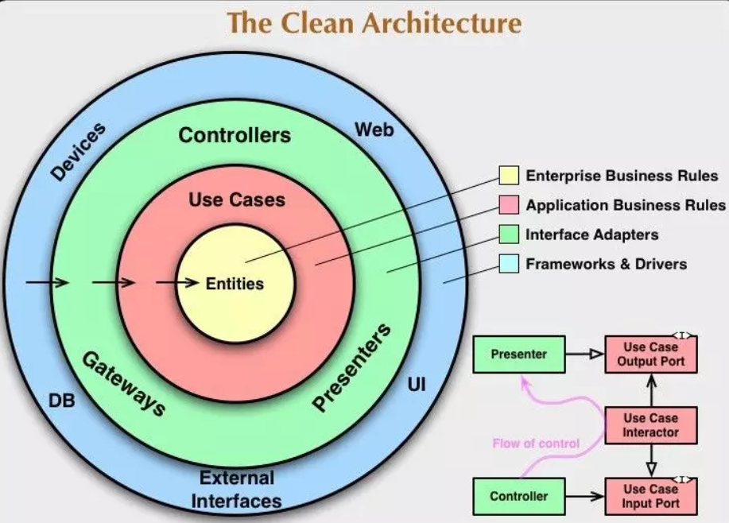
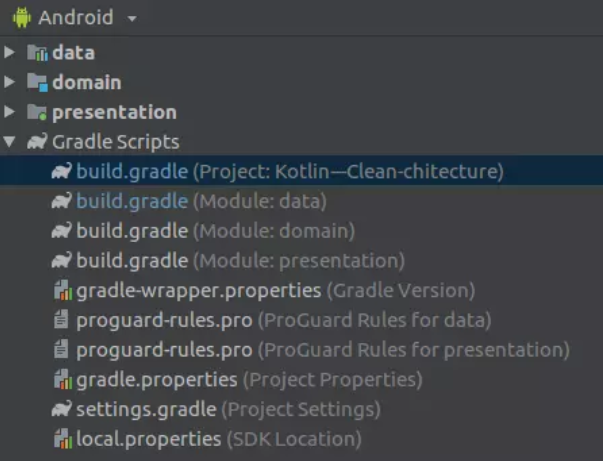
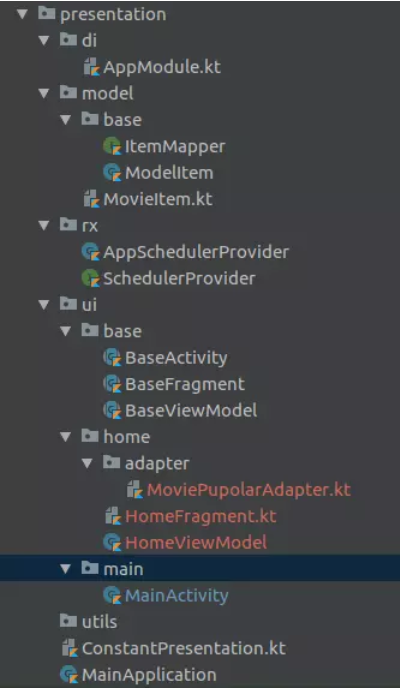
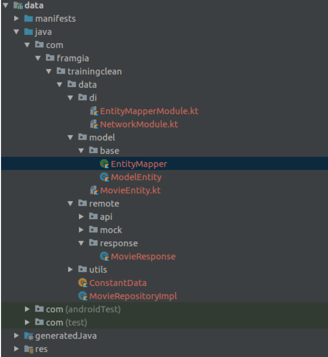
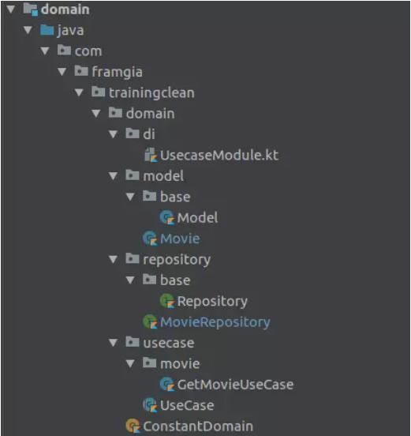

# Software Architecture Concepts

---

## SOLID
SOLID là viết tắt của 5 chữ cái đầu trong 5 nguyên tắc thiết kế hướng đối tượng. Giúp cho lập trình viên viết ra những đoạn code dễ đọc, dễ hiểu, dễ maintain.

5 nguyên tắc đó bao gồm:

- Single responsibility priciple (SRP)
- Open/Closed principle (OCP)
- Liskov substitution principe (LSP)
- Interface segregation principle (ISP)
- Dependency inversion principle (DIP)

### Single responsibility principle (Nguyên tắc đơn nhiệm)

| Một class có quá nhiều chức năng sẽ trở nên cồng kềnh và trở nên khó đọc, khó maintain. Mà đối với ngành IT việc requirement thay đổi, cần thêm sửa chức năng là rất bình thường, nên việc code trong sáng, dễ đọc dễ hiểu là rất cần thiết.|
|-----|

Một class có quá nhiều chức năng sẽ trở nên cồng kềnh và trở nên khó đọc, khó maintain. Mà đối với ngành IT việc requirement thay đổi, cần thêm sửa chức năng là rất bình thường, nên việc code trong sáng, dễ đọc dễ hiểu là rất cần thiết.

### Open-Closed principle (Nguyên tắc đóng mở)

|Có thể thoải mái mở rộng 1 class, nhưng không được sửa đổi bên trong class đó.     |
|-----|

Chúng ta không được thay đổi hiện trạng của các lớp có sẵn, nếu muốn thêm tính năng mới, thì hãy mở rộng class cũ bằng cách kế thừa để xây dựng class mới. Làm như vậy sẽ tránh được các tình huống làm hỏng tính ổn định của chương trình đang có.

Ví dụ: Class `Book`:
```java
public class Book {
    private String name;
    private int yearOfPublish, pages;
    private int price;
}
```
Muốn định giá sách, nếu là tiểu thuyết trên 100 trang thì x2 giá tiền:
```java
public class Book {
    String name, typeOfBook;
    int pages;

    private int price;
    int valuate()
    {
        if(this.typeOfBook.equals("Novel") && this.pages > 100) return (this.price * 2);
        return this.price;
    }
    Book(String name, String typeOfBook, int pages, int price)
    {
        this.typeOfBook = typeOfBook;
        this.name = name;
        this.pages = pages;
        this.price = valuate();
    }
}
```
Cách làm này đúng nhưng sai với nguyên tắc Open-Closed. Giả dụ nếu muốn thêm kiểu định giá khác với loại sách khác, chúng ta lại phải vào sửa hàm `valuate()`.

- Tạo nhiều class loại sách kế thừa `Book`:
```java

public class Novel extends Book {

    private int price;

    public int getPrice() {
        return price;
    }

    public void setPrice(int price) {
        this.price = price;
    }

    Novel(String name, int pages, int price)
    {
        super(name, pages);
        if(pages > 100) this.price = price * 2;
        else this.price = price;
    }
}
```
### The Liskov Subtitution Principle (Nguyên tắc phân cùng Liskov)

|Trong một chương trình, các object của class con có thể thay thế class cha mà không làm thay đổi tính đúng đắn của chương trình.     |
|-----|

Ví dụ: Việc viết class `Square` kế thừa từ `Rectangle` là vi phạm nguyên tắc L.

### Interface Segregation Principle (Nguyên tắc phân tách giao diện)

|Không nên ép các lớp (class) phụ thuộc vào những giao diện mà chúng không sử dụng.  |
|-----|

Nói cách khác, một lớp nên có các giao diện nhỏ gọn, tập trung thay vì những giao diện lớn và cồng kềnh. Điều này giúp tránh các phụ thuộc không cần thiết và đảm bảo rằng các lớp chỉ triển khai những phương thức mà chúng thực sự cần.

### Dependency Inversion Principle (Nguyên tắc đảo ngược phụ thuộc)

|Module cấp cao (high-level module) không nên phụ thuộc vào module cấp thấp (low-level module). Mà cả 2 nên phụ thuộc vào abstractions.     |
|-----|

|Abstraction không nên phụ thuộc vào chi tiết (implementation). Mà chi tiết (implementation) nên phụ thuộc vào abstraction.     |
|-----|

Ví dụ:

```java
class LightBulb {
    fun turnOn() {
        // Code to turn on the bulb
    }

    fun turnOff() {
        // Code to turn off the bulb
    }
}

class Switch(private val bulb: LightBulb) {
    fun operate() {
        // Code to operate the bulb (e.g., turn it on or off)
        bulb.turnOn()
    }
}
```
Class `Switch` phụ thuộc trực tiếp vào class `LightBulb`. 

Đoạn mã trên vi phạm nguyên tắc `Dependency Inversion Principle (DIP)` trong SOLID.

Sửa đổi để tuân thủ DIP:
```java
interface Switchable {
    fun turnOn()
    fun turnOff()
}

class LightBulb : Switchable {
    override fun turnOn() {
        // Code to turn on the bulb
    }

    override fun turnOff() {
        // Code to turn off the bulb
    }
}

class Switch(private val device: Switchable) {
    fun operate() {
        // Code to operate the device
        device.turnOn()
    }
}
```

### KISS (KEEP IT SIMPLE STUPID)

KISS có nghĩa là giữ cho code của bạn thật đơn giản, càng đơn giản, ngắn gọn càng tốt.

#### Áp dụng KISS vào code
- Đặt tên hàm, biến, method, class, package, comment rõ nghĩa.
- Không lạm dụng framework, pattern.
- Chia vấn task của bạn thành các task nhỏ hơn để code 1 cách rõ ràng.
- Giới hạn mỗi method chỉ nên từ 30-50 lines, và mỗi method chỉ nên thực hiện 1 chức năng.
- Hiểu rõ các vấn đề trước khi code.
- Không nên sử dụng nhiều câu lệnh `If` trong 1 method, hãy tách nó ra thành các method khác nhau.

### DRY (DON'T REPEAT YOURSELF)

Nguyên tắc này có nghĩa là đừng có viết lặp bất kỳ lại một đoạn mã nào mà hãy đóng gói nó thành phương thức riêng. Đến khi cần thì chỉ cần gọi tên nó ra.

## Dependency injection

Dependency Injection (DI) là một design pattern, một kỹ thuật cho phép xóa bỏ sự phụ thuộc giữa các module, làm cho ứng dụng dễ dàng hơn trong việc thay đổi module, bảo trì code và testing.

DI cung cấp cho một đối tượng các thể hiện phụ thuộc (dependencies) của nó từ bên ngoài truyền vào mà không phải khởi tạo trực tiếp từ trong class sử dụng.

Nhiệm vụ của dependency injection:
- Tạo các đối tượng
- Quản lý sự phụ thuộc (dependencies) giữa các đối tượng
- Cung cấp (inject) các phụ thuộc được yêu cầu cho đối tượng (được truyền từ bên ngoài đối tượng)

Nguyên tắc hoạt động của DI:
- Các module không giao tiếp trực tiếp với nhau, mà thông qua interface. Module cấp thấp sẽ implement interface, module cấp cao sẽ gọi module cấp thấp thông qua interface.
- Việc khởi tạo các module cấp thấp sẽ do DI Container/ IoC Container thực hiện.
- Việc module nào gắn với interface nào sẽ được config trong file properties, trong file XML DI cung cấp cho một đối tượng các thể hiện phụ thuộc (dependencies) của nó từ bên ngoài truyền vào mà không phải khởi tạo trực tiếp từ trong class sử dụng.



Các thành phần tham gia Dependency Injection Pattern:

- `Client` : là một class cần sử dụng Service.
- `Service` : là một class/ interface cung cấp service/ dependency cho Client.
- `ServiceImpl`: cài đặt các phương thực cụ thể của Service.
- `Injector`: là một lớp chịu trách nhiệm khởi tạo các service và inject các thể hiện này cho Client.

Các dạng Dependency Injection
- `Constructor Injection`: Các dependency sẽ được container truyền vào (inject vào) 1 class thông qua constructor của class đó. Đây là cách thông dụng nhất.
- `Setter Injection`: Các dependency sẽ được truyền vào 1 class thông qua các hàm setter.
- `Fields/properties`: các dependency sẽ được truyền vào class một cách trực tiếp vào các field.
- `Interface injection`: Class cần inject sẽ implement 1 interface. Interface này chứa 1 hàm tên Inject. Container sẽ injection dependency vào 1 class thông qua việc gọi hàm Inject của interface đó. Đây là cách rườm rà và cũng ít được sử dụng.
- `Service Locator`: nó hoạt động như một mapper, cho phép thay đổi code tại thời điểm run-time mà không cần biên dịch lại ứng dụng hoặc phải khởi động lại.

Ví dụ:

Chẳng hạn chúng ta có một ứng dụng sử dụng EmailService để thực hiện việc gửi mail, thì thông thường mã nguồn sẽ như sau:
```java
public class EmailService {
    public void sendEmail(String message, String receiver){
        // Code logic để gửi mail
        System.out.println("Email sent to "+receiver+"with Message="+message);
    }
}
```
Class EmailService có phương thức sendEmail bao gồm 2 tham số truyền vào, yêu cầu người gửi phải có nội dung thư và địa chỉ email của người nhận. Tiếp theo, chúng ta có code ứng dụng như sau:
```java
public class MyApplication {
    private EmailService email = new EmailService();

    public void processMessages(String msg, String receiver){
        // Thực hiện validate nội dung thư
        this.email.sendEmail(msg,receiver);
    }
}
```
Cuối cùng, chúng ta sẽ viết thêm code client sử dụng class MyApplication để gửi mail:
```java
public class ApplicationTest {
    public static void main(String[] args){
        MyApplication app = new MyApplication();
        app.processMessages("Hi Framgia", "framgia@framgia.com");
    }
}
```

Về cơ bản việc implement như trên không phải là sai, tuy nhiên nếu làm việc với một dự án lớn thì sẽ vô cùng hạn chế đối với team phát triển.

#### Sử dụng dependency injection
Tạo một interface có tên MessageService để service implement:
```java
public interface MessageService {
    public void sendMessage(String msg, String receiver);
}
```
Tiếp theo, chúng ta có Email và SMS service implement interface này:
```java
public class EmailServiceImpl implements MessageService {
    public void sendMessage(String msg, String receiver){
        // Code logic gửi mail
        System.out.println("Email sent to "+receiver+"with Message="+msg);
    }
}

public class SMSServiceImpl implements MessageService {
    public void sendMessage(String msg, String receiver){
        // Code logic gửi sms
        System.out.println("SMS sent to "+receiver+"with Message="+msg);
    }
}
```

Đối với những class sử dụng service thì không nhất thiết phải có một interface cơ sở. Trong ví dụ này sử dụng một interface cơ sở có tên Consumer:
```java
public interface Consumer {
    public void processMessages(String msg, String receiver);
}
```
Lớp Consumer implement interface này sẽ như sau:
```java
public class MyDIApplication implements Consumer {
    private MessageService service;

    public MyDIApplication(MessageService svc){
        this.service = svc;
    }

    public void processMessages(String msg, String receiver){
        // Thực hiện validate msg
        this.service.sendMessage(msg,receiver);
    }
}
```
Tiếp theo, chúng ta sẽ viết các class injector dùng để khởi tạo `service` và `consumer`. Trước tiên chúng ta có interface `MessageServiceInjector` với method trả về `Consumer`.
```java
public interface MessageServiceInjector {
    public Consumer getConsumer();
}
```
Như vậy, đối với mỗi một service, chúng ta sẽ có một class injector như sau:
```java
public class EmailServiceInjector implements MessageServiceInjector {
    public Consumer getConsumer() {
        return new MyDIApplication(new EmailServiceImpl());
    }
}

public class SMSServiceInjector implements MessageServiceInjector {
    public Consumer getConsumer() {
        return new MyDIApplication(new SMSServiceImpl());
    }
}
```
Chúng ta sẽ có ứng dụng client như sau:
```java
public class MyMessageDITest {
    public static void main(String[] args) {
        String msg = "Hi Pankaj";
        String email = "pankaj@abc.com";
        String phone = "4088888888";
        MessageServiceInjector injector = null;
        Consumer app = null;
        
        //Send email
        injector = new EmailServiceInjector();
        app = injector.getConsumer();
        app.processMessages(msg, email);
        
        //Send SMS
        injector = new SMSServiceInjector();
        app = injector.getConsumer();
        app.processMessages(msg, phone);
    }
}
```

## Clean Architecture
Clean Architecture được xây dựng dựa trên tư tưởng "độc lập" kết hợp với các nguyên lý thiết kế hướng đối tượng(đại diện tiêu biểu là Dependency Inversion).

Kiến trúc của Clean Architecture chia thành 4 layer với một quy tắc phụ thuộc. Các layer bên trong không nên biết bất kỳ điều gì về các layer bên ngoài. Điều này có nghĩa là nó có quan hệ phụ thuộc nên "hướng" vào bên trong.



**Entities**: là khái niệm dùng để mô tả các Business Logic. Đây là layer quan trọng nhất, là nơi bạn thực hiện giải quyết các vấn đề - mục đích khi xây dựng app.

**Use case**: chứa các rule liên quan trực tiếp tới ứng dụng cục bộ (application-specific business rules).

**Interface Adapter**: tập hợp các adapter phục vụ quá trình tương tác với các công nghệ.

**Framework and Drivers**: chứa các công cụ về cơ sở dữ liệu và các framework

> Code của các class thuộc lớp trong không được tham chiếu đến code của class thuộc lớp ngoài.

Thông thường thì một ứng dụng của bạn có thể có tùy ý số lượng các layer. Thường thì một ứng dụng Android sẽ có 3 layer:

- **Outer**: Implementation layer: là nơi mà tất cả mọi thứ của framwork xảy ra, điều này bao gồm tất cả các công cụ Android như là tạo các activity, các fragment, gửi intent, networking và databases.
- **Middle**: Interface adapter layer: là hoạt động như một kết nối giữa business logic và framework specific code.
- **Inner**: Business logic layer: tương tự như trên.

Ví dụ: project `MovieDB`



- **Package presentation(Outer)**: nó chứa UI, Network, Storage, ... UI là nơi bạn có thể đặt các Activity, Fragment hay các đoạn code có liên quan tới user interface. Storage - Database specific code được implements các Interactors interface để thực hiện truy cập dữ liệu và lưu trữ dữ liệu. Ví dụ như ContentProviders hay DBFlow. Network: gồm những code liên quan tới mạng như là Retrofit:



- **Package data (Middle)** : Đây là layer kết nối thực hiện business logic. Presenters - xử lý các event từ UI (như là click, touch) và phục vụ các callback từ inner layer. Interface EntityMapper - Có trách nhiệm chuyển đổi inner models thành outer models và ngược lại:



- **Package domain(Inner)**: Core layer chứa code ở mức level cao nhất. Models - là mô hình business của bạn, nơi bạn tao thao tác các business logic. Usecase - đây là những class thực sự chứa business logic của bạn. Chúng được chạy ở background và giao tiếp event với layer trên sử dụng callbacks. Repo thì tương tự như chúng ta đã biết:



## Modularization
Mô-đun hóa là một hoạt động tổ chức một cơ sở mã thành các phần được ghép nối lỏng lẻo và độc lập. Mỗi phần là một mô-đun. Mỗi mô-đun độc lập và phục vụ một mục đích rõ ràng. Bằng cách chia một vấn đề thành các bài toán con nhỏ hơn và dễ giải quyết hơn, bạn giảm bớt sự phức tạp của việc thiết kế và bảo trì một hệ thống lớn.


