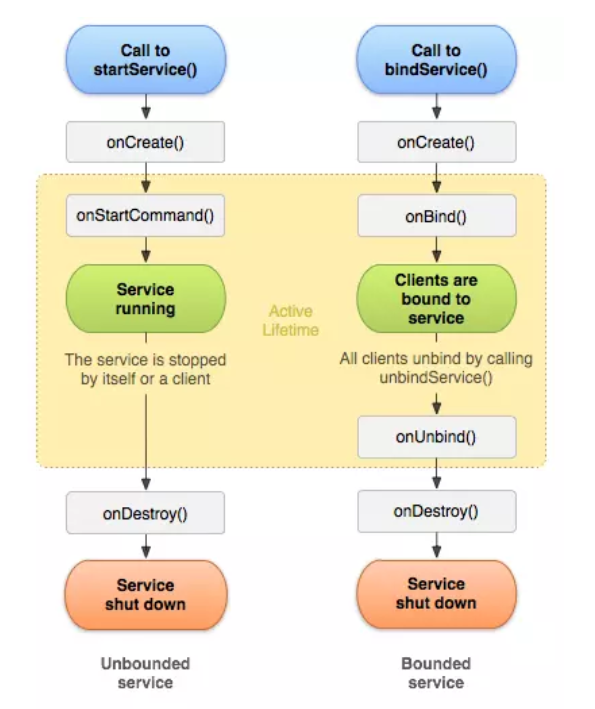
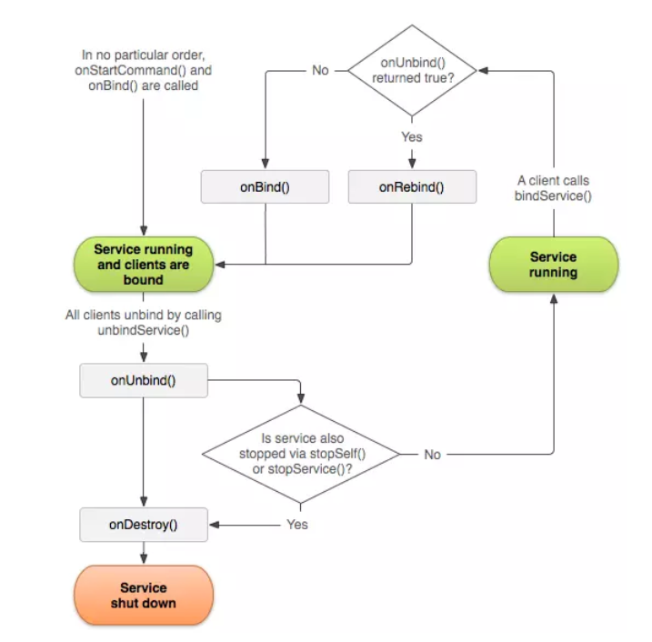

# Service & Broadcast receiver

## Service 
### Khái niệm
Một Service là một thành phần (component) có thể thực hiện các hoạt động lâu dài trong background và nó không cung cấp một giao diện người dùng. Một thành phần khác của ứng dụng có thể start nó, và nó tiếp tục chạy trong background ngay cả khi người dùng chuyển sang ứng dụng khác.

Ngoài ra một thành phần có thể liên kết (bind) với một Service để tương tác với Service đó, thậm chí là thực hiện truyền thông liên tiến trình IPC (interprocess communication - IPC bạn có thể hiểu là một hoạt động chia sẽ dữ liệu qua nhiều tiến trình, thông thường sử dụng giao thức truyền thông và nó phải có Client và Server).

### Phân loại Service

#### 1. Foreground Service
Một Foreground Service thực hiện một số thao tác mà người dùng chú ý, có thể thấy rõ ràng. Ví dụ một ứng dụng nghe nhạc có thể chơi một bản nhạc và control nó bằng Foreground Service. 

Một điều bắt buộc là Foreground Service phải hiện thị một Notification. Foreground Service sẽ tiếp tục chạy ngay cả khi người dùng không tương tác với ứng dụng.

#### 2. Background Service
Một Background Service sẽ thực hiện các hoạt động mà không được người dùng chú ý trực tiếp. Ví dụ một ứng dụng sử dụng một service để thu gom bộ nhớ chẳng hạn thì service là một Background Service, hoạt động mà người dùng không cần thiết phải để ý.

#### 3. Bound Service
Một service được gọi là Bound khi một thành phần của ứng dụng ràng buộc với nó bởi lời gọi `bindService()`. Một Bound Service cung cấp một giao diện Client - Server cho phép các thành phần tương tác với nó: gửi yêu cầu, nhận kết quả và thậm chí là IPC.

Một `Bound Service` chỉ chạy miễn là có một thành phần ràng buộc với nó. Có thể có nhiều thành phần ràng buộc với Bound Service cùng lúc, nhưng khi tất cả tháo bỏ ràng buộc (unbound) thì nó sẽ `Destroy`. 

### Vòng đời của Service 

Trước đây Service thường được chia là `Started Service` và `Bound Service`.



`Bound Service` khó bị kill nhất, tiếp theo là `Foreground Service` và `Background Service`.

`Bound > Foreground > Background`

Vậy nếu ở Background Service thì Service dễ bị kill nhất nên ta phải xử lý một cách thích hợp. Tùy thuộc vào giá trị trả về trong `onStartCommand()` mà Service có thể được khởi động lại.

Khi bạn tạo một service bạn phải kế thừa lớp Service của Android cung cấp. Khi bạn thực thi bạn phải override một vài phương thức quan trọng xử lý trong vòng đời của Service và cung cấp một cơ chế cho phép các thành phần liên kết với Service nếu thích hợp. Sau đây là một số phương thức quan trọng đó:

#### 1. `onStartCommand()`
Hệ thống gọi phương thức này khi một thành phần khác (Activity chẳng hạn) gọi đến Service bằng câu lệnh `startService()`. Khi phương thức này được thực hiện, dịch vụ được khởi động và có thể chạy trong background vô thời hạn. Khi công việc hoàn thành bạn nên stop bằng cách gọi `stopService()` từ một thành phần khác, hoặc cho chính Service gọi `stopSelf()`. Nếu bạn chỉ muốn ràng buộc với Service thì không nên sử dụng `onStartCommand()`.

#### 2. `onBind()`
Hệ thống sẽ gọi phương thức này khi một thành phần khác gọi đến Service bằng câu lệnh `bindService()`. Khi bạn triển khai phương thức này bạn phải cung cấp một giao diện để client có thể giao tiếp với Service thông qua một đối tượng IBinder do Service trả về. Khi bạn kế thừa từ lớp Service của Android bạn phải luôn luôn override phương thức này, nhưng nếu bạn không muốn ràng buộc (bind) bạn có thể `return null`.

#### 3. `onCreate()`
Hệ thống gọi phương thức này khi Service được khởi tạo, và nó chỉ chạy một lần trước khi `onStartCommand()` hoặc `onBind()` được gọi. Nếu Service đã chạy thì phương thức này không được gọi lại lần nào nữa.

#### 4. `onDestroy()`
Hệ thống gọi phương thức này khi Service không được sử dụng nữa và đang bị hủy (destroy). Bạn cũng nên giải phóng tài nguyên như các `Threads, Listeners hay Receivers` ở đây. Đây là phương thức cuối cùng được gọi của Service.

### Khi Started và Bound Service chạy đồng thời


Điều kiện cần là cả hai loại service đều được hủy thì Service mới được hủy.

### Phân biệt `startService()` và `bindService()`

|Đặc điểm   |`startService()`   |`bindService()`   |
|---|---|---|
| Cách hoạt động  |Gọi `onStartCommand()` của Service, chạy độc lập.   | Gọi `onBind()`, trả về một IBinder để giao tiếp với Service.  |
| Mục đích sử dụng  |Dùng khi không cần giao tiếp với Service, chỉ cần chạy nền.   |Dùng khi cần giao tiếp hai chiều giữa Service và Activity/Fragment.   |
|Khi nào dừng   |Dừng bằng `stopService()` hoặc khi tự gọi `stopSelf()`.   |Dừng khi tất cả các Client hủy liên kết bằng `unbindService()`.   |
|Vòng đời   |Không bị ràng buộc với Activity, có thể chạy ngay cả khi Activity bị hủy.   |Ràng buộc với Activity, nếu Activity bị hủy, Service có thể dừng nếu không có client nào khác.   |
|Ví dụ sử dụng   |- Phát nhạc nền, tải dữ liệu nền, đồng bộ dữ liệu.   |- Dịch vụ phát nhạc có điều khiển (Play, Pause, Stop), giao tiếp với Bluetooth.   |

## Broadcase receiver
Broadcast Receiver là một Android component cho phép đăng kí để lắng nghe những sự kiện từ hệ thống hoặc ứng dụng . Tất cả những "receiver" đã được đăng kí đều được thông báo khi sự kiện nó lắng nghe xảy ra vào run-time.

Ví dụ một số Broadcast từ hệ thống như thông báo rút cắm sạc , pin yếu , chế độ máy bay , khởi động máy ,... Không như activity , BroadcastReceiver không có giao diện , ta có thể truyền thông tin thông qua intent để đóng gói dữ liệu.


### Đăng kí nhận Broadcast
#### Đăng kí tĩnh
Sử dụng tag `<receiver>` trong Android Manifest.

Một vài sự kiện sẽ yêu cầu Permission.
```declarative
<receiver android:name = ".ActionReceiver">
    <intent-filter>
            <action android:name = "android.intent.action.AIRPLANE_MODE"/>
    </intent-filter>
</receiver>
```
```declarative
class ActionReceiver: BroadcastReceiver() {
    override fun onReceive(context: Context? , intent: Intent?) {
        // Event received....
    }
}
```

- Khi thiết bị bật/tắt chế độ máy bay, hệ thống Android sẽ tự động gửi Broadcast Intent.
- `ActionReceiver` sẽ nhận Intent này và thực thi phương thức `onReceive()`.

#### Đăng kí động
Đăng kí trong code với phương thức `Context.registerReceiver()` và hủy đăng kí bằng `Context.unregisterReceiver()`.

Khi `Activity` bị hủy thì việc lắng nghe Broadcast cũng dừng theo, còn đăng kí qua Manifest thì không.

```declarative
val intentFilter = IntentFilter("android.intent.action.AIRPLANE_MODE")
registerReceiver(actionReceiver , intentFilter)
```
```declarative
override fun onDestroy() {
    super.onStop()
    unregisterReceiver(actionReceiver)
}
```

### Gửi Broadcast
#### Normal Broadcast
Đây là cách gửi broadcast không đồng bộ , bên receiver cũng vậy. Các receiver nhận không theo thứ tự và không thể sử dụng kết quả truyền qua nhau.

```declarative
val intent = Intent("action.myaction")
intent.putExtra("action" , "data")
sendBroadcast(intent)
```

#### Ordered Broadcast
Cách gửi này được bên receiver nhận lần lượt theo thứ tự dựa vào thuộc tính `android:priority`. Receiver nào có chỉ số priority cao hơn sẽ nhận trước và truyền data tới receiver tiếp theo hoặc có thể hủy luôn chuỗi broadcast.

VD:
```declarative
class HighPriorityReceiver : BroadcastReceiver() {
    override fun onReceive(context: Context, intent: Intent) {
        Toast.makeText(context, "High Priority Receiver nhận Broadcast!", Toast.LENGTH_SHORT).show()
        
        // Chặn Broadcast, không cho LowPriorityReceiver nhận
        abortBroadcast()
    }
}
```
```declarative
class LowPriorityReceiver : BroadcastReceiver() {
    override fun onReceive(context: Context, intent: Intent) {
        Toast.makeText(context, "Low Priority Receiver nhận Broadcast!", Toast.LENGTH_SHORT).show()
    }
}
```

```declarative
<receiver android:name=".HighPriorityReceiver">
    <intent-filter android:priority="2">
        <action android:name="com.example.ORDERED_BROADCAST"/>
    </intent-filter>
</receiver>

<receiver android:name=".LowPriorityReceiver">
    <intent-filter android:priority="1">
        <action android:name="com.example.ORDERED_BROADCAST"/>
    </intent-filter>
</receiver>
```
- `android:priority="2"` → `HighPriorityReceiver` có độ ưu tiên cao hơn `LowPriorityReceiver` (priority = 1).

### Implicit Broadcast và Explicit Broadcast
Implicit Broadcast là một loại Broadcast Intent không chỉ định tên cụ thể của ứng dụng hoặc thành phần nhận, mà chỉ dựa vào action để hệ thống gửi đến tất cả các ứng dụng đã đăng ký.

VD:
Giả sử một ứng dụng muốn lắng nghe khi điện thoại hoàn tất khởi động (`BOOT_COMPLETED`), ứng dụng không biết chính xác ứng dụng nào gửi mà chỉ cần biết hệ thống Android sẽ gửi sự kiện này.

**Định nghĩa một `BroadcastReceiver` để nhận `BOOT_COMPLETED`**
```declarative
class BootReceiver : BroadcastReceiver() {
    override fun onReceive(context: Context, intent: Intent) {
        if (intent.action == Intent.ACTION_BOOT_COMPLETED) {
            Toast.makeText(context, "Thiết bị đã khởi động xong!", Toast.LENGTH_SHORT).show()
        }
    }
}
```
**Khai báo trong `AndroidManifest.xml`**
```declarative
<receiver android:name=".BootReceiver">
    <intent-filter>
        <action android:name="android.intent.action.BOOT_COMPLETED"/>
    </intent-filter>
</receiver>
```
#### Gửi một Implicit Broadcast
```declarative
val intent = Intent("com.example.MY_IMPLICIT_ACTION")
sendBroadcast(intent)
```
- Ứng dụng không chỉ định đích đến cụ thể, vì vậy bất kỳ ứng dụng nào đăng ký `com.example.MY_IMPLICIT_ACTION` đều có thể nhận.

> Lưu ý quan trọng (Android 8.0 trở lên)
> - Android 8.0 (API 26) đã hạn chế các Implicit Broadcast để tối ưu hiệu suất và tiết kiệm pin.
> - Nếu cần sử dụng Implicit Broadcast, hãy:
>   - Đăng ký động trong code bằng registerReceiver().
>   - Dùng WorkManager thay vì BroadcastReceiver khi cần xử lý nền lâu dài.

### Explicit Broadcast
Explicit Broadcast là loại Broadcast chỉ gửi đến một ứng dụng hoặc một thành phần cụ thể bằng cách chỉ định tên **package** hoặc **component name**.

#### Gửi một Explicit Broadcast
Trong `MainActivity.kt`, gửi Broadcast đến một `BroadcastReceiver` có tên `MyReceiver`:

```declarative
val intent = Intent()
intent.setClassName("com.example.receiverapp", "com.example.receiverapp.MyReceiver")
intent.putExtra("message", "Hello from sender app!")
sendBroadcast(intent)
```
- Ở đây, `com.example.receiverapp` là package name của ứng dụng nhận, và `com.example.receiverapp.MyReceiver` là tên lớp BroadcastReceiver mà ứng dụng muốn gửi.

- Nhận Explicit Broadcast trong `MyReceiver.kt`
```declarative
class MyReceiver : BroadcastReceiver() {
    override fun onReceive(context: Context, intent: Intent) {
        val message = intent.getStringExtra("message")
        Toast.makeText(context, "Received: $message", Toast.LENGTH_SHORT).show()
    }
}
```
- Khai báo trong `AndroidManifest.xml`
```declarative
<receiver android:name=".MyReceiver">
    <intent-filter>
        <action android:name="com.example.EXPLICIT_BROADCAST"/>
    </intent-filter>
</receiver>
```