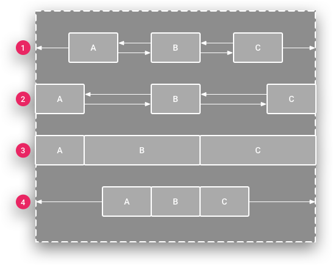

# MỘT SỐ LAYOUT - VIEWBINDING
## FrameLayout
FrameLayout là loại View cơ sở, nó là loại Layout đơn giản nhất. Mặc dù nó có thể chứa nhiều View con bên trong, nhưng mục đích chính thiết kế ra nó để chứa một View, từ đó nó trở thành cơ sở để tạo ra các View khác phức tạp hơn.

Các View con đặt vào FrameLayout nằm chồng nên nhau theo thứ tự cái nào đưa vào sau thì hiện thị ở lớp trước, mỗi View con chỉ có thể điều chỉnh vị trí nó thông qua thuộc tính android:layout_gravity gán cho View con.

### Thuộc tính android:layout_gravity trong các View con
Khi các View nằm trong FrameLayout thì khi gán thuộc tính android:layout_gravity gán các giá trị ở bảng sau vị trí của nó thay đổi tương ứng:

Các giá trị có thể kết hợp bằng ký hiệu `|`

| Giá trị           | Vị trí của view con   |
|-------------------|-----------------------|
| bottom            | Nằm dưới FrameLayout  |
| center            | Nằm giữa FrameLayout  |
| center_horizontal | Giữa theo chiều ngang |
| center_vertical   | Giữa theo chiều dọc   |
| end               | Cuối FrameLayout      |
| left              | Bên trái              |
| right             | Bên phải              |
| start             | Bắt đầu FrameLayout   |  
| top               | Trên FrameLayout      |

Ví dụ:
```
<?xml version="1.0" encoding="utf-8"?>
<FrameLayout xmlns:android="http://schemas.android.com/apk/res/android"
    android:padding="10dp"
    android:layout_width="match_parent"
    android:layout_height="match_parent">
    <!--Ảnh kín FrameLayout-->
    <ImageView
        android:src="@drawable/butterfly"
        android:scaleType="centerCrop"
        android:layout_width="match_parent"
        android:layout_height="match_parent" />

    <!--Button ở giữa, bên phải và cách mép phải FrameLayout 20dp-->
    <Button
        android:layout_gravity="center|right"
        android:layout_marginRight="20dp"
        android:text="Button"
        android:layout_width="wrap_content"
        android:layout_height="wrap_content" />

    <!--Ảnh ở giữa, bên dưới FrameLayout-->
    <ImageView
        android:layout_gravity="center|bottom"
        android:src="@drawable/xuanthulab"
        android:adjustViewBounds="true"
        android:layout_width="150dp"
        android:layout_height="wrap_content" />

    <!--Dòng chữ ở giữa, phần trên FrameLayout-->
    <TextView
        android:layout_gravity="center|top"
        android:layout_marginTop="10dp"
        android:text="Đây là một TextView"
        android:layout_width="100dp"
        android:gravity="center"
        android:layout_height="wrap_content" />

</FrameLayout>
```

## RelativeLayout 
RelativeLayout là layout mà các View con được xác định vị trí bởi các mối liên hệ với View cha hoặc với View con (như View con nằm dưới một View con khác, View con căn thẳng lề phải với View cha,...).

RelativeLayout là một layout hết sức mạnh mẽ về độ tiện lợi và hiệu quả, nếu giao diện không ở mức quá phức tạp việc chọn RelativeLayout mạng lại hiệu suất còn tốt hơn ConstraintLayout. RelativeLayout dùng khi đơn giản, ConstraintLayout khi giao diện phức tạp.

### Định vị và mối liên hệ các View 
Khi các View con đưa vào RelativeLayout nếu chưa có thiết lập mối liên hệ qua lại nào với phần tử cha hay với phần tử View con khác thì nó sẽ được định vị ở góc trên - trái của RelativeLayout.
#### `android:gravity` và `android:ignoreGravity` của RelativeLayout
Các View con khi đã định vị xong trong RelativeLayout, giả sử coi như tất cả các View con nằm vừa trong một đường biên chữ nhật, thì cả khối các View con này có thể dịch chuyển tới những vị trí nhất định trong RelativeLayout bằng thuộc tính: android:gravity, nó nhận các giá trị (có thể tổ hợp lại với ký hiêu `|`)

| Giá trị           | Ý nghĩa                 |
|-------------------|-------------------------|
| center            | Căn ở giữa              |
| top               | Căn ở trên              |
| bottom            | Căn ở dưới              |
| center_horizontal | Ở giữa theo chiều ngang |
| center_vertical   | Ở giữa theo chiều dọc   |
| left              | Theo cạnh trái          |
| right             | Theo cạnh phải          |

Ví dụ:
```java
<?xml version="1.0" encoding="utf-8"?>
<RelativeLayout
    xmlns:android="http://schemas.android.com/apk/res/android"
    android:layout_width="match_parent"
    android:layout_height="match_parent"
    android:layout_margin="8dp"
    android:gravity="center|right"
    android:background="#e2e3eb">

    <!-- Các View con --!>

</RelativeLayout>
```
RelativeLayout có hỗ trợ chỉ ra một View con tách khỏi khối biên chữ nhật chứa các View con để phần tử đó không bị ảnh hưởng bởi gravity bằng thuộc tính `android:ignoreGravity="id-view-con"`.

Ví dụ: Tách phần tử TextView có id: `textview` khỏi ảnh hưởng của **gravity** của RelativeLayout
```java
<?xml version="1.0" encoding="utf-8"?>
<RelativeLayout
    xmlns:android="http://schemas.android.com/apk/res/android"
            android:layout_width="match_parent"
            android:layout_height="match_parent"
            android:layout_margin="8dp"

            android:gravity="center|right"
            android:ignoreGravity="@id/textview"


            android:background="#e2e3eb">
            ...
</RelativeLayout>
```
#### Định vị View con bằng liên hệ với View cha RelativeLayout
Vị trí của View con trong RelativeLayout có thể thiết lập bằng cách chỉ ra mối liên hệ vị trí với view cha. Các thuộc tính thực hiện chức năng này như sau:

| Thuộc tính                                                         | Ý nghĩa                                                                           |
|--------------------------------------------------------------------|-----------------------------------------------------------------------------------|
| android:layout_alignParentBottom/alignParentTop/alignParentLeft/alignParentRight | căn thẳng cạnh dưới/trên/trái/phải view con với cạnh dưới/trên/trái/phải View cha |
| android:layout_centerInParent                                      | căn view con vào giữa View cha                                                    |
| android:layout_centerHorizontal                                    | căn view con vào giữa View cha theo chiều ngang                                   |
| android:layout_centerVertical                                      | căn view con vào giữa View cha theo chiều đứng                                    |

#### Định vị View con bằng liên hệ giữa chúng với nhau
View con trong RelativeLayout ngoài mối liên hệ với View cha như trên, chúng có có thể thiết lập liên hệ với nhau.
(ví dụ như View con này nằm phía trên một View con khác, nằm phía dưới một view con khác ...)

| Thuộc tính                                               | Ý nghĩa                                                                                     |
|----------------------------------------------------------|---------------------------------------------------------------------------------------------|
| android:layout_below                                     | Nằm phía dưới View có ID được chỉ ra                                                        |
| android:layout_above                                     | Nằm phía trên View có ID được chỉ ra                                                        |
| android:layout_toLeftOf/toRightOf                        | Nằm phía trái/phải View có ID được chỉ ra                                                   |
| android:layout_alignBottom/alignTop/alignLeft/alignRight | 	Căn thẳng cạnh dưới/trên/trái/phải với cạnh dưới/trên/trái/phải của View có ID được chỉ ra |

Về phía các cạnh của View con (left, top, right, bottom) nếu có mối liên hệ với View cha hoặc View con thì theo phía đó có thể thiết lập thêm thuộc tính về margin như: android:layout_marginLeft, android:layout_marginTop, android:layout_marginRight, android:layout_marginBottom để thiết lập khoảng cách của mối liên hệ đó.

Ví dụ:
```java
<TextView
        android:id="@+id/view3"
    

        android:layout_centerInParent="true"
        android:layout_alignParentRight="true"
        android:layout_marginRight="30dp"

        android:text="view3"
        android:gravity="center"
        android:layout_width="100dp"
        android:layout_height="100dp"
        android:background="#d4a00f8f" />
```
## ConstraintLayout
ConstraintLayout là một layout mạnh, nó giúp tạo ra các giao diện phức tạp, mềm dẻo (hạn chế tối đa sử dụng các layout lồng nhau). Nó giúp định vị, sắp xếp các View con dựa trên sự ràng buộc liên hệ của các View con với View cha và sự liên hệ ràng buộc giữa các View con với nhau, với cơ chế tạo xích các View, gán trọng số hay sử dụng trợ giúp giao diện với Guideline.

Mỗi view trong ConstraintLayout để định vị được chính xác cần tối thiếu 2 ràng buộc, một theo phương ngang (X) và một theo phương đứng (Y).

Ràng buộc:

| Ràng buộc                                  | Ý nghĩa                                                                                      |
|--------------------------------------------|----------------------------------------------------------------------------------------------|
| layout_constraintLeft_toLeftOf/toRightOf   | Ràng buộc cạnh trái của phần tử tới bên trái/phải của phần tử chỉ ra trong giá trị (gán ID)  |
| layout_constraintRight_toLeftOf/toRightOf  | Ràng buộc cạnh phải của phần tử tới cạnh trái/phải của phần tử chỉ ra trong giá trị (gán ID) |
| layout_constraintTop_toTopOf/toBottomOf    | Ràng buộc cạnh trên của phần tử tới cạnh trên/dưới của phần tử chỉ ra trong giá trị (gán ID) |
| layout_constraintBottom_toTopOf/toBottomOf | Ràng buộc cạnh dưới của phần tử tới cạnh trên/dưới của phần tử chỉ ra trong giá trị (gán ID) |
| layout_constraintBaseline_toBaselineOf     | Trùng Baseline                                                                               |
| layout_constraintStart_toStartOf/toEndOf   | Đầu - Đầu/Cuối                                                                               |
| layout_constraintEnd_toStartOf/toEndOf     | Cuối - Đầu/Cuối                                                                              |

Cạnh nào của View con có ràng buộc thì có thể thiết lập thêm thuộc tính Margin để điều chỉnh thêm khoảng cách các cạnh tới điểm nối ràng buộc.
>Các thuộc tính margin theo các cạnh: `android:layout_marginStart, android:layout_marginEnd, android:layout_marginLeft, android:layout_marginTop, android:layout_marginRight, android:layout_marginBottom`.
> 
> Tương tự có `layout_goneMarginStart, layout_goneMarginEnd, layout_goneMarginLeft, layout_goneMarginTop, layout_goneMarginRight, layout_goneMarginBottom` có hiệu lực khi đối tượng ràng buộc đến gone.

### Tỷ lệ các cạnh của View
Khi View con có thiết lập tối thiểu một kích thước là "0dp" thì kích thước đó có thể tự động điều chỉnh bằng cách lấy theo tỷ lệ với cạnh còn lại, thuộc tính `app:layout_constraintDimensionRatio` cho phép gán tỷ lệ giữa chiều rộng và chiều cao, ví dụ: `app:layout_constraintDimensionRatio="2:1"` chiều rộng gấp đôi chiều cao.


### Phần tử Guideline (Neo Constraint vào đường biên)
Nếu bạn có nhiều view được canh chỉnh theo một trật tự thẳng hàng nào đó (thẳng hàng ngang hay thẳng hàng dọc), bạn có thể cân nhắc sử dụng guideline. Ta có thể một đường kẻ ẩn trong ConstraintLayout nằm ngang hoặc đứng nó như là một View con để các View khác ràng buộc đến nếu muốn. Thêm vào bằng cách:
```java
<android.support.constraint.Guideline
    android:id="@+id/guideline_1"
    android:layout_width="wrap_content"
    android:layout_height="wrap_content"
    android:orientation="vertical"
    app:layout_constraintGuide_percent="0.3" />
```
Thiết lập đó là được kẻ ngang bằng thuộc tính: `android:orientation="horizontal"` đường kể đứng `android:orientation="vertical"`

Vị trị của Guideline có thể thiết lập nó cách cạnh trái (hoặc trên nếu là Guideline ngang) bằng thuộc tính `app:layout_constraintGuide_percent` giá trị là tỷ lệ phần trăm của ConstraintLayout.


### Chức Năng Chain (Xâu Chuỗi Các View Lại, Hay Xích Các View Lại)

Các View ràng buộc qua lại các cạnh tiếp giáp nhau sẽ tạo thành một xích các View. Có hai loại xích các phần tử theo phương ngang và theo phương đứng. Lúc đó, phần tử đầu tiên có chức năng thiết lập chung một số thông số về xích.

Phần tử đầu của xích thiết lập kiểu xích bằng thuộc tính: `app:layout_constraintHorizontal_chainStyle` và `app:layout_constraintVertical_chainStyle` tùy theo xích đứng hay ngang, mặc định xích có kiểu `spread` (`app:layout_constraintHorizontal_chainStyle="spread"` hoặc `app:layout_constraintVertical_chainStyle="spread"`).



1. **Spread**: Đây là kiểu dàn đều các view dựa vào không gian của chúng theo phương ngang hoặc dọc. Đây là kiểu sắp xếp mặc định khi bạn tạo mới một chain. Bạn có thể xem lại minh họa kiểu chain này ở trên kia.
2. **Spread inside**: Kiểu này cũng sẽ dàn đều các view, nhưng nó sẽ tôn trọng constraint của view đầu và cuối trong một chain. Như bạn thấy trên hình, nếu các view A và C đều set margin ở các biên là 0dp thì chúng sẽ dính chặt vào biên như vậy.
3. **Weight**: Cách này tương tự như bạn chỉ định trọng số layout_weight trong LinearLayout vậy. Để sử dụng được weight trong ConstraintLayout thì bạn phải chỉ định các view trong chain về match_constraint, rồi tìm đến thuộc tính horizontal_weight hoặc vertical_weight để thiết lập trọng số này cho từng view. Bạn sẽ hiểu rõ hơn ở minh họa phía dưới đây.
4. **Packed**: Kiểu “đóng gói” các view lại thành một “cục” sát vào nhau. Sau khi đóng gói các view lại xong, bạn có thể sử dụng bias để thay đổi độ lệch theo chiều ngang hoặc dọc cho các gói này (bạn nhớ để ý xem minh họa cho việc thay đổi bias với kiểu packed này ở dưới đây).

## ViewBinding
View Binding cung cấp cho bạn khả năng thay thế `findViewById` bằng các đối tượng ràng buộc được tạo ra để đơn giản hóa code, loại bỏ lỗi và tránh tất cả các `boilerplate` của `findViewById`.

### Setup
Tính năng ViewBinding được bật theo từng module, để bật tính năng liên kết khung hiển thị trong một module, hãy set `viewBinding = true` trong file `build.gradle` ở cấp module.
```java
android {
    ...
    buildFeatures {
        viewBinding = true
    }
}
```
### Cách sử dụng
Nếu tính năng ViewBinding được bật cho một module, hệ thống sẽ tạo một lớp Binding cho từng tệp layout có trong module đó. Mỗi lớp binding chứa thông tin tham chiếu đến view gốc và tất cả các view có ID. 

Tên của lớp liên kết được tạo bằng cách chuyển đổi tên của tệp XML theo quy ước viết hoa Pascal case và thêm từ `"Binding"` vào cuối.

Ví dụ: hãy xem xét tệp bố cục có tên là result_profile.xml có chứa nội dung sau:
```java
<LinearLayout ... >
    <TextView android:id="@+id/name" />
    <ImageView android:cropToPadding="true" />
    <Button android:id="@+id/button"
        android:background="@drawable/rounded_button" />
</LinearLayout>
```
Lớp liên kết được tạo có tên là `ResultProfileBinding`. Lớp này có hai trường: một `TextView` tên là `name` và một `Button` tên là `button`. ImageView trong bố cục không có mã nhận dạng nên không có tham chiếu đến mã này trong lớp liên kết.

Mỗi lớp liên kết cũng bao gồm một phương thức `getRoot()`, cung cấp thông tin tham chiếu trực tiếp đến khung hiển thị gốc của tệp bố cục tương ứng. Trong ví dụ này, phương thức `getRoot()` trong lớp `ResultProfileBinding` sẽ trả về khung hiển thị gốc LinearLayout.

#### Sử dụng tính năng liên kết thành phần hiển thị trong các Activity
Để thiết lập một instance của lớp binding để sử dụng với một Activity, hãy thực hiện các bước sau trong phương thức `onCreate()` của Activity:
1. Gọi phương thức static `inflate()` có trong lớp binding đã tạo. Thao tác này sẽ tạo một thực thể của lớp liên kết để Activity sử dụng.
2. Lấy thông tin tham chiếu đến khung hiển thị gốc bằng cách gọi phương thức `getRoot()` hoặc sử dụng cú pháp thuộc tính Kotlin.
3. Truyền khung hiển thị gốc vào `setContentView()` để đặt khung hiển thị đó làm khung hiển thị đang hoạt động trên màn hình.
```java
private lateinit var binding: ResultProfileBinding

override fun onCreate(savedInstanceState: Bundle?) {
    super.onCreate(savedInstanceState)
    binding = ResultProfileBinding.inflate(layoutInflater)
    val view = binding.root
    setContentView(view)
}
```
Bạn không cần phải gọi `findViewById` khi sử dụng view binding - thay vào đó chỉ sử dụng các thuộc tính được cung cấp để tham chiếu đến bất kì view nào trong layout với `id` của view.

#### Ví dụ
Giả sử bạn có một layout file `activity_main.xml`:
```java
<!-- activity_main.xml -->
<LinearLayout xmlns:android="http://schemas.android.com/apk/res/android"
    android:layout_width="match_parent"
    android:layout_height="match_parent"
    android:orientation="vertical">

    <TextView
        android:id="@+id/textView"
        android:layout_width="wrap_content"
        android:layout_height="wrap_content"
        android:text="Hello, World!" />

    <Button
        android:id="@+id/button"
        android:layout_width="wrap_content"
        android:layout_height="wrap_content"
        android:text="Click Me" />
</LinearLayout>
```
Trong file MainActivity.kt, bạn sẽ sử dụng View Binding như sau:
```java
class MainActivity : AppCompatActivity() {
    private lateinit var binding: ActivityMainBinding

    override fun onCreate(savedInstanceState: Bundle?) {
        super.onCreate(savedInstanceState)
        binding = ActivityMainBinding.inflate(layoutInflater)
        setContentView(binding.root)

        // Truy cập trực tiếp vào các view
        binding.textView.text = "Chào mừng đến với Bàn tay công nghệ!"
        binding.button.setOnClickListener {
            binding.textView.text = "Button đã được click!"
        }
    }
}
```
Trong ví dụ này, lớp ActivityMainBinding được tự động sinh ra dựa trên file activity_main.xml. Bạn có thể truy cập trực tiếp vào các view bằng cách gọi thuộc tính của binding, giúp mã nguồn ngắn gọn và dễ hiểu hơn so với việc sử dụng `findViewById()`.