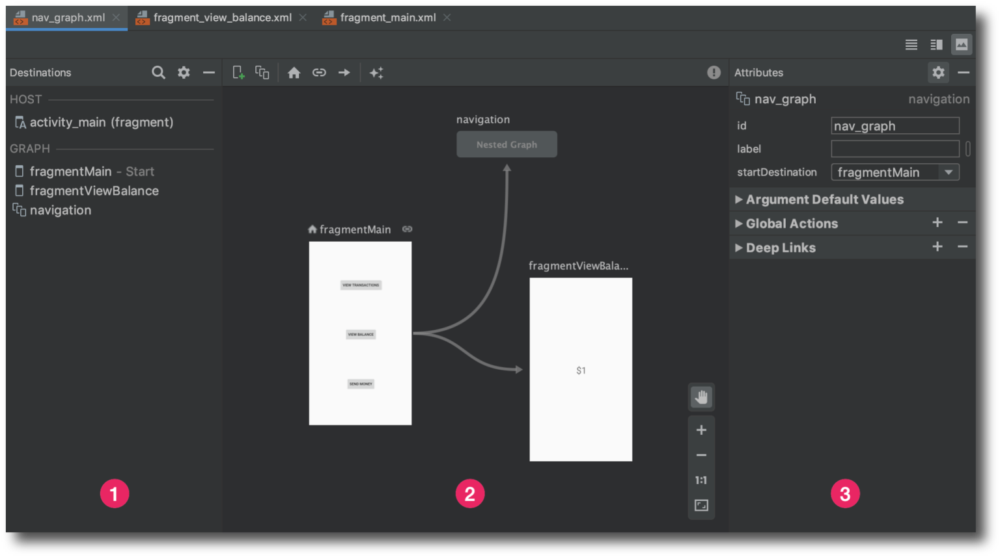
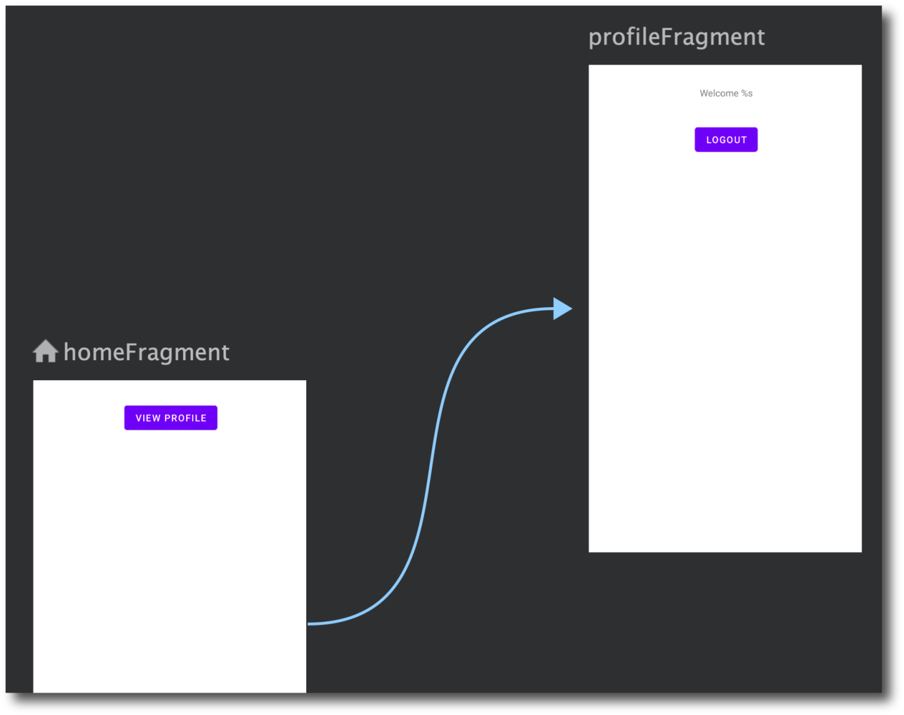
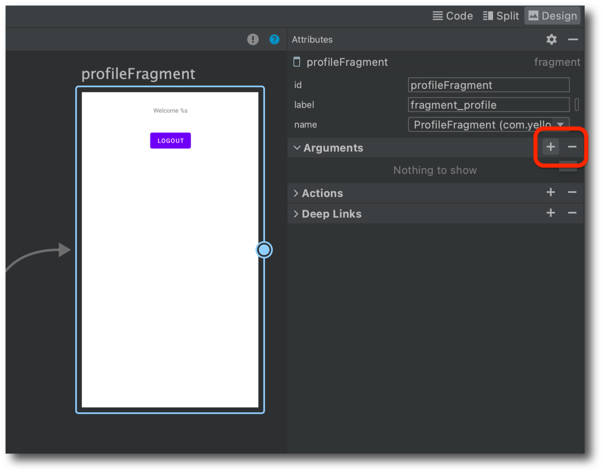
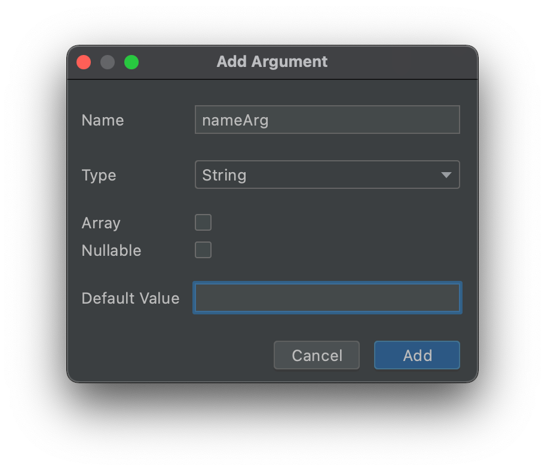

# Navigation

## AndroidX Navigation
**Navigation** là một khung công tác dùng để điều hướng giữa các 'điểm đến' trong ứng dụng Android của bạn, cung cấp một API đồng nhất cho dù các điểm đến được triển khai dưới dạng Fragment, Activity hay các thành phần khác.

Component Navigation bao gồm ba phần chính:

1. Navigation Graph (Tài nguyên XML mới) — Đây là một resource XML mới mà Android đã định nghĩa ra, nó giúp Android Studio vẽ lên một mô hình các màn hình. Mỗi một màn hình này được gọi với cái tên khá rõ ràng là `destination`. Các `destination` này có thể được liên kết với nhau bởi các `action`, mỗi action như vậy có thể cho chúng ta thông tin về đường đi trực quan giữa các `destination` với nhau.

2. NavHostFragment (Giao diện XML Layout) — NavHost là một không gian trên màn hình để chứa từng `destination` bên trong Navigation Graph. Vậy bạn có thể hiểu, Navigation Graph giúp tạo ra một sơ đồ, hay kịch bản mà người dùng sẽ đi qua theo từng `destination` bởi `action`. Rồi từng `destination` đó phải cần một nơi để hiển thị lên trên màn hình, nơi đó chính là NavHost.

3. NavController (Đối tượng Kotlin/Java) — Một đối tượng được xây dựng ra để giúp chúng ta điều khiển việc qua lại giữa các destination bên trong NavHost. Bởi vì dù có Navigation Graph giúp diễn đạt các destination lẫn action, có NavHost để hiển thị destination nào lên màn hình rồi, nhưng không có các dòng lệnh giúp thực thi các thay đổi hiển thị này thì không được, và NavController cung cấp cho chúng ta các công cụ để làm chuyện đó.

### Cách tạo một project sử dụng Navigation
#### Khai báo thư viện
```java
dependencies {
    def nav_version = "2.7.2" // Phiên bản mới nhất có thể khác, kiểm tra trang chính thức

    // Navigation
    implementation "androidx.navigation:navigation-fragment-ktx:$nav_version"
    implementation "androidx.navigation:navigation-ui-ktx:$nav_version"
}
```
#### Xây dựng Navigation Graph
Trong cửa sổ Project của Android Studio, click chuột phải vào thư mục `res/` của project rồi chọn `New > Android Resource File`.

Sau đó, một cửa sổ khai báo hiện ra. Định nghĩa một cái tên cho resource `Navigation Graph` này.


Khi này bạn sẽ thấy một thư mục mới, và một file XML mới được thêm vào project của chúng ta.
#### Làm quen với Navigation Graph
Click vào file `login_nav_graph.xml` để mở resource.



Editor dùng để hiển thị resource Navigation Graph chúng ta gọi với cái tên ngắn gọn hơn là Navigation Editor. Navigation Editor trên đây có đánh số, chia nó làm 3 phần riêng biệt giúp chúng ta dễ dàng thao tác hơn.

1. Destination panel: là một thanh chứ đựng các destination. Các destination bên trong Destination panel được chia ra thành hai nhóm, HOST và GRAPH.
2. Graph Editor: đây có thể nói là tinh túy của Navigation Graph, một nơi giúp vẽ ra sự tương quan giữa các thành phần bên trong Navigation Graph này.
3. Attributes: nơi chứa đựng các tham số định nghĩa cho từng thành phần được chọn bên trong Graph Editor.
#### Thêm NavHost Vào Activity
Tạo một activity chỉ có một `ConstraintLayout`.

Tìm trên thanh `Palette`, vào nhóm `Containers`, bạn sẽ thấy một thành phần UI có tên là `NavHostFragment`. `NavHostFragment` chính là nơi chứa Navigation Graph.
```
<?xml version="1.0" encoding="utf-8"?>
<androidx.constraintlayout.widget.ConstraintLayout xmlns:android="http://schemas.android.com/apk/res/android"
    xmlns:app="http://schemas.android.com/apk/res-auto"
    xmlns:tools="http://schemas.android.com/tools"
    android:layout_width="match_parent"
    android:layout_height="match_parent"
    tools:context=".MainActivity">

    <androidx.fragment.app.FragmentContainerView
        android:id="@+id/fragmentContainerView"
        android:name="androidx.navigation.fragment.NavHostFragment"
        android:layout_width="0dp"
        android:layout_height="0dp"
        app:defaultNavHost="true"
        app:layout_constraintBottom_toBottomOf="parent"
        app:layout_constraintEnd_toEndOf="parent"
        app:layout_constraintStart_toStartOf="parent"
        app:layout_constraintTop_toTopOf="parent"
        app:navGraph="@navigation/login_nav_graph" />
</androidx.constraintlayout.widget.ConstraintLayout>
```
Một số thuộc tính:

- `android:name`: định nghĩa rằng layout trên đây đang chứa thành phần `NavHostFragment`.
- `android:navGraph`: thuộc tính giúp hệ thống biết NavHostFragment này chứa đựng Navigation Graph nào, trong trường hợp này là `login_nav_graph`.
- `app:defaultNavHost`: thuộc tính này giúp hệ thống chặn nút system back cho chúng ta. Đặt thuộc tính này là `true` để NavHostFragment xử lý các sự kiện nhấn nút quay lại (back navigation) trong ứng dụng. Điều này đảm bảo rằng việc nhấn nút quay lại sẽ điều hướng đến các điểm đến trong Navigation Graph thay vì đóng ứng dụng.

#### Thêm Destination Vào Navigation Graph
Trong file `login_nav_graph`:
```java
<?xml version="1.0" encoding="utf-8"?>
<navigation xmlns:android="http://schemas.android.com/apk/res/android"
    xmlns:app="http://schemas.android.com/apk/res-auto"
    xmlns:tools="http://schemas.android.com/tools"
    android:id="@+id/login_nav_graph"
    app:startDestination="@id/homeFragment">
    <fragment
        android:id="@+id/profileFragment"
        android:name="com.yellowcode.navigationsample.ProfileFragment"
        android:label="fragment_profile"
        tools:layout="@layout/fragment_profile" />
    <fragment
        android:id="@+id/homeFragment"
        android:name="com.yellowcode.navigationsample.HomeFragment"
        android:label="fragment_home"
        tools:layout="@layout/fragment_home" />
    <fragment
        android:id="@+id/signInFragment"
        android:name="com.yellowcode.navigationsample.SignInFragment"
        android:label="fragment_sign_in"
        tools:layout="@layout/fragment_sign_in" />
    <fragment
        android:id="@+id/signUpFragment"
        android:name="com.yellowcode.navigationsample.SignUpFragment"
        android:label="fragment_sign_up"
        tools:layout="@layout/fragment_sign_up" />
</navigation>
```
Các thuộc tính:
- `id`: id của destination.
- `label`: là tên của destination. Tên này được dùng như với trường hợp hiển thị tên của màn hình lên Toolbar,...
- `name`: chính là Fragment mà destination này đang đại diện cho.
- `app:startDestination`: thuộc tính này nằm ở navigation, giúp hệ thống biết được destination nào chính là start destination.

#### Sử Dụng NavController
Công dụng của một NavController là di chuyển từ destination này sang destination khác.

NavController có sẵn bên trong NavHostFragment. Gọi ra một NavController bằng phương thức `findNavController()`.
```java
Fragment.findNavController()
        
View.findNavController()
        
Activity.findNavController(viewId: Int)
```
#### Dùng NavController Để Di Chuyển Đến Destination
```java
class HomeFragment : Fragment() {
    override fun onCreateView(
        inflater: LayoutInflater, container: ViewGroup?,
        savedInstanceState: Bundle?
    ): View? {
        // Inflate the layout for this fragment
        return inflater.inflate(R.layout.fragment_home, container, false)
    }

    override fun onViewCreated(view: View, savedInstanceState: Bundle?) {
        super.onViewCreated(view, savedInstanceState)

        view.findViewById<Button>(R.id.btnViewProfile)?.setOnClickListener { 
            // Will use NavController here
        }
    }
}
```
1. Cách 1 – Di Chuyển Trực Tiếp Trên Navigation Graph

NavController có một phương thức `navigate()` cho phép chúng ta truyền vào một `id` của destination để di chuyển.
```java
view.findViewById<Button>(R.id.btnViewProfile)?.setOnClickListener {
    findNavController().navigate(R.id.profileFragment)
}
```
2. Cách 2: Di chuyển bằng Action



```java
<?xml version="1.0" encoding="utf-8"?>
<navigation xmlns:android="http://schemas.android.com/apk/res/android"
    xmlns:app="http://schemas.android.com/apk/res-auto"
    xmlns:tools="http://schemas.android.com/tools"
    android:id="@+id/login_nav_graph"
    app:startDestination="@id/homeFragment">
    <fragment
        android:id="@+id/profileFragment"
        android:name="com.yellowcode.navigationsample.ProfileFragment"
        android:label="fragment_profile"
        tools:layout="@layout/fragment_profile" />
    <fragment
        android:id="@+id/homeFragment"
        android:name="com.yellowcode.navigationsample.HomeFragment"
        android:label="fragment_home"
        tools:layout="@layout/fragment_home" >
        <action
            android:id="@+id/action_homeFragment_to_profileFragment"
            app:destination="@id/profileFragment" />
    </fragment>
    <fragment
        ... />
</navigation>
```
- `id`: chính là id của action.
- `destination`: chính là id của destination mà action này sẽ dẫn đến.

Sau đó, truyền action vào phương thức `navigate()`
```java
view.findViewById<Button>(R.id.btnViewProfile)?.setOnClickListener {
    findNavController().navigate(R.id.action_homeFragment_to_profileFragment)
}
```
#### Truyền Data Qua Lại Giữa Các Destination
Truyền đối với dữ liệu nhỏ, dữ liệu lớn nên dùng ViewModel.

1. Truyền theo Bundle

Ví dụ truyền một giá trị `name` từ `HomeFragment` sang `ProfileFragment`.

Sử dụng phương thức `navigate()`.
```java
view.findViewById<Button>(R.id.btnViewProfile)?.setOnClickListener {
    val bundle = bundleOf(
        "name" to "My Name",
    )
    findNavController().navigate(R.id.action_homeFragment_to_profileFragment, bundle)
}
```
Nhận dữ liệu trong `ProfileFragment`.
```java
override fun onViewCreated(view: View, savedInstanceState: Bundle?) {
    super.onViewCreated(view, savedInstanceState)

    val name = arguments?.getString("name")
    view.findViewById<TextView>(R.id.tvWelcome)?.text = getString(R.string.welcome, "$name")
}
```
2. Cách 2 - Sử dụng Safe Args

Safe Args là một cách thức truyền dữ liệu mới dùng trong Navigaton này. Sở dĩ gọi là Safe Args là vì đây là một kiểu truyền dữ liệu được đảm bảo type-safety, tức là an toàn về kiểu dữ liệu.

Safe Args là viết tắt của từ Safe Arguments. Arguments sẽ thay thế Bundle (về mặt tên gọi thôi chứ thực ra chúng là một).





- Khai báo thư viện:

Thêm classpath sau vào file `build.gradle` của `project`.
```
buildscript {
    ext.kotlin_version = "1.5.10"
    ext.nav_version = "2.3.5"
    repositories {
        google()
        mavenCentral()
    }
    dependencies {
        classpath "com.android.tools.build:gradle:4.2.1"
        classpath "org.jetbrains.kotlin:kotlin-gradle-plugin:$kotlin_version"
        classpath "androidx.navigation:navigation-safe-args-gradle-plugin:$nav_version"
    }
}
```
Trong file `build.gradle` của `module` thì chúng ta phải khai báo thêm `plugin` như sau.
```java
plugins {
    id 'com.android.application'
    id 'kotlin-android'
    id 'androidx.navigation.safeargs.kotlin'
}
```

Sau khi khai báo các bước trên đây, hệ thống sẽ căn cứ vào project của chúng ta mà sẽ tạo ra một số lớp tương ứng. 

- Cứ mỗi một destination mà có một action “dính” tới nó. Tức là một mũi tên từ nó trỏ ra. Sẽ có thêm một lớp mới tạo ra, với tên lớp là sự kết hợp giữa tên lớp của destination cộng với từ `Directions`. Như vậy trong project của chúng ta giờ đây sẽ có thêm một lớp: `HomeFragmentDirections`. Lớp này sẽ chứa đựng các phương thức chính là các action được định nghĩa bên trong destination này.
- Mỗi một phương thức action trên đây có tham số đầu vào chính là các argument cần truyền qua destination khác. Tên của phương thức này cũng chính là tên action. Như vậy với việc khai báo một action với tên (id) là `action_homeFragment_to_profileFragment`, chúng ta sẽ có phương thức kèm theo với tên `actionHomeFragmentToProfileFragment()`, tham số truyền vào chính là một kiểu String có tên `nameArg`.
- Cứ mỗi một destination mà có một argument “dính” tới nó. Tức là đây là destination nhận dữ liệu. Sẽ có thêm một lớp mới tạo ra, với tên lớp là sự kết hợp giữa tên lớp của destination cộng với từ `“Args”`. Như vậy trong project của chúng ta giờ đây sẽ có thêm một lớp: `ProfileFragmentArgs`.

Truyền tham số từ `homeFragment`:
```java
override fun onViewCreated(view: View, savedInstanceState: Bundle?) {
    super.onViewCreated(view, savedInstanceState)

    view.findViewById<Button>(R.id.btnViewProfile)?.setOnClickListener {
        val action = HomeFragmentDirections.actionHomeFragmentToProfileFragment(nameArg = "My Name")
        findNavController().navigate(action)
    }
}
```
Còn ở `ProfileFragment`, chúng ta dùng như sau (có sự hỗ trợ Android KTX ở dòng khai báo args đầu tiên).
```java
val args: ProfileFragmentArgs by navArgs()

// ...

override fun onViewCreated(view: View, savedInstanceState: Bundle?) {
    super.onViewCreated(view, savedInstanceState)

    val name = args.nameArg
    view.findViewById<TextView>(R.id.tvWelcome)?.text = getString(R.string.welcome, "$name")
}
```
## Bottom Navigation
Bottom Navigation là một thanh menu ở cuối màn hình cung cấp điều hướng giữa các chế độ views ở top-level trong ứng dụng.

Ví dụ: Tạo Bottom Navigation theo yêu cầu ở dưới


### Implement thư viện
```java
implementation 'com.android.support:design:28.0.0'
```
### Tạo menu cho Bottom Navigation
`navigation.xml`
```java
<?xml version="1.0" encoding="utf-8"?>
<menu xmlns:android="http://schemas.android.com/apk/res/android">
 
    <item
        android:id="@+id/navigation_shop"
        android:icon="@drawable/ic_store_white_24dp"
        android:title="@string/title_shop" />
 
    <item
        android:id="@+id/navigation_gifts"
        android:icon="@drawable/ic_card_giftcard_white_24dp"
        android:title="@string/title_gifts" />
 
    <item
        android:id="@+id/navigation_cart"
        android:icon="@drawable/ic_shopping_cart_white_24dp"
        android:title="@string/title_cart" />
 
    <item
        android:id="@+id/navigation_profile"
        android:icon="@drawable/ic_person_white_24dp"
        android:title="@string/title_profile" />
 
</menu>
```
### Thiết kế giao diện
`activitymain.xml`
```java
<?xml version="1.0" encoding="utf-8"?>
<android.support.design.widget.CoordinatorLayout xmlns:android="http://schemas.android.com/apk/res/android"
    xmlns:app="http://schemas.android.com/apk/res-auto"
    xmlns:tools="http://schemas.android.com/tools">
 
    <FrameLayout
        android:id="@+id/frame_container"
        android:layout_width="match_parent"
        android:layout_height="match_parent"
        app:layout_behavior="@string/appbar_scrolling_view_behavior" />
 
    <android.support.design.widget.BottomNavigationView
        android:id="@+id/navigation"
        android:layout_width="match_parent"
        android:layout_height="wrap_content"
        android:layout_gravity="bottom"
        android:background="?android:attr/windowBackground"
        app:itemBackground="@color/bgBottomNavigation"
        android:foreground="?attr/selectableItemBackground"
        app:itemIconTint="@android:color/white"
        app:itemTextColor="@android:color/white"
        app:menu="@menu/navigation" />
 
</android.support.design.widget.CoordinatorLayout>
```
Giao diện gồm 2 phần:

- FrameLayout để chứa các Fragment
- BottomNavigationView: Chính là Bottom Navigation, cần sử dụng các thuộc tính để đặt nó xuống phía dưới cùng của màn hình, như ở đây chúng ta sử dụng android:layout_gravity="bottom"

Chú ý các thuộc tính của BottomNavigationView:

- `app:menu` - File menu resource để hiển thị các mục điều hướng cùng với icon và text.
- `app:itemBackground` - Áp dụng background color cho Bottom Navigation.
- `app:itemTextColor` - Màu text của Bottom Navigation item.
- `app:itemIconTint`- Màu icon của Bottom Navigation item.

### Tạo các Fragment và xử lý các sự kiện
Chúng ta tạo ra bốn fragment có tên là StoreFragment, GiftsFragment, CartFragment và ProfileFragment.
```java
class MainActivity : AppCompatActivity() {

    override fun onCreate(savedInstanceState: Bundle?) {
        super.onCreate(savedInstanceState)
        setContentView(R.layout.activity_main)
        
        supportActionBar?.title = "Shop"
        loadFragment(StoreFragment())
        
        val navigation: BottomNavigationView = findViewById(R.id.navigation)
        navigation.setOnNavigationItemSelectedListener { item ->
            handleNavigationItemSelected(item)
        }
    }

    private fun handleNavigationItemSelected(item: MenuItem): Boolean {
        val fragment: Fragment = when (item.itemId) {
            R.id.navigation_shop -> {
                supportActionBar?.title = "Shop"
                StoreFragment()
            }
            R.id.navigation_gifts -> {
                supportActionBar?.title = "My Gifts"
                GiftsFragment()
            }
            R.id.navigation_cart -> {
                supportActionBar?.title = "Cart"
                CartFragment()
            }
            R.id.navigation_profile -> {
                supportActionBar?.title = "Profile"
                ProfileFragment()
            }
            else -> return false
        }
        loadFragment(fragment)
        return true
    }

    private fun loadFragment(fragment: Fragment) {
        supportFragmentManager.beginTransaction()
            .replace(R.id.frame_container, fragment)
            .addToBackStack(null)
            .commit()
    }
}
```
## TabLayout và ViewPager
Thành phần TabLayout là một trong những thành phần thuộc material design. Hơn nữa, nó cũng nằm trong trong thư viện hỗ trợ thiết kế. Trong TabLayout, khi một tab được chọn, một trang khác (hoặc fragment) sẽ được hiển thị tới người dùng.

Thành phần TabLayout có thể có các tab được hiển thị theo một trong hai cách: cố định và cuộn. Nếu các tab được cố định, tất cả các tab sẽ được hiển thị trên màn hình cùng một lúc.

Trong các tab ở chế độ cuộn, nếu số lượng các tab trở nên quá rộng cho màn hình, người dùng có thể vuốt sang trái hoặc phải để xem nhiều tab hơn.

### Xây dựng một ứng dụng đơn giản sử dụng TabLayout với ViewPager
Tạo một TabLayout với 3 tab. Khi mỗi tab được chọn, nó sẽ hiển thị Fragment tương ứng.

```java
class FragmentOne : Fragment() {
 
    override fun onCreateView(inflater: LayoutInflater?, container: ViewGroup?,
                              savedInstanceState: Bundle?): View? =
            inflater!!.inflate(R.layout.fragment_one, container, false)
 
    companion object {
        fun newInstance(): FragmentOne = FragmentOne()
    }
}
```
```java
<LinearLayout xmlns:android="http://schemas.android.com/apk/res/android"
             xmlns:tools="http://schemas.android.com/tools"
             android:layout_width="match_parent"
             android:layout_height="match_parent"
             android:orientation="vertical">
 
    <TextView
            android:layout_width="match_parent"
            android:layout_height="match_parent"
            android:text="FragmentOne"
            android:gravity="center_vertical|center_horizontal"/>
 
</LinearLayout>
```
2 Fragment còn lại làm tương tự.
#### Thêm TabLayout và ViewPager
import thự viện support trong `build.gradle`:
```java
dependencies {
    implementation 'com.android.support:design:26.1.0'
    implementation 'com.android.support:support-v4:26.1.0'
}
```
`res/layout/activlty_main.xml`:
```java
<?xml version="1.0" encoding="utf-8"?>
<android.support.design.widget.CoordinatorLayout
        xmlns:android="http://schemas.android.com/apk/res/android"
        xmlns:app="http://schemas.android.com/apk/res-auto"
        android:id="@+id/main_content"
        android:layout_width="match_parent"
        android:layout_height="match_parent"
        android:fitsSystemWindows="true">
 
    <android.support.design.widget.AppBarLayout
            android:id="@+id/appbar"
            android:layout_width="match_parent"
            android:layout_height="wrap_content"
            android:theme="@style/AppTheme.AppBarOverlay">
 
        <android.support.v7.widget.Toolbar
                android:id="@+id/toolbar"
                android:layout_width="match_parent"
                android:layout_height="?attr/actionBarSize"
                android:background="?attr/colorPrimary"
                app:contentInsetStartWithNavigation="0dp"
                app:layout_scrollFlags="scroll|enterAlways"
                app:popupTheme="@style/AppTheme.PopupOverlay"/>
 
        <android.support.design.widget.TabLayout
                android:id="@+id/tab_layout"
                style="@style/CustomTabLayout"
                android:layout_width="match_parent"
                android:layout_height="?attr/actionBarSize"
                android:layout_gravity="left"
                android:background="@color/colorPrimary"
                app:tabGravity="fill"
                app:tabMode="fixed"/>
 
    </android.support.design.widget.AppBarLayout>
 
    <android.support.v4.view.ViewPager
            android:id="@+id/view_pager"
            android:layout_width="match_parent"
            android:layout_height="match_parent"
            app:layout_behavior="@string/appbar_scrolling_view_behavior"/>
 
</android.support.design.widget.CoordinatorLayout>
```
#### Tạo PagerAdapter
Chúng ta cần phải tạo ra một lớp `SampleAdapter.kt` kế thừa từ `FragmentPagerAdapter`. Lớp này có trách nhiệm quản lý các Fragment khác nhau sẽ được hiển thị trên các tab.
```java
class SampleAdapter(fm: FragmentManager) : FragmentPagerAdapter(fm) {
 
    override fun getItem(position: Int): Fragment? = when (position) {
        0 -> FragmentOne.newInstance()
        1 -> FragmentTwo.newInstance()
        2 -> FragmentThree.newInstance()
        else -> null
    }
 
    override fun getPageTitle(position: Int): CharSequence = when (position) {
        0 -> "Tab 1 Item"
        1 -> "Tab 2 Item"
        2 -> "Tab 3 Item"
        else -> ""
    }
 
    override fun getCount(): Int = 3
}
```
#### Khởi tạo các thành phần
Việc này được thực hiện bên trong `onCreate()` trong `MainActivity.kt`.
```java
class MainActivity : AppCompatActivity() {
 
    override fun onCreate(savedInstanceState: Bundle?) {
        super.onCreate(savedInstanceState)
        setContentView(R.layout.activity_main)
 
        initToolbar()
 
        val tabLayout: TabLayout = findViewById(R.id.tab_layout)
 
        val viewPager: ViewPager = findViewById(R.id.view_pager)
 
        val adapter = SampleAdapter(supportFragmentManager)
 
        viewPager.adapter = adapter
        tabLayout.setupWithViewPager(viewPager)
        
        tabLayout.addTab(tabLayout.newTab().setText("TAB 1 ITEM"))
        tabLayout.addTab(tabLayout.newTab().setText("TAB 2 ITEM"))
        tabLayout.addTab(tabLayout.newTab().setText("TAB 3 ITEM"))
         
        tabLayout.addOnTabSelectedListener(object : TabLayout.OnTabSelectedListener {
            override fun onTabSelected(tab: TabLayout.Tab) {
 
            }
 
            override fun onTabUnselected(tab: TabLayout.Tab) {
 
            }
 
            override fun onTabReselected(tab: TabLayout.Tab) {
 
            }
        })
    }
 
    private fun initToolbar() {
        val toolbar: Toolbar = findViewById(R.id.toolbar)
        setSupportActionBar(toolbar)
        supportActionBar!!.title = "TabLayout Demo"
    }
}
```
## ViewPager2
- Các tính năng mới:
  - Hỗ trợ bố cục right to left (RTL)
  - Hỗ trợ bố trí theo chiều dọc
  - Sự kiện PageChangeListener tốt hơn
- Những gì đã được thay đổi so với phiên bản trước:
  - Ở phiên bản trước sử dụng `PageAdapter` đã được thay thế bằng `RecyclerView.Adapter`
  - `FragmentStateFragmentAdapter` được thay thế bằng `FragmentStateAdapter`
  - `registerOnPageChangeCallback` được thay thế bằng `addPageChangeListener`
### SỬ dụng ViewPager2
#### Thêm dependency
```java
dependencies {
    implementation "androidx.viewpager2:viewpager2:1.1.0"
    // Thêm các dependencies khác nếu cần
}
```
#### Cài đặt
Thêm ViewPager2 vào trong giao diện của Activity hoặc Fragment:
```java
<androidx.viewpager2.widget.ViewPager2
        android:id="@+id/viewPager2"
        android:layout_width="match_parent"
        android:layout_height="match_parent"/>
```
Tạo một layout cho nó `item_page.xml`:
```java
<?xml version="1.0" encoding="utf-8"?>
<RelativeLayout xmlns:android="http://schemas.android.com/apk/res/android"
    xmlns:tools="http://schemas.android.com/tools"
    android:id="@+id/container"
    android:layout_width="match_parent"
    android:layout_height="match_parent">

    <androidx.appcompat.widget.AppCompatTextView
        android:id="@+id/tvTitle"
        android:textColor="@android:color/white"
        android:layout_width="wrap_content"
        android:layout_centerInParent="true"
        tools:text= "item"
        android:textSize="32sp"
        android:layout_height="wrap_content" />

</RelativeLayout>
```
`ViewPagerAdapter.kt`
```java
class ViewPagerAdapter : RecyclerView.Adapter<PagerVH>() {

    private val colors = intArrayOf(
        android.R.color.black,
        android.R.color.holo_red_light,
        android.R.color.holo_blue_dark,
        android.R.color.holo_purple
    )

    override fun onCreateViewHolder(parent: ViewGroup, viewType: Int): PagerVH =
        PagerVH(LayoutInflater.from(parent.context).inflate(R.layout.item_page, parent, false))

    override fun getItemCount(): Int = colors.size

    override fun onBindViewHolder(holder: PagerVH, position: Int) = holder.itemView.run {
        tvTitle.text = "item $position"
        container.setBackgroundResource(colors[position])
    }
}

class PagerVH(itemView: View) : RecyclerView.ViewHolder(itemView)
```
`MainActivity.kt`
```java
class MainActivity : AppCompatActivity() {

    override fun onCreate(savedInstanceState: Bundle?) {
        super.onCreate(savedInstanceState)
        setContentView(R.layout.activity_main)
        viewPager2.adapter = ViewPagerAdapter()
    }
}
```