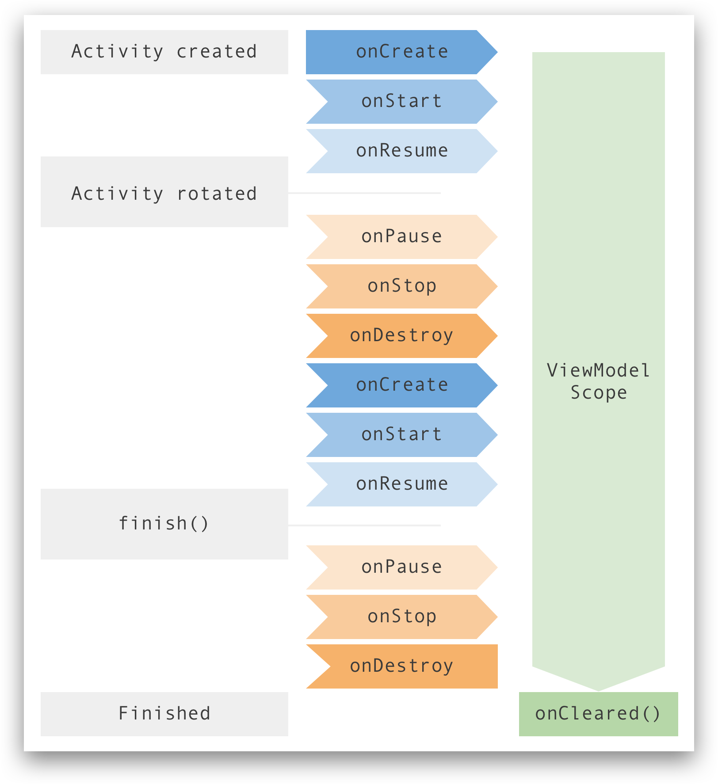
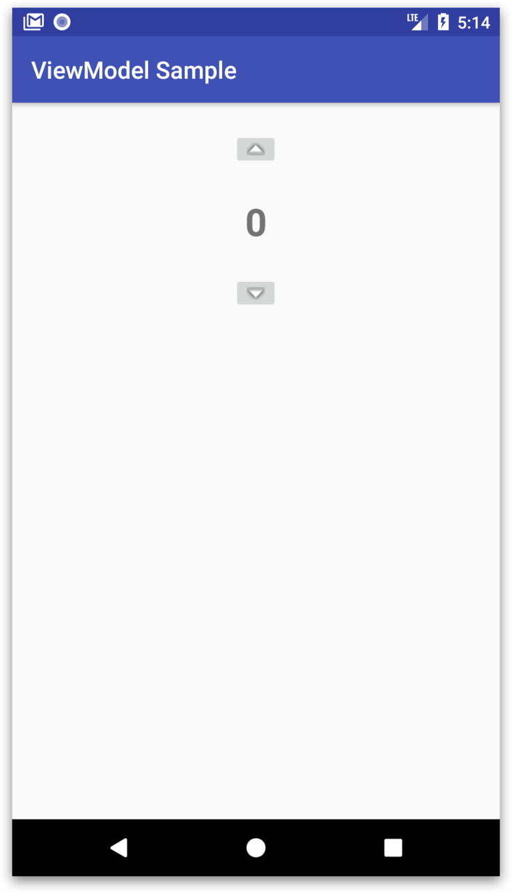

# MVVM
## ViewModel
ViewModel là một phần trong Android Architechture Component. ViewModel thực chất chỉ là một lớp được cung cấp bởi hệ thống, nó được tạo ra nhằm mục đích giúp bạn quản lý các dữ liệu của UI, đảm bảo các dữ liệu này luôn được bảo toàn trong quá trình sống của UI đó.

### Tại sao sử dụng ViewModel?
#### Quản lý Dữ liệu Qua Các Thay Đổi Cấu Hình
   
Khi một Activity hoặc Fragment bị hủy và tạo lại do **configuration change** (như xoay màn hình), ViewModel giữ nguyên trạng thái và dữ liệu. Điều này giúp tránh việc phải tải lại dữ liệu từ đầu, cải thiện hiệu suất và trải nghiệm người dùng.
#### Tách Biệt Logic Kinh Doanh và Giao Diện
ViewModel giúp tách biệt logic xử lý dữ liệu khỏi mã giao diện (UI). Điều này không chỉ giúp mã nguồn trở nên rõ ràng, dễ bảo trì mà còn dễ dàng kiểm thử (unit test) logic xử lý mà không cần phải phụ thuộc vào giao diện.
#### Tối Ưu Hóa Tài Nguyên và Hiệu Suất
Vì ViewModel chỉ được tạo một lần và được chia sẻ giữa các Fragment hoặc Activity (miễn là chúng có cùng phạm vi), nó giúp tránh việc tạo nhiều đối tượng thừa thãi, tiết kiệm tài nguyên và tăng hiệu suất cho ứng dụng.

### Vòng đời vủa ViewModel



Mô tả:
- Theo như sơ đồ trên, thì bạn có thể nhìn thấy “đời sống” của một ViewModel sẽ bắt đầu khi Activity created, trải qua các trạng thái `onCreate, onStart, onResume`.
- Sau đó dù cho Activity rotated (xoay màn hình), với các trạng thái `onPause, onStop, onDestroy, onCreate, onStart, onResume`, mà ViewModel vẫn còn sống.
- Cho đến khi `finish()`, thì ở các trạng thái `onPause, onStop, onDestroy` sau lần gọi đó vẫn chứng kiến ViewModel còn hoạt động, cho đến khi kết thúc sự kiện `onDestroy` thì ViewModel mới kết thúc sứ mệnh bảo vệ dữ liệu cho Activity.

ViewModel hỗ trợ cho Fragment cũng tương tự như vậy.

### Cách sử dụng ViewModel
#### Thêm dependency
```java
implementation("androidx.lifecycle:lifecycle-viewmodel-ktx:2.2.0")
```
#### Tạo lớp ViewModel
Tạo một lớp kế thừa từ lớp ViewModel của hệ thống. Lớp mới này sẽ là lớp giúp chúng ta quản lý dữ liệu.

Ví dụ: `CounterViewModel.kt.`
```java
class CounterViewModel : ViewModel() {
 
    var count = 0
}
```
Code của CounterViewModel rất đơn giản. Bởi vì lớp cha của nó là ViewModel đã làm đủ mọi cách để bảo toàn dữ liệu cho UI mà nó được chỉ định rồi. Nên bên trong CounterViewModel chỉ cần chúng ta chỉ định data nào cần được bảo toàn mà thôi.

#### Sử dụng ViewModel ở UI


Không dùng ViewModel:
```java
class MainActivity : AppCompatActivity(), View.OnClickListener {
 
    var mCounter = 0
 
    override fun onCreate(savedInstanceState: Bundle?) {
        super.onCreate(savedInstanceState)
        setContentView(R.layout.activity_main)
 
        displayCount()
 
        btnUp.setOnClickListener(this)
        btnDown.setOnClickListener(this)
    }
 
    fun displayCount() {
        tvCount.text = mCounter.toString()
    }
 
    override fun onClick(v: View?) {
        when (v?.id) {
            btnUp.id -> {
                mCounter++
                displayCount()
            }
 
            btnDown.id -> {
                mCounter--
                displayCount()
            }
        }
    }
}
```
Dùng ViewModel:
```java
class MainActivity : AppCompatActivity(), View.OnClickListener {
 
    var mCounterViewModel: CounterViewModel? = null
 
    override fun onCreate(savedInstanceState: Bundle?) {
        super.onCreate(savedInstanceState)
        setContentView(R.layout.activity_main)
 
        mCounterViewModel = ViewModelProviders.of(this).get(CounterViewModel::class.java)
 
        displayCount()
 
        btnUp.setOnClickListener(this)
        btnDown.setOnClickListener(this)
    }
 
    fun displayCount() {
        tvCount.text = mCounterViewModel?.count.toString()
    }
 
    override fun onClick(v: View?) {
        when (v?.id) {
            btnUp.id -> {
                mCounterViewModel?.count = mCounterViewModel?.count!! + 1
                displayCount()
            }
 
            btnDown.id -> {
                mCounterViewModel?.count = mCounterViewModel?.count!! - 1
                displayCount()
            }
        }
    }
}
```
> Giải thích:
> - Đầu tiên, chúng ta không cần dùng đến biến `mCounter` để mà lưu trữ con số cho TextView nữa. Thay vào đó chúng ta dùng đến một đối tượng của CounterViewModel với tên mCounterViewModel.
> - Dòng khai báo tiếp theo `mCounterViewModel = ViewModelProviders.of(this).get(CounterViewModel::class.java)` giúp khởi tạo cho `mCounterViewModel`, giúp cho đối tượng này biết mà bảo toàn dữ liệu cho UI được chỉ định ở tham số truyền vào phương thức `of()`, và bảo toàn bằng cách chứa dữ liệu đó vào ViewModel được chỉ định ở tham số truyền vào phương thức `get()`.
> - Nếu bạn truyền vào cùng một UI cho tham số `of()`, bạn sẽ nhận được cùng một thể hiện của ViewModel, điều này giúp đảm bảo được rằng dù cho Activity bị reset lại, thì `mCounterViewModel` vẫn giữ nguyên, thế nên nó mới bảo toàn được dữ liệu.

## LiveData
`LiveData` cũng như ViewModel đều là một phần trong bộ `Android Architecture Component`. LiveData là một lớp, nó dùng để truyền tải các thông điệp về dữ liệu, dựa trên mô hình của Observer.

> `Observer` là một mô hình trong số các mô hình mẫu khác (các mô hình mẫu đều được gọi chung với cái tên Design Pattern). Mô hình Observer này được xây dựng với ý tưởng sẽ có một đối tượng trung tâm (còn được gọi là Subject), đối tượng trung tâm này nắm danh sách các đối tượng quan sát khác (đối tượng quan sát chính là các Observer). Để rồi khi có bất kỳ thay đổi nào với trạng thái của đối tượng trung tâm đó, nó sẽ thông báo ngay cho các đối tượng quan sát được biết.

Với việc `LiveData` cũng dựa trên mô hình của Observer, nó cũng sẽ có các Subject, và các Subject này cũng sẽ có trách nhiệm thông báo các sự thay đổi trạng thái đến các đối tượng quan sát khác. Cụ thể hơn, các Subject khi này là các `ViewModel`, còn các đối tượng giám sát khi này là các Thành phần của ứng dụng (đó là các `Activity, Fragment, hay Service`). 

LiveData hơn hẳn Observer truyền thống ở chỗ nó hiểu rõ vòng đời của các `Thành phần của ứng dụng`, những tín hiệu mà Subject của LiveData truyền đến chỉ khi nào vòng đời của các thành phần quan sát đó đang ở trong trạng thái hoạt động mà thôi.

### Các loại LiveData
LiveData thực tế chỉ là một Abstract Class. Vì vậy, nó không thể được sử dụng như chính nó. Google đã triển khai một số lớp cụ thể đơn giản mà chúng ta có thể sử dụng.

#### LiveData
Đây là một lớp cha mà chỉ cho phép đọc dữ liệu. Không thể trực tiếp thay đổi giá trị của LiveData. Điều này giúp đảm bảo rằng dữ liệu không bị thay đổi từ bên ngoài ViewModel, nơi dữ liệu được quản lý.
#### MutableLiveData
Đây là loại LiveData thông thường mà bạn có thể thay đổi giá trị của nó bằng cách sử dụng phương thức `setValue()` hoặc `postValue()`. MutableLiveData thường được sử dụng trong ViewModel để cập nhật dữ liệu.
#### MediatorLiveData
Loại này cho phép kết hợp nhiều nguồn dữ liệu `LiveData` và theo dõi chúng. `MediatorLiveData` có thể quan sát nhiều `LiveData` và thực hiện các hành động khi bất kỳ một trong các `LiveData` đó thay đổi.
#### Transformations (Map và SwitchMap):

Mặc dù không phải là các loại LiveData riêng biệt, nhưng `Transformations.map` và `Transformations.switchMap` là các phương thức hữu ích để biến đổi hoặc liên kết các LiveData với nhau mà không cần thay đổi dữ liệu gốc.

`map`: Biến đổi dữ liệu bên trong LiveData.

`switchMap`: Chuyển đổi dữ liệu từ một LiveData sang một LiveData khác, thường được sử dụng khi dữ liệu phụ thuộc vào một LiveData khác.

### Sử dụng LiveData
Các bước:
1. Tạo một thực thể của LiveData để lưu giữ một loại dữ liệu nhất định. Bước này thường được thực hiện trong lớp ViewModel.
2. Tạo một đối tượng Observer để xác định phương thức `onChanged()`. Phương thức này sẽ kiểm soát hành động diễn ra khi đối tượng LiveData thay đổi dữ liệu đã lưu giữ.
3. Gắn đối tượng `Observer` vào đối tượng `LiveData` bằng phương thức `observe()`. Phương thức `observe()` sẽ nhận đối tượng `LifecycleOwner`. Thao tác này sẽ đăng ký đối tượng `Observer` với đối tượng `LiveData` để được thông báo về các thay đổi.

#### Tạo đối tượng LiveData
```java
class NameViewModel : ViewModel() {

    // Create a LiveData with a String
    val currentName: MutableLiveData<String> by lazy {
        MutableLiveData<String>()
    }

    // Rest of the ViewModel...
}
```
#### Quan sát các đối tượng LiveData
Bắt đầu quan sát đối tượng LiveData trong hàm `onCreate()` của thành phần ứng dụng.
```java
class NameActivity : AppCompatActivity() {

    // Use the 'by viewModels()' Kotlin property delegate
    // from the activity-ktx artifact
    private val model: NameViewModel by viewModels()

    override fun onCreate(savedInstanceState: Bundle?) {
        super.onCreate(savedInstanceState)

        // Other code to setup the activity...

        // Create the observer which updates the UI.
        val nameObserver = Observer<String> { newName ->
            // Update the UI, in this case, a TextView.
            nameTextView.text = newName
        }

        // Observe the LiveData, passing in this activity as the LifecycleOwner and the observer.
        model.currentName.observe(this, nameObserver)
    }
}
```
Sau khi `observe()` được gọi và có `nameObserver` được chuyển dưới dạng thông số, `onChanged()` sẽ được gọi ngay lập tức để cung cấp tức giá trị gần đây nhất được lưu trữ trong `mCurrentName`.

#### Cập nhật đối tượng Data
LiveData không có phương pháp công khai để cập nhật dữ liệu đã lưu trữ. Lớp MutableLiveData sẽ hiển thị công khai phương thức `setValue(T)` và `postValue(T)`. Bạn phải sử dụng các phương thức này nếu cần chỉnh sửa giá trị được lưu trữ trong đối tượng LiveData.

Thông thường, `MutableLiveData` được sử dụng trong `ViewModel` và sau đó ViewModel chỉ hiển thị các đối tượng `LiveData` không thể thay đổi cho trình quan sát.

```java
button.setOnClickListener {
    val anotherName = "John Doe"
    model.currentName.setValue(anotherName)
}
```
## MVVM
MVVM là viết tắt của Model - View - ViewModel.

MVVM giúp tách biệt rõ ràng logic nghiệp vụ và logic trình bày của ứng dụng khỏi giao diện người dùng (UI). Duy trì sự tách biệt giữa logic ứng dụng và UI giúp giải quyết nhiều vấn đề phát triển và làm cho ứng dụng dễ kiểm thử, bảo trì và phát triển hơn. Nó cũng có thể cải thiện đáng kể cơ hội tái sử dụng mã và cho phép các nhà phát triển và nhà thiết kế UI cộng tác dễ dàng hơn khi phát triển các phần tương ứng của ứng dụng.

#### Các thành phần trong MVVM
Có ba thành phần cốt lõi trong MVVM: mô hình (model), giao diện (view) và mô hình giao diện (view model). Mỗi thành phần đảm nhiệm một mục đích riêng biệt.


Ở mức cao, view "biết về" view model, và view model "biết về" model, nhưng model không biết gì về view model và view model không biết gì về view. Do đó, view model cô lập view khỏi model và cho phép model phát triển độc lập với view.

- **View**: 
  - View được hiểu là thành phần giao diện mô tả dữ liệu của một ứng dụng, đồng thời đây cũng là thành phần duy nhất cho phép người dùng tương tác trong chương trình.
  - View trong MVVM được đánh giá là tích cực hơn so với các mô hình khác nhờ vào khả năng thực hiện hành vi và cung cấp phản hồi cho người dùng với một số tính năng nổi bật như Command, Binding,…
- **Model**:
  - Giống với mô hình MVC, Model là đối tượng cho phép bạn truy xuất dữ liệu và thao tác trên dữ liệu thật sự. 
- **ViewModel**:
  - ViewModel đóng vai trò trung gian và có nhiệm vụ đồng bộ hóa dữ liệu khi truyền tải từ Model lên View, đồng thời xử lý các hoạt động từ View để cập nhật Model. View sẽ được ánh xạ (binding) tới ViewModel, nhưng ViewModel lại không biết thông tin của View mà thông tin này sẽ được ẩn giấu bởi Data-binding cùng cơ chế hoạt động của mô hình Observer. Trong đó, một ViewModel có khả năng ánh xạ (binding) từ nhiều View. 